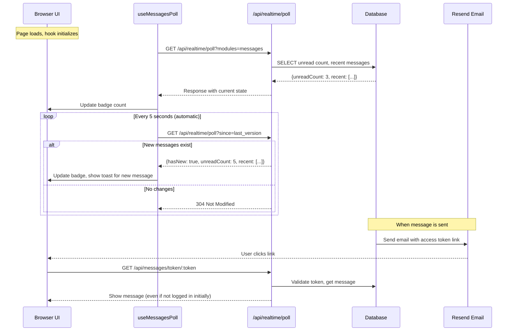

# Messages Module Specification

## Overview

The Messages module provides an internal messaging system with support for:
- **Object attachments** - Attach Open Mercato entities (e.g., leave requests, orders) with actions
- **File attachments** - Attach files via the existing attachments module
- **Message types** - Module-extensible message types with custom renderers
- **Message actions** - Actionable buttons attached to messages (e.g., Approve/Reject)
- **Email forwarding** - Send via Resend with unique access links
- **Threading** - Reply chains and conversation threads

**Package Location:** `packages/core/src/modules/messages/`

---

## Use Cases

| ID | Actor | Use Case | Description | Priority |
|----|-------|----------|-------------|----------|
| M1 | User | Compose message | User writes a new message to one or more recipients | High |
| M2 | User | Attach object | User attaches an entity (e.g., leave request, order) to the message | High |
| M3 | User | Attach file | User attaches files (documents, images) to the message | High |
| M4 | User | Send message | Message is saved and recipients are notified (in-app + optional email) | High |
| M5 | User | View inbox | User sees list of received messages with unread count | High |
| M6 | User | Read message | User opens and reads message content with type-specific renderer | High |
| M7 | User | View attached object | User views attached entity and can take actions on it | High |
| M8 | User | Download attachment | User downloads attached files | High |
| M9 | User | Execute action | User clicks action button (e.g., Approve/Reject) attached to message | High |
| M10 | User | Reply to message | User replies within the same thread | Medium |
| M11 | User | Forward message | User forwards message to other recipients | Medium |
| M12 | User | Archive message | User archives message (removes from inbox, keeps for reference) | Medium |
| M13 | System | Send via email | System sends message copy via Resend with unique access link | High |
| M14 | User | Access via email link | User clicks unique link in email to view message | High |
| M15 | User | Search messages | User searches messages by content, sender, or date | Medium |
| M16 | User | Filter messages | User filters by status, type, has-attachment, sender | Medium |
| M17 | Module | Register message type | Module registers message type with custom renderer and actions | High |
| M18 | Module | Register object type | Module registers attachable entity type with preview/actions | High |
| M19 | User | Mark as unread | User marks a read message as unread | Low |
| M20 | User | Delete message | User deletes message from their view | Low |
| M21 | User | Save draft | User saves message as draft before sending | Medium |
| M22 | System | Notify recipient | System creates notification when new message arrives | High |

---

## Real-Time Updates (Polling)

### How Users Receive Messages Automatically

Users do **not** need to take any action to receive new messages. The system uses automatic polling:



### Polling Configuration

```typescript
// Automatic polling - no user interaction required
const MESSAGE_POLL_INTERVAL = 5000 // 5 seconds

// Polling is always active when MessagesIcon is mounted
// User sees new message badge updates without any interaction
```

---

## Database Schema

### Entity: `Message`

**Table:** `messages`

```typescript
// packages/core/src/modules/messages/data/entities.ts
import { Entity, PrimaryKey, Property, Index, OptionalProps, ManyToOne, OneToMany, Collection } from '@mikro-orm/core'

export type MessageStatus = 'draft' | 'sent'
export type MessagePriority = 'low' | 'normal' | 'high' | 'urgent'
export type MessageBodyFormat = 'text' | 'markdown'

@Entity({ tableName: 'messages' })
@Index({ name: 'messages_sender_idx', properties: ['senderUserId', 'sentAt'] })
@Index({ name: 'messages_thread_idx', properties: ['threadId'] })
@Index({ name: 'messages_type_idx', properties: ['type', 'tenantId'] })
@Index({ name: 'messages_tenant_idx', properties: ['tenantId', 'organizationId'] })
export class Message {
  [OptionalProps]?: 'type' | 'status' | 'priority' | 'bodyFormat' | 'isDraft' | 'createdAt' | 'updatedAt'

  @PrimaryKey({ type: 'uuid', defaultRaw: 'gen_random_uuid()' })
  id!: string

  // Message type (for custom renderers, e.g., 'default', 'staff.leave_request', 'sales.quote')
  @Property({ name: 'type', type: 'text' })
  type: string = 'default'

  // Threading
  @Property({ name: 'thread_id', type: 'uuid', nullable: true })
  threadId?: string | null // NULL = new thread, groups replies together

  @Property({ name: 'parent_message_id', type: 'uuid', nullable: true })
  parentMessageId?: string | null // Direct reply to

  // Sender
  @Property({ name: 'sender_user_id', type: 'uuid' })
  senderUserId!: string

  // Content
  @Property({ name: 'subject', type: 'text' })
  subject!: string

  @Property({ name: 'body', type: 'text' })
  body!: string

  @Property({ name: 'body_format', type: 'text' })
  bodyFormat: MessageBodyFormat = 'text'

  // Priority
  @Property({ name: 'priority', type: 'text' })
  priority: MessagePriority = 'normal'

  // Status
  @Property({ name: 'status', type: 'text' })
  status: MessageStatus = 'draft'

  @Property({ name: 'is_draft', type: 'boolean' })
  isDraft: boolean = true

  @Property({ name: 'sent_at', type: Date, nullable: true })
  sentAt?: Date | null

  // Actions attached to the message (similar to notifications)
  @Property({ name: 'action_data', type: 'json', nullable: true })
  actionData?: MessageActionData | null

  // Result of executed action
  @Property({ name: 'action_result', type: 'json', nullable: true })
  actionResult?: Record<string, unknown> | null

  // Which action was taken (and by whom)
  @Property({ name: 'action_taken', type: 'text', nullable: true })
  actionTaken?: string | null

  @Property({ name: 'action_taken_by_user_id', type: 'uuid', nullable: true })
  actionTakenByUserId?: string | null

  @Property({ name: 'action_taken_at', type: Date, nullable: true })
  actionTakenAt?: Date | null

  // Flags
  @Property({ name: 'send_via_email', type: 'boolean', default: false })
  sendViaEmail: boolean = false

  // Multi-tenant
  @Property({ name: 'tenant_id', type: 'uuid' })
  tenantId!: string

  @Property({ name: 'organization_id', type: 'uuid', nullable: true })
  organizationId?: string | null

  @Property({ name: 'created_at', type: Date, onCreate: () => new Date() })
  createdAt: Date = new Date()

  @Property({ name: 'updated_at', type: Date, onUpdate: () => new Date() })
  updatedAt: Date = new Date()

  @Property({ name: 'deleted_at', type: Date, nullable: true })
  deletedAt?: Date | null
}

// Action configuration type (same pattern as notifications)
export type MessageAction = {
  id: string                    // Unique action ID, e.g., 'approve'
  label: string                 // Display label
  labelKey?: string             // i18n key for label
  variant?: 'default' | 'secondary' | 'destructive' | 'outline' | 'ghost'
  icon?: string                 // Optional icon
  commandId?: string            // Command to execute, e.g., 'staff.leave_requests.accept'
  href?: string                 // Link to navigate (supports {sourceEntityId} interpolation)
  confirmRequired?: boolean     // Show confirmation dialog
  confirmMessage?: string       // Confirmation message
}

export type MessageActionData = {
  actions: MessageAction[]
  primaryActionId?: string      // Which action is primary (highlighted)
  expiresAt?: string            // Actions expire after this date
}
```

### Entity: `MessageRecipient`

**Table:** `message_recipients`

```typescript
export type RecipientType = 'to' | 'cc' | 'bcc'
export type RecipientStatus = 'unread' | 'read' | 'archived' | 'deleted'

@Entity({ tableName: 'message_recipients' })
@Index({ name: 'message_recipients_user_idx', properties: ['recipientUserId', 'status'] })
@Index({ name: 'message_recipients_message_idx', properties: ['messageId'] })
export class MessageRecipient {
  [OptionalProps]?: 'recipientType' | 'status' | 'createdAt'

  @PrimaryKey({ type: 'uuid', defaultRaw: 'gen_random_uuid()' })
  id!: string

  @Property({ name: 'message_id', type: 'uuid' })
  messageId!: string

  @Property({ name: 'recipient_user_id', type: 'uuid' })
  recipientUserId!: string

  @Property({ name: 'recipient_type', type: 'text' })
  recipientType: RecipientType = 'to'

  @Property({ name: 'status', type: 'text' })
  status: RecipientStatus = 'unread'

  @Property({ name: 'read_at', type: Date, nullable: true })
  readAt?: Date | null

  @Property({ name: 'archived_at', type: Date, nullable: true })
  archivedAt?: Date | null

  @Property({ name: 'deleted_at', type: Date, nullable: true })
  deletedAt?: Date | null

  // Email delivery tracking
  @Property({ name: 'email_sent_at', type: Date, nullable: true })
  emailSentAt?: Date | null

  @Property({ name: 'email_delivered_at', type: Date, nullable: true })
  emailDeliveredAt?: Date | null

  @Property({ name: 'email_opened_at', type: Date, nullable: true })
  emailOpenedAt?: Date | null

  @Property({ name: 'email_failed_at', type: Date, nullable: true })
  emailFailedAt?: Date | null

  @Property({ name: 'email_error', type: 'text', nullable: true })
  emailError?: string | null

  @Property({ name: 'created_at', type: Date, onCreate: () => new Date() })
  createdAt: Date = new Date()
}
```

### Entity: `MessageObject`

**Table:** `message_objects`

Attached entities (e.g., leave requests, orders, quotes)

```typescript
@Entity({ tableName: 'message_objects' })
@Index({ name: 'message_objects_message_idx', properties: ['messageId'] })
@Index({ name: 'message_objects_entity_idx', properties: ['entityType', 'entityId'] })
export class MessageObject {
  [OptionalProps]?: 'actionRequired' | 'createdAt'

  @PrimaryKey({ type: 'uuid', defaultRaw: 'gen_random_uuid()' })
  id!: string

  @Property({ name: 'message_id', type: 'uuid' })
  messageId!: string

  @Property({ name: 'entity_module', type: 'text' })
  entityModule!: string // e.g., 'staff'

  @Property({ name: 'entity_type', type: 'text' })
  entityType!: string // e.g., 'leave_request'

  @Property({ name: 'entity_id', type: 'uuid' })
  entityId!: string

  // Action context
  @Property({ name: 'action_required', type: 'boolean' })
  actionRequired: boolean = false

  @Property({ name: 'action_type', type: 'text', nullable: true })
  actionType?: string | null // e.g., 'approve', 'review'

  @Property({ name: 'action_label', type: 'text', nullable: true })
  actionLabel?: string | null // Display label for the action

  // Snapshot of entity at time of attachment (for historical reference)
  @Property({ name: 'entity_snapshot', type: 'json', nullable: true })
  entitySnapshot?: Record<string, unknown> | null

  @Property({ name: 'created_at', type: Date, onCreate: () => new Date() })
  createdAt: Date = new Date()
}
```

### Entity: `MessageAccessToken`

**Table:** `message_access_tokens`

Secure tokens for email access links

```typescript
@Entity({ tableName: 'message_access_tokens' })
@Index({ name: 'message_access_tokens_token_idx', properties: ['token'] })
@Index({ name: 'message_access_tokens_message_idx', properties: ['messageId'] })
export class MessageAccessToken {
  [OptionalProps]?: 'createdAt'

  @PrimaryKey({ type: 'uuid', defaultRaw: 'gen_random_uuid()' })
  id!: string

  @Property({ name: 'message_id', type: 'uuid' })
  messageId!: string

  @Property({ name: 'recipient_user_id', type: 'uuid' })
  recipientUserId!: string

  @Property({ name: 'token', type: 'text', unique: true })
  token!: string // Secure random token (e.g., 64 chars)

  @Property({ name: 'expires_at', type: Date })
  expiresAt!: Date

  @Property({ name: 'used_at', type: Date, nullable: true })
  usedAt?: Date | null

  @Property({ name: 'use_count', type: 'int', default: 0 })
  useCount: number = 0

  @Property({ name: 'created_at', type: Date, onCreate: () => new Date() })
  createdAt: Date = new Date()
}
```

### SQL Migration

```sql
-- packages/core/src/modules/messages/migrations/Migration_CreateMessages.ts

-- Main messages table
CREATE TABLE messages (
  id UUID PRIMARY KEY DEFAULT gen_random_uuid(),
  
  -- Message type (for custom renderers)
  type TEXT NOT NULL DEFAULT 'default',
  
  -- Threading
  thread_id UUID,
  parent_message_id UUID REFERENCES messages(id),
  
  -- Sender
  sender_user_id UUID NOT NULL,
  
  -- Content
  subject TEXT NOT NULL,
  body TEXT NOT NULL,
  body_format TEXT NOT NULL DEFAULT 'text',
  
  -- Priority and status
  priority TEXT NOT NULL DEFAULT 'normal',
  status TEXT NOT NULL DEFAULT 'draft',
  is_draft BOOLEAN NOT NULL DEFAULT true,
  sent_at TIMESTAMPTZ,
  
  -- Actions
  action_data JSONB,
  action_result JSONB,
  action_taken TEXT,
  action_taken_by_user_id UUID,
  action_taken_at TIMESTAMPTZ,
  
  -- Email flag
  send_via_email BOOLEAN NOT NULL DEFAULT false,
  
  -- Multi-tenant
  tenant_id UUID NOT NULL,
  organization_id UUID,
  
  created_at TIMESTAMPTZ NOT NULL DEFAULT now(),
  updated_at TIMESTAMPTZ NOT NULL DEFAULT now(),
  deleted_at TIMESTAMPTZ
);

CREATE INDEX messages_sender_idx ON messages(sender_user_id, sent_at DESC);
CREATE INDEX messages_thread_idx ON messages(thread_id) WHERE thread_id IS NOT NULL;
CREATE INDEX messages_type_idx ON messages(type, tenant_id);
CREATE INDEX messages_tenant_idx ON messages(tenant_id, organization_id);

-- Recipients junction table
CREATE TABLE message_recipients (
  id UUID PRIMARY KEY DEFAULT gen_random_uuid(),
  message_id UUID NOT NULL REFERENCES messages(id) ON DELETE CASCADE,
  recipient_user_id UUID NOT NULL,
  
  recipient_type TEXT NOT NULL DEFAULT 'to',
  status TEXT NOT NULL DEFAULT 'unread',
  
  read_at TIMESTAMPTZ,
  archived_at TIMESTAMPTZ,
  deleted_at TIMESTAMPTZ,
  
  -- Email tracking
  email_sent_at TIMESTAMPTZ,
  email_delivered_at TIMESTAMPTZ,
  email_opened_at TIMESTAMPTZ,
  email_failed_at TIMESTAMPTZ,
  email_error TEXT,
  
  created_at TIMESTAMPTZ NOT NULL DEFAULT now(),
  
  UNIQUE(message_id, recipient_user_id)
);

CREATE INDEX message_recipients_user_idx 
  ON message_recipients(recipient_user_id, status, created_at DESC);
CREATE INDEX message_recipients_message_idx ON message_recipients(message_id);

-- Object attachments
CREATE TABLE message_objects (
  id UUID PRIMARY KEY DEFAULT gen_random_uuid(),
  message_id UUID NOT NULL REFERENCES messages(id) ON DELETE CASCADE,
  
  entity_module TEXT NOT NULL,
  entity_type TEXT NOT NULL,
  entity_id UUID NOT NULL,
  
  action_required BOOLEAN NOT NULL DEFAULT false,
  action_type TEXT,
  action_label TEXT,
  
  entity_snapshot JSONB,
  
  created_at TIMESTAMPTZ NOT NULL DEFAULT now()
);

CREATE INDEX message_objects_message_idx ON message_objects(message_id);
CREATE INDEX message_objects_entity_idx ON message_objects(entity_type, entity_id);

-- Access tokens for email links
CREATE TABLE message_access_tokens (
  id UUID PRIMARY KEY DEFAULT gen_random_uuid(),
  message_id UUID NOT NULL REFERENCES messages(id) ON DELETE CASCADE,
  recipient_user_id UUID NOT NULL,
  
  token TEXT NOT NULL UNIQUE,
  
  expires_at TIMESTAMPTZ NOT NULL,
  used_at TIMESTAMPTZ,
  use_count INTEGER NOT NULL DEFAULT 0,
  
  created_at TIMESTAMPTZ NOT NULL DEFAULT now()
);

CREATE INDEX message_access_tokens_token_idx ON message_access_tokens(token);
CREATE INDEX message_access_tokens_message_idx ON message_access_tokens(message_id);
```

---

## Validators (Zod Schemas)

```typescript
// packages/core/src/modules/messages/data/validators.ts
import { z } from 'zod'

export const messageRecipientSchema = z.object({
  userId: z.string().uuid(),
  type: z.enum(['to', 'cc', 'bcc']).optional().default('to'),
})

export const messageObjectSchema = z.object({
  entityModule: z.string().min(1),
  entityType: z.string().min(1),
  entityId: z.string().uuid(),
  actionRequired: z.boolean().optional().default(false),
  actionType: z.string().optional(),
  actionLabel: z.string().optional(),
})

export const messageActionSchema = z.object({
  id: z.string().min(1),
  label: z.string().min(1),
  labelKey: z.string().optional(),
  variant: z.enum(['default', 'secondary', 'destructive', 'outline', 'ghost']).optional(),
  icon: z.string().optional(),
  commandId: z.string().optional(),
  href: z.string().optional(),
  confirmRequired: z.boolean().optional(),
  confirmMessage: z.string().optional(),
})

export const messageActionDataSchema = z.object({
  actions: z.array(messageActionSchema),
  primaryActionId: z.string().optional(),
  expiresAt: z.string().datetime().optional(),
})

export const composeMessageSchema = z.object({
  type: z.string().optional().default('default'), // Message type for custom renderer
  recipients: z.array(messageRecipientSchema).min(1).max(100),
  subject: z.string().min(1).max(500),
  body: z.string().min(1).max(50000),
  bodyFormat: z.enum(['text', 'markdown']).optional().default('text'),
  priority: z.enum(['low', 'normal', 'high', 'urgent']).optional().default('normal'),
  objects: z.array(messageObjectSchema).optional(),
  attachmentIds: z.array(z.string().uuid()).optional(), // References to existing attachments
  actionData: messageActionDataSchema.optional(), // Actions attached to the message
  sendViaEmail: z.boolean().optional().default(false),
  parentMessageId: z.string().uuid().optional(), // For replies
  isDraft: z.boolean().optional().default(false),
})

export const updateDraftSchema = z.object({
  type: z.string().optional(),
  recipients: z.array(messageRecipientSchema).optional(),
  subject: z.string().min(1).max(500).optional(),
  body: z.string().min(1).max(50000).optional(),
  bodyFormat: z.enum(['text', 'markdown']).optional(),
  priority: z.enum(['low', 'normal', 'high', 'urgent']).optional(),
  objects: z.array(messageObjectSchema).optional(),
  attachmentIds: z.array(z.string().uuid()).optional(),
  actionData: messageActionDataSchema.optional(),
  sendViaEmail: z.boolean().optional(),
})

export const listMessagesSchema = z.object({
  folder: z.enum(['inbox', 'sent', 'drafts', 'archived', 'all']).optional().default('inbox'),
  status: z.enum(['unread', 'read', 'archived']).optional(),
  type: z.string().optional(), // Filter by message type
  hasObjects: z.boolean().optional(),
  hasAttachments: z.boolean().optional(),
  hasActions: z.boolean().optional(),
  senderId: z.string().uuid().optional(),
  search: z.string().max(200).optional(),
  since: z.string().datetime().optional(),
  page: z.coerce.number().int().min(1).optional().default(1),
  pageSize: z.coerce.number().int().min(1).max(100).optional().default(20),
})

export const forwardMessageSchema = z.object({
  recipients: z.array(messageRecipientSchema).min(1).max(100),
  additionalBody: z.string().max(10000).optional(),
  includeAttachments: z.boolean().optional().default(true), // Include file attachments
  sendViaEmail: z.boolean().optional().default(false),
})

export const replyMessageSchema = z.object({
  body: z.string().min(1).max(50000),
  bodyFormat: z.enum(['text', 'markdown']).optional().default('text'),
  attachmentIds: z.array(z.string().uuid()).optional(),
  replyAll: z.boolean().optional().default(false),
  sendViaEmail: z.boolean().optional().default(false),
})

export const executeActionSchema = z.object({
  messageId: z.string().uuid(),
  actionId: z.string().min(1),
  payload: z.record(z.unknown()).optional(), // Additional payload for the action
})

export type ComposeMessageInput = z.infer<typeof composeMessageSchema>
export type UpdateDraftInput = z.infer<typeof updateDraftSchema>
export type ListMessagesInput = z.infer<typeof listMessagesSchema>
export type ForwardMessageInput = z.infer<typeof forwardMessageSchema>
export type ReplyMessageInput = z.infer<typeof replyMessageSchema>
export type ExecuteActionInput = z.infer<typeof executeActionSchema>
```

---

## Object Types Registry

Modules register object types for message attachments in their `message-objects.ts` file.

### Type Definition Pattern

```typescript
// packages/shared/src/modules/messages/types.ts
import type { ComponentType } from 'react'

export type MessageObjectAction = {
  id: string
  labelKey: string
  variant?: 'default' | 'secondary' | 'destructive' | 'outline'
  icon?: string
  commandId?: string
  href?: string
}

export type MessageObjectTypeDefinition = {
  module: string                    // e.g., 'staff'
  entityType: string                // e.g., 'leave_request'
  labelKey: string                  // i18n key for object type label
  icon: string                      // Lucide icon name
  
  // Component to render small preview in message list
  PreviewComponent: ComponentType<ObjectPreviewProps>
  
  // Component to render full object with actions in message detail
  DetailComponent: ComponentType<ObjectDetailProps>
  
  // Available actions on this object type
  actions: MessageObjectAction[]
  
  // Function to load entity data for preview
  loadPreview?: (entityId: string, ctx: LoadContext) => Promise<ObjectPreviewData>
}

export type ObjectPreviewProps = {
  entityId: string
  entityModule: string
  entityType: string
  snapshot?: Record<string, unknown>
  actionRequired?: boolean
  actionType?: string
  actionLabel?: string
}

export type ObjectDetailProps = ObjectPreviewProps & {
  onAction: (actionId: string) => Promise<void>
  actions: MessageObjectAction[]
}

export type ObjectPreviewData = {
  title: string
  subtitle?: string
  status?: string
  statusColor?: string
  metadata?: Record<string, string>
}

export type LoadContext = {
  tenantId: string
  organizationId?: string | null
}
```

### Module Example: Staff Leave Requests

```typescript
// packages/core/src/modules/staff/message-objects.ts
import type { MessageObjectTypeDefinition } from '@open-mercato/shared/modules/messages/types'
import { LeaveRequestPreview } from './components/LeaveRequestPreview'
import { LeaveRequestDetail } from './components/LeaveRequestDetail'

export const messageObjectTypes: MessageObjectTypeDefinition[] = [
  {
    module: 'staff',
    entityType: 'leave_request',
    labelKey: 'staff.objects.leaveRequest',
    icon: 'calendar-clock',
    PreviewComponent: LeaveRequestPreview,
    DetailComponent: LeaveRequestDetail,
    actions: [
      {
        id: 'approve',
        labelKey: 'staff.actions.approve',
        variant: 'default',
        commandId: 'staff.leave_requests.accept',
        icon: 'check',
      },
      {
        id: 'reject',
        labelKey: 'staff.actions.reject',
        variant: 'destructive',
        commandId: 'staff.leave_requests.reject',
        icon: 'x',
      },
      {
        id: 'view',
        labelKey: 'common.viewDetails',
        variant: 'outline',
        href: '/backend/staff/leave-requests/{entityId}',
        icon: 'external-link',
      },
    ],
    loadPreview: async (entityId, ctx) => {
      // Load leave request data for preview
      return {
        title: 'Leave Request',
        subtitle: 'John Doe - 3 days',
        status: 'Pending',
        statusColor: 'amber',
        metadata: {
          'Start Date': '2026-02-01',
          'End Date': '2026-02-03',
          'Type': 'Vacation',
        },
      }
    },
  },
]

export default messageObjectTypes
```

---

## Message Types Registry

Modules register message types with custom renderers for different message kinds. This allows modules to define how their messages appear in the inbox and detail views.

### Type Definition Pattern

```typescript
// packages/shared/src/modules/messages/types.ts (continued)

export type MessageTypeDefinition = {
  type: string                     // Unique type ID, e.g., 'default', 'staff.leave_request_approval'
  module: string                   // Owning module, e.g., 'staff'
  labelKey: string                 // i18n key for type label
  icon: string                     // Lucide icon name
  color?: string                   // Badge/accent color
  
  // Component to render in message list
  ListItemComponent?: ComponentType<MessageListItemProps>
  
  // Component to render full message content
  ContentComponent?: ComponentType<MessageContentProps>
  
  // Component to render message actions
  ActionsComponent?: ComponentType<MessageActionsProps>
  
  // Default actions for this message type (if not overridden per message)
  defaultActions?: MessageAction[]
  
  // Whether this type supports replies/forwarding
  allowReply?: boolean             // Default: true
  allowForward?: boolean           // Default: true
  
  // Auto-expiry for actions
  actionsExpireAfterHours?: number
}

export type MessageListItemProps = {
  message: {
    id: string
    type: string
    subject: string
    body: string
    bodyFormat: 'text' | 'markdown'
    priority: 'low' | 'normal' | 'high' | 'urgent'
    sentAt: Date | null
    senderName?: string
    senderAvatar?: string
    hasObjects: boolean
    hasAttachments: boolean
    hasActions: boolean
    actionTaken?: string | null
    unread: boolean
  }
  onClick: () => void
}


export type MessageContentProps = {
  message: {
    id: string
    type: string
    subject: string
    body: string
    bodyFormat: 'text' | 'markdown'
    priority: 'low' | 'normal' | 'high' | 'urgent'
    sentAt: Date | null
    senderName?: string
    senderAvatar?: string
    senderUserId: string
    actionData?: MessageActionData | null
    actionTaken?: string | null
    actionTakenAt?: Date | null
    actionTakenByName?: string
  }
  objects: Array<{
    id: string
    entityModule: string
    entityType: string
    entityId: string
    actionRequired: boolean
    snapshot?: Record<string, unknown>
  }>
  attachments: Array<{
    id: string
    fileName: string
    fileSize: number
    mimeType: string
    url: string
  }>
}

export type MessageActionsProps = {
  message: {
    id: string
    type: string
    actionData?: MessageActionData | null
    actionTaken?: string | null
  }
  onExecuteAction: (actionId: string, payload?: Record<string, unknown>) => Promise<void>
  isExecuting: boolean
  executingActionId?: string | null
}
```

### Module Example: Staff Leave Request Messages

```typescript
// packages/core/src/modules/staff/message-types.ts
import type { MessageTypeDefinition } from '@open-mercato/shared/modules/messages/types'
import { LeaveRequestMessageContent } from './components/LeaveRequestMessageContent'
import { LeaveRequestMessageActions } from './components/LeaveRequestMessageActions'

export const messageTypes: MessageTypeDefinition[] = [
  {
    type: 'staff.leave_request_approval',
    module: 'staff',
    labelKey: 'staff.messages.leaveRequestApproval',
    icon: 'calendar-check',
    color: 'amber',
    ContentComponent: LeaveRequestMessageContent,
    ActionsComponent: LeaveRequestMessageActions,
    defaultActions: [
      {
        id: 'approve',
        label: 'Approve',
        labelKey: 'staff.actions.approve',
        variant: 'default',
        icon: 'check',
        commandId: 'staff.leave_requests.accept',
        confirmRequired: true,
        confirmMessage: 'Are you sure you want to approve this leave request?',
      },
      {
        id: 'reject',
        label: 'Reject',
        labelKey: 'staff.actions.reject',
        variant: 'destructive',
        icon: 'x',
        commandId: 'staff.leave_requests.reject',
        confirmRequired: true,
        confirmMessage: 'Are you sure you want to reject this leave request?',
      },
      {
        id: 'view',
        label: 'View Details',
        labelKey: 'common.viewDetails',
        variant: 'outline',
        icon: 'external-link',
        href: '/backend/staff/leave-requests/{sourceEntityId}',
      },
    ],
    actionsExpireAfterHours: 168, // 7 days
    allowReply: true,
    allowForward: false,
  },
  {
    type: 'staff.leave_request_status',
    module: 'staff',
    labelKey: 'staff.messages.leaveRequestStatus',
    icon: 'calendar-clock',
    color: 'blue',
    allowReply: false,
    allowForward: false,
  },
]

export default messageTypes
```

### Default Message Type

```typescript
// packages/core/src/modules/messages/message-types.ts
import type { MessageTypeDefinition } from '@open-mercato/shared/modules/messages/types'
import { DefaultMessageContent } from './components/DefaultMessageContent'
import { DefaultMessageActions } from './components/DefaultMessageActions'

export const messageTypes: MessageTypeDefinition[] = [
  {
    type: 'default',
    module: 'messages',
    labelKey: 'messages.types.default',
    icon: 'mail',
    ContentComponent: DefaultMessageContent,
    ActionsComponent: DefaultMessageActions,
    allowReply: true,
    allowForward: true,
  },
  {
    type: 'system',
    module: 'messages',
    labelKey: 'messages.types.system',
    icon: 'info',
    color: 'blue',
    allowReply: false,
    allowForward: false,
  },
]

export default messageTypes
```

### Message Type Registry Service

```typescript
// packages/core/src/modules/messages/lib/message-types-registry.ts
import type { MessageTypeDefinition } from '@open-mercato/shared/modules/messages/types'

const registry = new Map<string, MessageTypeDefinition>()

export function registerMessageTypes(types: MessageTypeDefinition[]): void {
  for (const type of types) {
    if (registry.has(type.type)) {
      console.warn(`[messages] Message type "${type.type}" is already registered, overwriting`)
    }
    registry.set(type.type, type)
  }
}

export function getMessageType(type: string): MessageTypeDefinition | undefined {
  return registry.get(type)
}

export function getMessageTypeOrDefault(type: string): MessageTypeDefinition {
  return registry.get(type) || registry.get('default')!
}

export function getAllMessageTypes(): MessageTypeDefinition[] {
  return Array.from(registry.values())
}

export function getMessageTypesByModule(module: string): MessageTypeDefinition[] {
  return Array.from(registry.values()).filter(t => t.module === module)
}
```

### Auto-Discovery and Registration

Message types are auto-discovered from modules and registered at startup:

```typescript
// packages/core/src/modules/messages/lib/init.ts
import { registerMessageTypes } from './message-types-registry'
import { getModules } from '@mercato/.mercato/generated/modules.generated'

export async function initializeMessageTypes(): Promise<void> {
  const modules = getModules()
  
  for (const mod of modules) {
    try {
      // Try to import message-types.ts from the module
      const messageTypesModule = await import(`@open-mercato/core/modules/${mod.id}/message-types`)
      if (messageTypesModule.default) {
        registerMessageTypes(messageTypesModule.default)
      } else if (messageTypesModule.messageTypes) {
        registerMessageTypes(messageTypesModule.messageTypes)
      }
    } catch {
      // Module doesn't have message types, skip
    }
  }
}
```

---

## File Attachments

Messages support file attachments via the existing `attachments` module. Files are stored using the attachments infrastructure and linked to messages via the `messages:message` entity ID pattern.

### Integration with Attachments Module

```typescript
// packages/core/src/modules/messages/lib/attachments.ts
import type { EntityManager } from '@mikro-orm/core'

// Entity ID for message attachments
export const MESSAGE_ATTACHMENT_ENTITY_ID = 'messages:message'

// Partition code for message attachments
export const MESSAGE_ATTACHMENT_PARTITION = 'messages'

/**
 * Link existing attachments to a message.
 * Attachments are first uploaded via the attachments module,
 * then linked to the message during compose.
 */
export async function linkAttachmentsToMessage(
  em: EntityManager,
  messageId: string,
  attachmentIds: string[],
  organizationId: string,
  tenantId: string,
): Promise<void> {
  if (!attachmentIds.length) return
  
  const { Attachment } = await import('@open-mercato/core/modules/attachments/data/entities')
  
  // Find attachments that belong to this org/tenant
  const attachments = await em.find(Attachment, {
    id: { $in: attachmentIds },
    organizationId,
    tenantId,
  })
  
  // Update them to point to this message
  for (const attachment of attachments) {
    attachment.entityId = MESSAGE_ATTACHMENT_ENTITY_ID
    attachment.recordId = messageId
  }
  
  await em.flush()
}

/**
 * Get attachments for a message
 */
export async function getMessageAttachments(
  em: EntityManager,
  messageId: string,
  organizationId: string,
  tenantId: string,
): Promise<Array<{
  id: string
  fileName: string
  fileSize: number
  mimeType: string
  url: string
}>> {
  const { Attachment } = await import('@open-mercato/core/modules/attachments/data/entities')
  
  const attachments = await em.find(Attachment, {
    entityId: MESSAGE_ATTACHMENT_ENTITY_ID,
    recordId: messageId,
    organizationId,
    tenantId,
  })
  
  return attachments.map(a => ({
    id: a.id,
    fileName: a.fileName,
    fileSize: a.fileSize,
    mimeType: a.mimeType,
    url: a.url,
  }))
}

/**
 * Copy attachments when forwarding a message
 */
export async function copyAttachmentsForForward(
  em: EntityManager,
  sourceMessageId: string,
  targetMessageId: string,
  organizationId: string,
  tenantId: string,
): Promise<void> {
  const sourceAttachments = await getMessageAttachments(em, sourceMessageId, organizationId, tenantId)
  
  if (!sourceAttachments.length) return
  
  const { Attachment } = await import('@open-mercato/core/modules/attachments/data/entities')
  
  // Create copies pointing to the new message
  for (const source of sourceAttachments) {
    const original = await em.findOne(Attachment, { id: source.id })
    if (!original) continue
    
    const copy = em.create(Attachment, {
      entityId: MESSAGE_ATTACHMENT_ENTITY_ID,
      recordId: targetMessageId,
      organizationId,
      tenantId,
      fileName: original.fileName,
      mimeType: original.mimeType,
      fileSize: original.fileSize,
      storageDriver: original.storageDriver,
      storagePath: original.storagePath, // Same file, new record
      storageMetadata: original.storageMetadata,
      url: original.url,
      partitionCode: original.partitionCode,
    })
    em.persist(copy)
  }
  
  await em.flush()
}
```

### Compose Form with Attachments

```typescript
// packages/core/src/modules/messages/components/ComposeMessageForm.tsx (updated)
import { AttachmentUploader } from '@open-mercato/core/modules/attachments/components/AttachmentUploader'
import { AttachmentList } from '@open-mercato/core/modules/attachments/components/AttachmentList'
import { MESSAGE_ATTACHMENT_ENTITY_ID, MESSAGE_ATTACHMENT_PARTITION } from '../lib/attachments'

export function ComposeMessageForm({ draftId }: { draftId?: string }) {
  const [attachmentIds, setAttachmentIds] = useState<string[]>([])
  const [uploadedFiles, setUploadedFiles] = useState<AttachmentFile[]>([])
  
  const handleAttachmentUploaded = (attachment: AttachmentFile) => {
    setAttachmentIds(prev => [...prev, attachment.id])
    setUploadedFiles(prev => [...prev, attachment])
  }
  
  const handleRemoveAttachment = (attachmentId: string) => {
    setAttachmentIds(prev => prev.filter(id => id !== attachmentId))
    setUploadedFiles(prev => prev.filter(a => a.id !== attachmentId))
  }
  
  return (
    <form onSubmit={handleSubmit}>
      {/* ... other form fields ... */}
      
      <div className="space-y-4">
        <Label>Attachments</Label>
        
        {/* Uploaded files list */}
        {uploadedFiles.length > 0 && (
          <AttachmentList 
            attachments={uploadedFiles}
            onRemove={handleRemoveAttachment}
            removable
          />
        )}
        
        {/* Upload button */}
        <AttachmentUploader
          entityId={MESSAGE_ATTACHMENT_ENTITY_ID}
          recordId={draftId || 'draft-temp'}
          partitionCode={MESSAGE_ATTACHMENT_PARTITION}
          onUploadComplete={handleAttachmentUploaded}
          multiple
          accept="*/*"
          maxSize={25 * 1024 * 1024} // 25MB
        />
      </div>
      
      {/* Hidden field to include attachment IDs in form submission */}
      <input type="hidden" name="attachmentIds" value={JSON.stringify(attachmentIds)} />
    </form>
  )
}
```

### Message Detail with Attachments

```typescript
// packages/core/src/modules/messages/components/MessageDetail.tsx (updated)
import { AttachmentList } from '@open-mercato/core/modules/attachments/components/AttachmentList'
import { FileIcon, Download } from 'lucide-react'

export function MessageDetail({ message, attachments }: MessageDetailProps) {
  return (
    <div className="space-y-6">
      {/* ... header and body ... */}
      
      {/* Attachments section */}
      {attachments && attachments.length > 0 && (
        <div className="border-t pt-4">
          <h3 className="font-medium mb-3 flex items-center gap-2">
            <FileIcon className="h-4 w-4" />
            Attachments ({attachments.length})
          </h3>
          <AttachmentList 
            attachments={attachments}
            downloadable
          />
        </div>
      )}
      
      {/* ... objects and actions ... */}
    </div>
  )
}
```

### API: Get Message with Attachments

```typescript
// packages/core/src/modules/messages/api/[id]/route.ts (updated)
import { getMessageAttachments } from '../../lib/attachments'

export async function GET(req: Request, { params }: { params: { id: string } }) {
  // ... auth and validation ...
  
  const message = await em.findOne(Message, { id: params.id, tenantId })
  if (!message) {
    return NextResponse.json({ error: 'Message not found' }, { status: 404 })
  }
  
  // Get attached objects
  const objects = await em.find(MessageObject, { messageId: message.id })
  
  // Get file attachments
  const attachments = await getMessageAttachments(em, message.id, orgId, tenantId)
  
  // Get message type definition for rendering
  const messageType = getMessageTypeOrDefault(message.type)
  
  return NextResponse.json({
    message: {
      ...message,
      typeDefinition: {
        labelKey: messageType.labelKey,
        icon: messageType.icon,
        color: messageType.color,
        allowReply: messageType.allowReply,
        allowForward: messageType.allowForward,
      },
    },
    objects,
    attachments,
  })
}
```

---

### Preview Component Example

```typescript
// packages/core/src/modules/staff/components/LeaveRequestPreview.tsx
import type { ObjectPreviewProps } from '@open-mercato/shared/modules/messages/types'
import { CalendarClock } from 'lucide-react'
import { Badge } from '@open-mercato/ui/primitives/badge'

export function LeaveRequestPreview({ snapshot, actionRequired, actionLabel }: ObjectPreviewProps) {
  const data = snapshot as { 
    employeeName?: string
    startDate?: string
    endDate?: string
    status?: string
    type?: string
  } | undefined
  
  return (
    <div className="flex items-start gap-3 rounded-md border p-3 bg-muted/30">
      <CalendarClock className="h-5 w-5 text-muted-foreground mt-0.5" />
      <div className="flex-1 min-w-0">
        <div className="flex items-center gap-2">
          <span className="font-medium">Leave Request</span>
          {actionRequired && (
            <Badge variant="secondary" className="text-xs">
              {actionLabel || 'Action Required'}
            </Badge>
          )}
        </div>
        {data && (
          <p className="text-sm text-muted-foreground mt-1">
            {data.employeeName} · {data.startDate} to {data.endDate} · {data.type}
          </p>
        )}
        {data?.status && (
          <Badge variant="outline" className="mt-2 text-xs">
            {data.status}
          </Badge>
        )}
      </div>
    </div>
  )
}
```

---

## Email Integration

### Email Sender Service

```typescript
// packages/core/src/modules/messages/lib/email-sender.ts
import { sendEmail } from '@open-mercato/shared/lib/email/send'
import { MessageEmailTemplate } from '../components/email/MessageEmailTemplate'
import type { Message, MessageRecipient, MessageObject } from '../data/entities'
import crypto from 'crypto'

const ACCESS_TOKEN_EXPIRY_HOURS = 168 // 7 days

export async function generateAccessToken(): Promise<string> {
  return crypto.randomBytes(32).toString('hex') // 64 character token
}

export async function sendMessageEmail(
  message: Message,
  recipient: MessageRecipient,
  recipientUser: { email: string; name?: string },
  senderUser: { name?: string; email?: string },
  objects: MessageObject[],
  attachments: Array<{ fileName: string; fileSize: number; mimeType: string }>,
  em: any, // EntityManager
): Promise<void> {
  // Generate access token
  const token = await generateAccessToken()
  const expiresAt = new Date(Date.now() + ACCESS_TOKEN_EXPIRY_HOURS * 60 * 60 * 1000)
  
  // Save token to database
  const accessToken = em.create('MessageAccessToken', {
    messageId: message.id,
    recipientUserId: recipient.recipientUserId,
    token,
    expiresAt,
  })
  await em.persistAndFlush(accessToken)
  
  // Build access URL
  const appUrl = process.env.APP_URL || 'http://localhost:3000'
  const viewUrl = `${appUrl}/messages/view/${token}`
  
  // Format actions for email (if any)
  const actions = message.actionData?.actions?.map(a => ({
    id: a.id,
    label: a.label,
    variant: a.variant,
  })) || []
  
  // Send email
  await sendEmail({
    to: recipientUser.email,
    subject: message.subject,
    react: MessageEmailTemplate({
      messageType: message.type,
      subject: message.subject,
      body: message.body,
      bodyFormat: message.bodyFormat,
      senderName: senderUser.name || senderUser.email || 'Unknown',
      sentAt: message.sentAt || new Date(),
      viewUrl,
      objects: objects.map(o => ({
        entityType: o.entityType,
        actionRequired: o.actionRequired,
        actionLabel: o.actionLabel,
      })),
      attachments: attachments.map(a => ({
        fileName: a.fileName,
        fileSize: a.fileSize,
        mimeType: a.mimeType,
      })),
      actions,
      hasActions: actions.length > 0,
    }),
  })
  
  // Update recipient with email sent timestamp
  recipient.emailSentAt = new Date()
  await em.flush()
}
```

### Email Template Component

```typescript
// packages/core/src/modules/messages/components/email/MessageEmailTemplate.tsx
import * as React from 'react'
import {
  Html,
  Head,
  Body,
  Container,
  Section,
  Text,
  Button,
  Hr,
  Preview,
  Link,
} from '@react-email/components'
import { formatFileSize } from '@open-mercato/shared/lib/format'

export type MessageEmailTemplateProps = {
  messageType: string
  subject: string
  body: string
  bodyFormat: 'text' | 'markdown'
  senderName: string
  sentAt: Date
  viewUrl: string
  objects?: Array<{
    entityType: string
    actionRequired?: boolean
    actionLabel?: string
  }>
  attachments?: Array<{
    fileName: string
    fileSize: number
    mimeType: string
  }>
  actions?: Array<{
    id: string
    label: string
    variant?: string
  }>
  hasActions?: boolean
}

export function MessageEmailTemplate({
  messageType,
  subject,
  body,
  bodyFormat,
  senderName,
  sentAt,
  viewUrl,
  objects = [],
  attachments = [],
  actions = [],
  hasActions = false,
}: MessageEmailTemplateProps) {
  const previewText = `Message from ${senderName}: ${subject}`
  const hasRequiredActions = hasActions || objects.some(o => o.actionRequired)
  
  return (
    <Html>
      <Head />
      <Preview>{previewText}</Preview>
      <Body style={styles.body}>
        <Container style={styles.container}>
          <Section style={styles.header}>
            <Text style={styles.title}>{subject}</Text>
            <Text style={styles.meta}>
              From: {senderName} · {sentAt.toLocaleDateString()}
            </Text>
          </Section>
          
          <Hr style={styles.hr} />
          
          <Section style={styles.content}>
            <Text style={styles.bodyText}>
              {bodyFormat === 'markdown' ? body : body}
            </Text>
          </Section>
          
          {/* Object attachments (entities) */}
          {objects.length > 0 && (
            <>
              <Hr style={styles.hr} />
              <Section style={styles.attachments}>
                <Text style={styles.attachmentsTitle}>Attached Items:</Text>
                {objects.map((obj, i) => (
                  <Text key={i} style={styles.attachment}>
                    • {obj.entityType}
                    {obj.actionRequired && ` (${obj.actionLabel || 'Action Required'})`}
                  </Text>
                ))}
              </Section>
            </>
          )}
          
          {/* File attachments */}
          {attachments.length > 0 && (
            <>
              <Hr style={styles.hr} />
              <Section style={styles.attachments}>
                <Text style={styles.attachmentsTitle}>📎 File Attachments:</Text>
                {attachments.map((att, i) => (
                  <Text key={i} style={styles.attachment}>
                    • {att.fileName} ({formatFileSize(att.fileSize)})
                  </Text>
                ))}
                <Text style={styles.fileNote}>
                  View the full message to download attachments.
                </Text>
              </Section>
            </>
          )}
          
          {/* Actions */}
          {actions.length > 0 && (
            <>
              <Hr style={styles.hr} />
              <Section style={styles.actionsSection}>
                <Text style={styles.actionsTitle}>⚡ Actions Available:</Text>
                <Text style={styles.actionsText}>
                  This message requires your action. Click below to respond.
                </Text>
              </Section>
            </>
          )}
          
          <Hr style={styles.hr} />
          
          <Section style={styles.cta}>
            <Button href={viewUrl} style={styles.button}>
              {hasRequiredActions ? 'View and Take Action' : 'View Message'}
            </Button>
            <Text style={styles.linkNote}>
              Or copy this link: {viewUrl}
            </Text>
          </Section>
          
          <Hr style={styles.hr} />
          
          <Section style={styles.footer}>
            <Text style={styles.footerText}>
              This message was sent via Open Mercato. 
              Click the button above to view the full message and respond.
            </Text>
          </Section>
        </Container>
      </Body>
    </Html>
  )
}

const styles = {
  body: {
    backgroundColor: '#f4f4f5',
    fontFamily: '-apple-system, BlinkMacSystemFont, "Segoe UI", Roboto, sans-serif',
  },
  container: {
    backgroundColor: '#ffffff',
    margin: '40px auto',
    padding: '20px',
    maxWidth: '600px',
    borderRadius: '8px',
  },
  header: {
    marginBottom: '20px',
  },
  title: {
    fontSize: '24px',
    fontWeight: 'bold',
    color: '#18181b',
    margin: '0 0 8px 0',
  },
  meta: {
    fontSize: '14px',
    color: '#71717a',
    margin: '0',
  },
  hr: {
    borderColor: '#e4e4e7',
    margin: '20px 0',
  },
  content: {
    marginBottom: '20px',
  },
  bodyText: {
    fontSize: '16px',
    lineHeight: '1.6',
    color: '#3f3f46',
    margin: '0',
    whiteSpace: 'pre-wrap' as const,
  },
  attachments: {
    marginBottom: '20px',
  },
  attachmentsTitle: {
    fontSize: '14px',
    fontWeight: 'bold',
    color: '#52525b',
    margin: '0 0 8px 0',
  },
  attachment: {
    fontSize: '14px',
    color: '#52525b',
    margin: '4px 0',
  },
  fileNote: {
    fontSize: '12px',
    color: '#a1a1aa',
    marginTop: '8px',
    fontStyle: 'italic' as const,
  },
  actionsSection: {
    marginBottom: '20px',
    backgroundColor: '#fef3c7',
    padding: '12px',
    borderRadius: '6px',
  },
  actionsTitle: {
    fontSize: '14px',
    fontWeight: 'bold',
    color: '#92400e',
    margin: '0 0 4px 0',
  },
  actionsText: {
    fontSize: '14px',
    color: '#a16207',
    margin: '0',
  },
  cta: {
    textAlign: 'center' as const,
    marginBottom: '20px',
  },
  button: {
    backgroundColor: '#18181b',
    color: '#ffffff',
    padding: '12px 24px',
    borderRadius: '6px',
    fontSize: '16px',
    fontWeight: 'bold',
    textDecoration: 'none',
  },
  linkNote: {
    fontSize: '12px',
    color: '#a1a1aa',
    marginTop: '12px',
    wordBreak: 'break-all' as const,
  },
  footer: {
    textAlign: 'center' as const,
  },
  footerText: {
    fontSize: '12px',
    color: '#a1a1aa',
    margin: '0',
  },
}
```

---

## API Endpoints

### Route: `/api/messages`

```typescript
// packages/core/src/modules/messages/api/route.ts
import { resolveRequestContext } from '@open-mercato/shared/lib/api/context'
import type { EntityManager } from '@mikro-orm/core'
import { Message, MessageRecipient, MessageObject } from '../data/entities'
import { listMessagesSchema, composeMessageSchema } from '../data/validators'
import { json } from '@open-mercato/shared/lib/api/response'

export async function GET(req: Request) {
  const { ctx } = await resolveRequestContext(req)
  const em = ctx.container.resolve('em') as EntityManager
  const url = new URL(req.url)
  const params = Object.fromEntries(url.searchParams)
  const input = listMessagesSchema.parse(params)
  
  const userId = ctx.auth?.sub
  const knex = em.getKnex()
  
  let query = knex('messages as m')
    .join('message_recipients as r', 'm.id', 'r.message_id')
    .where('m.tenant_id', ctx.auth?.tenantId)
    .whereNull('m.deleted_at')
  
  // Folder filtering
  switch (input.folder) {
    case 'inbox':
      query = query
        .where('r.recipient_user_id', userId)
        .whereNull('r.deleted_at')
        .whereNull('r.archived_at')
        .where('m.is_draft', false)
      break
    case 'sent':
      query = query
        .where('m.sender_user_id', userId)
        .where('m.is_draft', false)
      break
    case 'drafts':
      query = query
        .where('m.sender_user_id', userId)
        .where('m.is_draft', true)
      break
    case 'archived':
      query = query
        .where('r.recipient_user_id', userId)
        .whereNotNull('r.archived_at')
      break
  }
  
  // Additional filters
  if (input.status) {
    query = query.where('r.status', input.status)
  }
  if (input.search) {
    query = query.where(function() {
      this.whereILike('m.subject', `%${input.search}%`)
        .orWhereILike('m.body', `%${input.search}%`)
    })
  }
  if (input.since) {
    query = query.where('m.sent_at', '>', new Date(input.since))
  }
  
  // Count total
  const countResult = await query.clone().count('* as count').first()
  const total = Number(countResult?.count ?? 0)
  
  // Fetch page
  const offset = (input.page - 1) * input.pageSize
  const messages = await query
    .select('m.*', 'r.status as recipient_status', 'r.read_at')
    .orderBy('m.sent_at', 'desc')
    .offset(offset)
    .limit(input.pageSize)
  
  // Load objects for each message
  const messageIds = messages.map((m: any) => m.id)
  const objects = messageIds.length > 0
    ? await em.find(MessageObject, { messageId: { $in: messageIds } })
    : []
  
  const objectsByMessage = objects.reduce((acc, obj) => {
    if (!acc[obj.messageId]) acc[obj.messageId] = []
    acc[obj.messageId].push(obj)
    return acc
  }, {} as Record<string, MessageObject[]>)
  
  // Load attachments counts
  const { MESSAGE_ATTACHMENT_ENTITY_ID } = await import('../lib/attachments')
  const attachmentCounts = messageIds.length > 0
    ? await em.getKnex()('attachments')
        .select('record_id')
        .count('* as count')
        .where('entity_id', MESSAGE_ATTACHMENT_ENTITY_ID)
        .whereIn('record_id', messageIds)
        .groupBy('record_id')
    : []
  
  const attachmentCountByMessage = attachmentCounts.reduce((acc: Record<string, number>, row: any) => {
    acc[row.record_id] = Number(row.count)
    return acc
  }, {})
  
  return json({
    items: messages.map((m: any) => ({
      id: m.id,
      type: m.type, // Message type
      subject: m.subject,
      bodyPreview: m.body.substring(0, 150) + (m.body.length > 150 ? '...' : ''),
      senderUserId: m.sender_user_id,
      priority: m.priority,
      status: m.recipient_status,
      hasObjects: (objectsByMessage[m.id] || []).length > 0,
      objectCount: (objectsByMessage[m.id] || []).length,
      hasAttachments: (attachmentCountByMessage[m.id] || 0) > 0,
      attachmentCount: attachmentCountByMessage[m.id] || 0,
      hasActions: !!m.action_data?.actions?.length,
      actionTaken: m.action_taken,
      sentAt: m.sent_at,
      readAt: m.read_at,
      threadId: m.thread_id,
    })),
    page: input.page,
    pageSize: input.pageSize,
    total,
    totalPages: Math.ceil(total / input.pageSize),
  })
}

export async function POST(req: Request) {
  const { ctx } = await resolveRequestContext(req)
  const em = (ctx.container.resolve('em') as EntityManager).fork()
  const body = await req.json()
  const input = composeMessageSchema.parse(body)
  
  const userId = ctx.auth?.sub!
  const tenantId = ctx.auth?.tenantId!
  const organizationId = ctx.selectedOrganizationId
  
  // Create message
  const threadId = input.parentMessageId
    ? (await em.findOne(Message, { id: input.parentMessageId }))?.threadId ?? input.parentMessageId
    : undefined
  
  const message = em.create(Message, {
    type: input.type, // Message type for custom rendering
    threadId: threadId ?? undefined,
    parentMessageId: input.parentMessageId,
    senderUserId: userId,
    subject: input.subject,
    body: input.body,
    bodyFormat: input.bodyFormat,
    priority: input.priority,
    status: input.isDraft ? 'draft' : 'sent',
    isDraft: input.isDraft ?? false,
    sentAt: input.isDraft ? null : new Date(),
    actionData: input.actionData, // Actions attached to the message
    sendViaEmail: input.sendViaEmail,
    tenantId,
    organizationId,
  })
  
  // Set thread ID to self if new thread
  if (!threadId && !input.isDraft) {
    message.threadId = message.id
  }
  
  await em.persistAndFlush(message)
  
  // Create recipients
  for (const recipient of input.recipients) {
    const mr = em.create(MessageRecipient, {
      messageId: message.id,
      recipientUserId: recipient.userId,
      recipientType: recipient.type,
      status: 'unread',
    })
    em.persist(mr)
  }
  
  // Create object attachments
  if (input.objects) {
    for (const obj of input.objects) {
      const mo = em.create(MessageObject, {
        messageId: message.id,
        entityModule: obj.entityModule,
        entityType: obj.entityType,
        entityId: obj.entityId,
        actionRequired: obj.actionRequired,
        actionType: obj.actionType,
        actionLabel: obj.actionLabel,
      })
      em.persist(mo)
    }
  }
  
  await em.flush()
  
  // Link file attachments (uploaded via attachments module)
  if (input.attachmentIds?.length) {
    const { linkAttachmentsToMessage } = await import('../lib/attachments')
    await linkAttachmentsToMessage(em, message.id, input.attachmentIds, organizationId!, tenantId)
  }
  
  // If not a draft, trigger email sending and notification
  if (!input.isDraft) {
    const eventBus = ctx.container.resolve('eventBus') as any
    await eventBus.emit('messages.sent', {
      messageId: message.id,
      senderUserId: userId,
      recipientUserIds: input.recipients.map(r => r.userId),
      sendViaEmail: input.sendViaEmail,
      tenantId,
      organizationId,
    }, { persistent: true })
  }
  
  return json({ id: message.id, threadId: message.threadId }, { status: 201 })
}
```

### Route: `/api/messages/[id]`

```typescript
// packages/core/src/modules/messages/api/[id]/route.ts
import { resolveRequestContext } from '@open-mercato/shared/lib/api/context'
import type { EntityManager } from '@mikro-orm/core'
import { Message, MessageRecipient, MessageObject } from '../../data/entities'
import { json } from '@open-mercato/shared/lib/api/response'

export async function GET(req: Request, { params }: { params: { id: string } }) {
  const { ctx } = await resolveRequestContext(req)
  const em = ctx.container.resolve('em') as EntityManager
  const userId = ctx.auth?.sub
  
  // Find message (must be sender or recipient)
  const message = await em.findOne(Message, {
    id: params.id,
    tenantId: ctx.auth?.tenantId,
    deletedAt: null,
  })
  
  if (!message) {
    return json({ error: 'Message not found' }, { status: 404 })
  }
  
  // Check access
  const recipient = await em.findOne(MessageRecipient, {
    messageId: params.id,
    recipientUserId: userId,
    deletedAt: null,
  })
  
  const isSender = message.senderUserId === userId
  const isRecipient = !!recipient
  
  if (!isSender && !isRecipient) {
    return json({ error: 'Access denied' }, { status: 403 })
  }
  
  // Mark as read if recipient
  if (isRecipient && recipient.status === 'unread') {
    recipient.status = 'read'
    recipient.readAt = new Date()
    await em.flush()
  }
  
  // Load objects
  const objects = await em.find(MessageObject, { messageId: params.id })
  
  // Load all recipients (for reply all)
  const allRecipients = await em.find(MessageRecipient, { messageId: params.id })
  
  // Load thread messages if threaded
  let threadMessages: Message[] = []
  if (message.threadId) {
    threadMessages = await em.find(Message, {
      threadId: message.threadId,
      deletedAt: null,
      isDraft: false,
    }, {
      orderBy: { sentAt: 'ASC' },
    })
  }
  
  // Get file attachments
  const { getMessageAttachments } = await import('../../lib/attachments')
  const attachments = await getMessageAttachments(em, params.id, ctx.selectedOrganizationId!, ctx.auth?.tenantId!)
  
  // Get message type definition
  const { getMessageTypeOrDefault } = await import('../../lib/message-types-registry')
  const messageType = getMessageTypeOrDefault(message.type)
  
  return json({
    id: message.id,
    type: message.type,
    typeDefinition: {
      labelKey: messageType.labelKey,
      icon: messageType.icon,
      color: messageType.color,
      allowReply: messageType.allowReply ?? true,
      allowForward: messageType.allowForward ?? true,
    },
    threadId: message.threadId,
    parentMessageId: message.parentMessageId,
    senderUserId: message.senderUserId,
    subject: message.subject,
    body: message.body,
    bodyFormat: message.bodyFormat,
    priority: message.priority,
    sentAt: message.sentAt,
    actionData: message.actionData,
    actionTaken: message.actionTaken,
    actionTakenAt: message.actionTakenAt,
    actionTakenByUserId: message.actionTakenByUserId,
    recipients: allRecipients.map(r => ({
      userId: r.recipientUserId,
      type: r.recipientType,
      status: r.status,
      readAt: r.readAt,
    })),
    objects: objects.map(o => ({
      id: o.id,
      entityModule: o.entityModule,
      entityType: o.entityType,
      entityId: o.entityId,
      actionRequired: o.actionRequired,
      actionType: o.actionType,
      actionLabel: o.actionLabel,
      snapshot: o.entitySnapshot,
    })),
    attachments,
    thread: threadMessages.map(m => ({
      id: m.id,
      senderUserId: m.senderUserId,
      body: m.body,
      sentAt: m.sentAt,
    })),
    isRead: isRecipient ? recipient.status !== 'unread' : true,
  })
}
```

### Route: `/api/messages/token/[token]`

Public endpoint for accessing messages via email link.

```typescript
// packages/core/src/modules/messages/api/token/[token]/route.ts
import { getOrm } from '@open-mercato/shared/lib/db/mikro'
import { Message, MessageRecipient, MessageObject, MessageAccessToken } from '../../../data/entities'
import { json } from '@open-mercato/shared/lib/api/response'

export async function GET(req: Request, { params }: { params: { token: string } }) {
  const orm = await getOrm()
  const em = orm.em.fork()
  
  // Find token
  const accessToken = await em.findOne(MessageAccessToken, {
    token: params.token,
  })
  
  if (!accessToken) {
    return json({ error: 'Invalid or expired link' }, { status: 404 })
  }
  
  // Check expiry
  if (accessToken.expiresAt < new Date()) {
    return json({ error: 'This link has expired' }, { status: 410 })
  }
  
  // Load message
  const message = await em.findOne(Message, { id: accessToken.messageId })
  if (!message) {
    return json({ error: 'Message not found' }, { status: 404 })
  }
  
  // Update token usage
  accessToken.usedAt = new Date()
  accessToken.useCount++
  
  // Mark as read for this recipient
  const recipient = await em.findOne(MessageRecipient, {
    messageId: accessToken.messageId,
    recipientUserId: accessToken.recipientUserId,
  })
  
  if (recipient && recipient.status === 'unread') {
    recipient.status = 'read'
    recipient.readAt = new Date()
  }
  
  await em.flush()
  
  // Load objects
  const objects = await em.find(MessageObject, { messageId: message.id })
  
  return json({
    id: message.id,
    subject: message.subject,
    body: message.body,
    bodyFormat: message.bodyFormat,
    senderUserId: message.senderUserId,
    sentAt: message.sentAt,
    objects: objects.map(o => ({
      id: o.id,
      entityModule: o.entityModule,
      entityType: o.entityType,
      entityId: o.entityId,
      actionRequired: o.actionRequired,
      actionType: o.actionType,
      actionLabel: o.actionLabel,
    })),
    // Include info needed to authenticate and take actions
    requiresAuth: objects.some(o => o.actionRequired),
    recipientUserId: accessToken.recipientUserId,
  })
}

export const metadata = {
  GET: { requireAuth: false }, // Public endpoint
}
```

### Route: `/api/messages/[id]/forward`

```typescript
// packages/core/src/modules/messages/api/[id]/forward/route.ts
import { resolveRequestContext } from '@open-mercato/shared/lib/api/context'
import type { EntityManager } from '@mikro-orm/core'
import { Message, MessageRecipient, MessageObject } from '../../../data/entities'
import { forwardMessageSchema } from '../../../data/validators'
import { json } from '@open-mercato/shared/lib/api/response'

export async function POST(req: Request, { params }: { params: { id: string } }) {
  const { ctx } = await resolveRequestContext(req)
  const em = (ctx.container.resolve('em') as EntityManager).fork()
  const body = await req.json()
  const input = forwardMessageSchema.parse(body)
  
  const userId = ctx.auth?.sub!
  const tenantId = ctx.auth?.tenantId!
  const organizationId = ctx.selectedOrganizationId
  
  // Load original message
  const original = await em.findOne(Message, {
    id: params.id,
    tenantId,
    deletedAt: null,
  })
  
  if (!original) {
    return json({ error: 'Message not found' }, { status: 404 })
  }
  
  // Check access (must be sender or recipient)
  const isRecipient = await em.findOne(MessageRecipient, {
    messageId: params.id,
    recipientUserId: userId,
  })
  
  if (original.senderUserId !== userId && !isRecipient) {
    return json({ error: 'Access denied' }, { status: 403 })
  }
  
  // Load original objects
  const originalObjects = await em.find(MessageObject, { messageId: params.id })
  
  // Create forwarded message
  const forwardedBody = input.additionalBody
    ? `${input.additionalBody}\n\n---------- Forwarded message ----------\n\n${original.body}`
    : `---------- Forwarded message ----------\n\n${original.body}`
  
  const newMessage = em.create(Message, {
    senderUserId: userId,
    subject: `Fwd: ${original.subject}`,
    body: forwardedBody,
    bodyFormat: original.bodyFormat,
    priority: original.priority,
    status: 'sent',
    isDraft: false,
    sentAt: new Date(),
    sendViaEmail: input.sendViaEmail,
    tenantId,
    organizationId,
  })
  
  newMessage.threadId = newMessage.id
  await em.persistAndFlush(newMessage)
  
  // Create recipients
  for (const recipient of input.recipients) {
    em.persist(em.create(MessageRecipient, {
      messageId: newMessage.id,
      recipientUserId: recipient.userId,
      recipientType: recipient.type,
      status: 'unread',
    }))
  }
  
  // Copy object attachments
  for (const obj of originalObjects) {
    em.persist(em.create(MessageObject, {
      messageId: newMessage.id,
      entityModule: obj.entityModule,
      entityType: obj.entityType,
      entityId: obj.entityId,
      actionRequired: obj.actionRequired,
      actionType: obj.actionType,
      actionLabel: obj.actionLabel,
      entitySnapshot: obj.entitySnapshot,
    }))
  }
  
  await em.flush()
  
  // Copy file attachments if requested
  if (input.includeAttachments !== false) {
    const { copyAttachmentsForForward } = await import('../../../lib/attachments')
    await copyAttachmentsForForward(em, params.id, newMessage.id, organizationId!, tenantId)
  }
  
  // Trigger events
  const eventBus = ctx.container.resolve('eventBus') as any
  await eventBus.emit('messages.sent', {
    messageId: newMessage.id,
    senderUserId: userId,
    recipientUserIds: input.recipients.map(r => r.userId),
    sendViaEmail: input.sendViaEmail,
    forwardedFrom: original.id,
    tenantId,
    organizationId,
  }, { persistent: true })
  
  return json({ id: newMessage.id }, { status: 201 })
}
```

### Route: `/api/messages/unread-count`

```typescript
// packages/core/src/modules/messages/api/unread-count/route.ts
import { resolveRequestContext } from '@open-mercato/shared/lib/api/context'
import type { EntityManager } from '@mikro-orm/core'
import { MessageRecipient } from '../../data/entities'

export async function GET(req: Request) {
  const { ctx } = await resolveRequestContext(req)
  const em = ctx.container.resolve('em') as EntityManager

  const count = await em.count(MessageRecipient, {
    recipientUserId: ctx.auth?.sub,
    status: 'unread',
    deletedAt: null,
    archivedAt: null,
  })

  return Response.json({ unreadCount: count })
}
```

### Route: `/api/messages/[id]/actions/[actionId]`

Execute an action attached to a message.

```typescript
// packages/core/src/modules/messages/api/[id]/actions/[actionId]/route.ts
import { resolveRequestContext } from '@open-mercato/shared/lib/api/context'
import type { EntityManager } from '@mikro-orm/core'
import { Message, MessageRecipient } from '../../../../data/entities'
import { json } from '@open-mercato/shared/lib/api/response'
import { getMessageType } from '../../../../lib/message-types-registry'
import type { CommandBus } from '@open-mercato/shared/lib/commands/command-bus'

export async function POST(
  req: Request,
  { params }: { params: { id: string; actionId: string } }
) {
  const { ctx } = await resolveRequestContext(req)
  const em = (ctx.container.resolve('em') as EntityManager).fork()
  const commandBus = ctx.container.resolve('commandBus') as CommandBus
  const userId = ctx.auth?.sub!
  const tenantId = ctx.auth?.tenantId!
  const organizationId = ctx.selectedOrganizationId
  
  const body = await req.json().catch(() => ({}))
  
  // Find message
  const message = await em.findOne(Message, {
    id: params.id,
    tenantId,
    deletedAt: null,
  })
  
  if (!message) {
    return json({ error: 'Message not found' }, { status: 404 })
  }
  
  // Check access - must be recipient
  const recipient = await em.findOne(MessageRecipient, {
    messageId: params.id,
    recipientUserId: userId,
    deletedAt: null,
  })
  
  if (!recipient) {
    return json({ error: 'Access denied' }, { status: 403 })
  }
  
  // Check if action already taken
  if (message.actionTaken) {
    return json({
      error: 'Action already taken',
      actionTaken: message.actionTaken,
      actionTakenAt: message.actionTakenAt,
    }, { status: 409 })
  }
  
  // Find the action in message or type defaults
  let action = message.actionData?.actions?.find(a => a.id === params.actionId)
  
  if (!action) {
    // Check type defaults
    const messageType = getMessageType(message.type)
    action = messageType?.defaultActions?.find(a => a.id === params.actionId)
  }
  
  if (!action) {
    return json({ error: 'Action not found' }, { status: 404 })
  }
  
  // Check expiry
  if (message.actionData?.expiresAt) {
    if (new Date(message.actionData.expiresAt) < new Date()) {
      return json({ error: 'Actions have expired' }, { status: 410 })
    }
  }
  
  let result: Record<string, unknown> = {}
  
  // Execute the action
  if (action.commandId) {
    // Execute via command bus
    try {
      result = await commandBus.execute({
        commandId: action.commandId,
        payload: {
          ...body,
          _messageId: message.id,
          _actionId: action.id,
        },
        tenantId,
        organizationId,
        actorUserId: userId,
      })
    } catch (error) {
      console.error(`[messages:action] Command ${action.commandId} failed:`, error)
      return json({
        error: 'Action failed',
        message: error instanceof Error ? error.message : 'Unknown error',
      }, { status: 500 })
    }
  } else if (action.href) {
    // Just redirect - return the URL
    result = { redirect: action.href.replace('{sourceEntityId}', message.id) }
  }
  
  // Record the action
  message.actionTaken = action.id
  message.actionTakenByUserId = userId
  message.actionTakenAt = new Date()
  message.actionResult = result
  
  await em.flush()
  
  // Emit event
  const eventBus = ctx.container.resolve('eventBus') as any
  await eventBus.emit('messages.action.taken', {
    messageId: message.id,
    actionId: action.id,
    userId,
    result,
    tenantId,
    organizationId,
  }, { persistent: true })
  
  return json({
    ok: true,
    actionId: action.id,
    result,
  })
}

export const metadata = {
  POST: { requireAuth: true, requireFeatures: ['messages.view'] },
}
```

### Route: `/api/messages/[id]/attachments`

Get file attachments for a message.

```typescript
// packages/core/src/modules/messages/api/[id]/attachments/route.ts
import { resolveRequestContext } from '@open-mercato/shared/lib/api/context'
import type { EntityManager } from '@mikro-orm/core'
import { Message, MessageRecipient } from '../../../data/entities'
import { getMessageAttachments } from '../../../lib/attachments'
import { json } from '@open-mercato/shared/lib/api/response'

export async function GET(req: Request, { params }: { params: { id: string } }) {
  const { ctx } = await resolveRequestContext(req)
  const em = ctx.container.resolve('em') as EntityManager
  const userId = ctx.auth?.sub!
  const tenantId = ctx.auth?.tenantId!
  const organizationId = ctx.selectedOrganizationId!
  
  // Find message
  const message = await em.findOne(Message, {
    id: params.id,
    tenantId,
    deletedAt: null,
  })
  
  if (!message) {
    return json({ error: 'Message not found' }, { status: 404 })
  }
  
  // Check access - must be sender or recipient
  const recipient = await em.findOne(MessageRecipient, {
    messageId: params.id,
    recipientUserId: userId,
    deletedAt: null,
  })
  
  if (message.senderUserId !== userId && !recipient) {
    return json({ error: 'Access denied' }, { status: 403 })
  }
  
  // Get attachments
  const attachments = await getMessageAttachments(em, params.id, organizationId, tenantId)
  
  return json({ attachments })
}

export const metadata = {
  GET: { requireAuth: true, requireFeatures: ['messages.view'] },
}
```

---

## Events

```typescript
// packages/core/src/modules/messages/lib/events.ts
export const MESSAGE_EVENTS = {
  SENT: 'messages.sent',
  READ: 'messages.read',
  ARCHIVED: 'messages.archived',
  DELETED: 'messages.deleted',
  ACTION_TAKEN: 'messages.action.taken',
  EMAIL_SENT: 'messages.email.sent',
  EMAIL_FAILED: 'messages.email.failed',
} as const

export type MessageSentPayload = {
  messageId: string
  senderUserId: string
  recipientUserIds: string[]
  sendViaEmail: boolean
  forwardedFrom?: string
  replyTo?: string
  tenantId: string
  organizationId?: string | null
}

export type MessageActionTakenPayload = {
  messageId: string
  actionId: string
  userId: string
  result: Record<string, unknown>
  tenantId: string
  organizationId?: string | null
}
```

---

## Queue Worker (Email Sending)

```typescript
// packages/core/src/modules/messages/workers/send-email.worker.ts
import type { QueuedJob, JobContext, WorkerMeta } from '@open-mercato/queue'
import type { EntityManager } from '@mikro-orm/core'
import { Message, MessageRecipient, MessageObject } from '../data/entities'
import { sendMessageEmail } from '../lib/email-sender'

export const MESSAGES_EMAIL_QUEUE_NAME = 'messages-email'

export type SendMessageEmailJob = {
  messageId: string
  recipientUserId: string
  tenantId: string
}

export const metadata: WorkerMeta = {
  queue: MESSAGES_EMAIL_QUEUE_NAME,
  id: 'messages:send-email',
  concurrency: 10,
}

type HandlerContext = { resolve: <T = unknown>(name: string) => T }

export default async function handle(
  job: QueuedJob<SendMessageEmailJob>,
  ctx: JobContext & HandlerContext
): Promise<void> {
  const { payload } = job
  const em = (ctx.resolve('em') as EntityManager).fork()
  
  const message = await em.findOne(Message, { id: payload.messageId })
  if (!message) {
    console.error(`[messages:send-email] Message ${payload.messageId} not found`)
    return
  }
  
  const recipient = await em.findOne(MessageRecipient, {
    messageId: payload.messageId,
    recipientUserId: payload.recipientUserId,
  })
  if (!recipient) {
    console.error(`[messages:send-email] Recipient not found`)
    return
  }
  
  // Load user data (would need user service)
  const userService = ctx.resolve('userService') as any
  const [recipientUser, senderUser] = await Promise.all([
    userService.findById(payload.recipientUserId),
    userService.findById(message.senderUserId),
  ])
  
  if (!recipientUser?.email) {
    console.warn(`[messages:send-email] Recipient has no email`)
    recipient.emailFailedAt = new Date()
    recipient.emailError = 'Recipient has no email address'
    await em.flush()
    return
  }
  
  // Load objects
  const objects = await em.find(MessageObject, { messageId: payload.messageId })
  
  // Load file attachments
  const { getMessageAttachments } = await import('../lib/attachments')
  const attachments = await getMessageAttachments(em, payload.messageId, message.organizationId!, message.tenantId)
  
  try {
    await sendMessageEmail(message, recipient, recipientUser, senderUser, objects, attachments, em)
    console.log(`[messages:send-email] Email sent for message ${payload.messageId}`)
  } catch (error) {
    console.error(`[messages:send-email] Failed to send email:`, error)
    recipient.emailFailedAt = new Date()
    recipient.emailError = error instanceof Error ? error.message : 'Unknown error'
    await em.flush()
  }
}
```

### Subscriber: Create Notification on Message

```typescript
// packages/core/src/modules/messages/subscribers/message-notification.ts
import { createQueue } from '@open-mercato/queue'
import type { MessageSentPayload } from '../lib/events'
import type { CreateNotificationJob } from '@open-mercato/core/modules/notifications/workers/create-notification.worker'

export const metadata = {
  event: 'messages.sent',
  id: 'messages:create-notification',
  persistent: true,
}

export default async function handle(
  payload: MessageSentPayload,
  ctx: { resolve: <T>(name: string) => T }
): Promise<void> {
  const notifQueue = createQueue<CreateNotificationJob>('notifications', 'async')
  const emailQueue = createQueue<any>('messages-email', 'async')
  
  for (const recipientUserId of payload.recipientUserIds) {
    // Create in-app notification
    await notifQueue.enqueue({
      type: 'create',
      input: {
        recipientUserId,
        type: 'messages.new',
        title: 'New message',
        body: 'You have received a new message',
        icon: 'mail',
        severity: 'info',
        sourceModule: 'messages',
        sourceEntityType: 'message',
        sourceEntityId: payload.messageId,
        linkHref: `/backend/messages/${payload.messageId}`,
      },
      tenantId: payload.tenantId,
      organizationId: payload.organizationId,
    })
    
    // Queue email if requested
    if (payload.sendViaEmail) {
      await emailQueue.enqueue({
        messageId: payload.messageId,
        recipientUserId,
        tenantId: payload.tenantId,
      })
    }
  }
}
```

---

## UI Components

### MessagesIcon (Header)

```typescript
// packages/ui/src/backend/messages/MessagesIcon.tsx
"use client"
import * as React from 'react'
import { Mail } from 'lucide-react'
import Link from 'next/link'
import { Button } from '../../primitives/button'
import { cn } from '../../lib/utils'
import { useMessagesPoll } from './useMessagesPoll'

export function MessagesIcon({ className }: { className?: string }) {
  const { unreadCount } = useMessagesPoll()
  
  return (
    <Button
      variant="ghost"
      size="icon"
      asChild
      className={cn('relative', className)}
    >
      <Link href="/backend/messages" aria-label={`Messages${unreadCount > 0 ? ` (${unreadCount} unread)` : ''}`}>
        <Mail className="h-5 w-5" />
        {unreadCount > 0 && (
          <span className="absolute -top-1 -right-1 flex h-5 w-5 items-center justify-center rounded-full bg-destructive text-[10px] font-medium text-destructive-foreground">
            {unreadCount > 99 ? '99+' : unreadCount}
          </span>
        )}
      </Link>
    </Button>
  )
}
```

### useMessagesPoll Hook

```typescript
// packages/ui/src/backend/messages/useMessagesPoll.ts
"use client"
import * as React from 'react'
import { apiCall } from '../utils/apiCall'
import { emitRealtimeEvent } from '@open-mercato/shared/lib/frontend/realtimeEvents'

export type MessagePreview = {
  id: string
  subject: string
  bodyPreview: string
  senderUserId: string
  senderName?: string
  priority: string
  status: string
  hasObjects: boolean
  sentAt: string
  readAt?: string | null
}

const POLL_INTERVAL = 5000 // Automatic polling every 5 seconds

export function useMessagesPoll() {
  const [messages, setMessages] = React.useState<MessagePreview[]>([])
  const [unreadCount, setUnreadCount] = React.useState(0)
  const [hasNew, setHasNew] = React.useState(false)
  const [isLoading, setIsLoading] = React.useState(true)
  const lastIdRef = React.useRef<string | null>(null)
  
  const fetchMessages = React.useCallback(async () => {
    try {
      const [msgResult, countResult] = await Promise.all([
        apiCall<{ items: MessagePreview[] }>('/api/messages?folder=inbox&pageSize=20'),
        apiCall<{ unreadCount: number }>('/api/messages/unread-count'),
      ])
      
      if (msgResult.ok && msgResult.result) {
        const newMessages = msgResult.result.items
        
        // Detect new messages
        if (lastIdRef.current && newMessages.length > 0 && newMessages[0].id !== lastIdRef.current) {
          setHasNew(true)
          emitRealtimeEvent('om:messages:new', { messageId: newMessages[0].id })
          setTimeout(() => setHasNew(false), 3000)
        }
        
        if (newMessages.length > 0) {
          lastIdRef.current = newMessages[0].id
        }
        
        setMessages(newMessages)
      }
      
      if (countResult.ok && countResult.result) {
        setUnreadCount(countResult.result.unreadCount)
      }
    } catch {
      // Silent fail for polling
    } finally {
      setIsLoading(false)
    }
  }, [])
  
  // Automatic polling - no user interaction required
  React.useEffect(() => {
    fetchMessages()
    const interval = setInterval(fetchMessages, POLL_INTERVAL)
    return () => clearInterval(interval)
  }, [fetchMessages])
  
  return {
    messages,
    unreadCount,
    hasNew,
    isLoading,
    refresh: fetchMessages,
  }
}
```

### MessageComposer

```typescript
// packages/ui/src/backend/messages/MessageComposer.tsx
"use client"
import * as React from 'react'
import { Send, Paperclip, X } from 'lucide-react'
import { Button } from '../../primitives/button'
import { Input } from '../../primitives/input'
import { Textarea } from '../../primitives/textarea'
import { Switch } from '../../primitives/switch'
import { Label } from '../../primitives/label'
import { Dialog, DialogContent, DialogHeader, DialogTitle, DialogFooter } from '../../primitives/dialog'
import { useT } from '@open-mercato/shared/lib/i18n/context'
import { flash } from '../FlashMessages'
import { apiCall } from '../utils/apiCall'
import { UserLookup } from '../inputs/UserLookup'
import { ObjectAttachmentPicker } from './ObjectAttachmentPicker'
import { AttachmentUploader } from '@open-mercato/core/modules/attachments/components/AttachmentUploader'
import { AttachmentList } from '@open-mercato/core/modules/attachments/components/AttachmentList'
import { MESSAGE_ATTACHMENT_ENTITY_ID, MESSAGE_ATTACHMENT_PARTITION } from '@open-mercato/core/modules/messages/lib/attachments'
import { File as FileIcon } from 'lucide-react'

export type AttachmentFile = {
  id: string
  fileName: string
  fileSize: number
  mimeType: string
  url: string
}

export type MessageComposerProps = {
  open: boolean
  onOpenChange: (open: boolean) => void
  replyTo?: {
    messageId: string
    subject: string
    recipientUserIds: string[]
  }
  forwardFrom?: {
    messageId: string
    subject: string
  }
  onSent?: (messageId: string) => void
}

export function MessageComposer({
  open,
  onOpenChange,
  replyTo,
  forwardFrom,
  onSent,
}: MessageComposerProps) {
  const t = useT()
  const [recipients, setRecipients] = React.useState<Array<{ userId: string; type: 'to' | 'cc' | 'bcc' }>>([])
  const [subject, setSubject] = React.useState('')
  const [body, setBody] = React.useState('')
  const [objects, setObjects] = React.useState<Array<{
    entityModule: string
    entityType: string
    entityId: string
    actionRequired: boolean
    actionType?: string
    actionLabel?: string
  }>>([])
  const [attachmentIds, setAttachmentIds] = React.useState<string[]>([])
  const [uploadedFiles, setUploadedFiles] = React.useState<AttachmentFile[]>([])
  const [sendViaEmail, setSendViaEmail] = React.useState(false)
  const [sending, setSending] = React.useState(false)
  const [objectPickerOpen, setObjectPickerOpen] = React.useState(false)
  
  // Handle new file attachment uploaded
  const handleAttachmentUploaded = (attachment: AttachmentFile) => {
    setAttachmentIds(prev => [...prev, attachment.id])
    setUploadedFiles(prev => [...prev, attachment])
  }
  
  const handleRemoveAttachment = (attachmentId: string) => {
    setAttachmentIds(prev => prev.filter(id => id !== attachmentId))
    setUploadedFiles(prev => prev.filter(a => a.id !== attachmentId))
  }
  
  // Initialize for reply/forward
  React.useEffect(() => {
    if (replyTo) {
      setSubject(`Re: ${replyTo.subject}`)
      setRecipients(replyTo.recipientUserIds.map(id => ({ userId: id, type: 'to' })))
    } else if (forwardFrom) {
      setSubject(`Fwd: ${forwardFrom.subject}`)
    }
  }, [replyTo, forwardFrom])
  
  const handleSend = async () => {
    if (recipients.length === 0) {
      flash(t('messages.errors.noRecipients'), 'error')
      return
    }
    if (!subject.trim()) {
      flash(t('messages.errors.noSubject'), 'error')
      return
    }
    if (!body.trim()) {
      flash(t('messages.errors.noBody'), 'error')
      return
    }
    
    setSending(true)
    try {
      const result = await apiCall<{ id: string }>('/api/messages', {
        method: 'POST',
        body: JSON.stringify({
          recipients,
          subject,
          body,
          objects: objects.length > 0 ? objects : undefined,
          attachmentIds: attachmentIds.length > 0 ? attachmentIds : undefined,
          sendViaEmail,
          parentMessageId: replyTo?.messageId,
          isDraft: false,
        }),
      })
      
      if (result.ok && result.result) {
        flash(t('messages.sent'), 'success')
        onSent?.(result.result.id)
        onOpenChange(false)
        // Reset form
        setRecipients([])
        setSubject('')
        setBody('')
        setObjects([])
        setAttachmentIds([])
        setUploadedFiles([])
        setSendViaEmail(false)
      } else {
        flash(t('messages.errors.sendFailed'), 'error')
      }
    } finally {
      setSending(false)
    }
  }
  
  const handleKeyDown = (e: React.KeyboardEvent) => {
    if ((e.metaKey || e.ctrlKey) && e.key === 'Enter') {
      e.preventDefault()
      handleSend()
    }
    if (e.key === 'Escape') {
      onOpenChange(false)
    }
  }
  
  return (
    <>
      <Dialog open={open} onOpenChange={onOpenChange}>
        <DialogContent className="sm:max-w-2xl" onKeyDown={handleKeyDown}>
          <DialogHeader>
            <DialogTitle>
              {replyTo ? t('messages.reply') : forwardFrom ? t('messages.forward') : t('messages.compose')}
            </DialogTitle>
          </DialogHeader>
          
          <div className="space-y-4 py-4">
            {/* Recipients */}
            <div className="space-y-2">
              <Label>{t('messages.to')}</Label>
              <UserLookup
                value={recipients.filter(r => r.type === 'to').map(r => r.userId)}
                onChange={(userIds) => {
                  const others = recipients.filter(r => r.type !== 'to')
                  setRecipients([...others, ...userIds.map(id => ({ userId: id, type: 'to' as const }))])
                }}
                multiple
                placeholder={t('messages.selectRecipients')}
              />
            </div>
            
            {/* Subject */}
            <div className="space-y-2">
              <Label>{t('messages.subject')}</Label>
              <Input
                value={subject}
                onChange={(e) => setSubject(e.target.value)}
                placeholder={t('messages.subjectPlaceholder')}
              />
            </div>
            
            {/* Body */}
            <div className="space-y-2">
              <Label>{t('messages.body')}</Label>
              <Textarea
                value={body}
                onChange={(e) => setBody(e.target.value)}
                placeholder={t('messages.bodyPlaceholder')}
                rows={8}
              />
            </div>
            
            {/* Attached objects */}
            {objects.length > 0 && (
              <div className="space-y-2">
                <Label>{t('messages.attachedObjects')}</Label>
                <div className="space-y-2">
                  {objects.map((obj, i) => (
                    <div key={i} className="flex items-center gap-2 rounded border p-2">
                      <span className="flex-1 text-sm">
                        {obj.entityType} {obj.actionRequired && `(${obj.actionLabel || 'Action Required'})`}
                      </span>
                      <Button
                        variant="ghost"
                        size="icon"
                        onClick={() => setObjects(objects.filter((_, j) => j !== i))}
                      >
                        <X className="h-4 w-4" />
                      </Button>
                    </div>
                  ))}
                </div>
              </div>
            )}
            
            {/* File Attachments */}
            {uploadedFiles.length > 0 && (
              <div className="space-y-2">
                <Label className="flex items-center gap-2">
                  <FileIcon className="h-4 w-4" />
                  {t('messages.attachedFiles')} ({uploadedFiles.length})
                </Label>
                <AttachmentList 
                  attachments={uploadedFiles}
                  onRemove={handleRemoveAttachment}
                  removable
                />
              </div>
            )}
            
            {/* Options */}
            <div className="flex items-center gap-4">
              {/* File attachment upload */}
              <AttachmentUploader
                entityId={MESSAGE_ATTACHMENT_ENTITY_ID}
                recordId="draft-temp"
                partitionCode={MESSAGE_ATTACHMENT_PARTITION}
                onUploadComplete={handleAttachmentUploaded}
                multiple
                accept="*/*"
                maxSize={25 * 1024 * 1024}
                variant="button"
                buttonLabel={t('messages.attachFile')}
              />
              
              <Button
                variant="outline"
                size="sm"
                onClick={() => setObjectPickerOpen(true)}
              >
                <Paperclip className="mr-1 h-4 w-4" />
                {t('messages.attachObject')}
              </Button>
              
              <div className="flex items-center gap-2">
                <Switch
                  id="send-email"
                  checked={sendViaEmail}
                  onCheckedChange={setSendViaEmail}
                />
                <Label htmlFor="send-email" className="text-sm">
                  {t('messages.sendViaEmail')}
                </Label>
              </div>
            </div>
          </div>
          
          <DialogFooter>
            <Button variant="outline" onClick={() => onOpenChange(false)}>
              {t('common.cancel')}
            </Button>
            <Button onClick={handleSend} disabled={sending}>
              <Send className="mr-1 h-4 w-4" />
              {sending ? t('messages.sending') : t('messages.send')}
            </Button>
          </DialogFooter>
        </DialogContent>
      </Dialog>
      
      <ObjectAttachmentPicker
        open={objectPickerOpen}
        onOpenChange={setObjectPickerOpen}
        onSelect={(obj) => {
          setObjects([...objects, obj])
          setObjectPickerOpen(false)
        }}
      />
    </>
  )
}
```

---

## ACL (Features)

```typescript
// packages/core/src/modules/messages/acl.ts
export const features = [
  'messages.view',           // View own messages
  'messages.compose',        // Compose and send messages
  'messages.attach',         // Attach objects to messages
  'messages.attach_files',   // Attach files to messages
  'messages.email',          // Send messages via email
  'messages.actions',        // Execute actions on messages
  'messages.manage',         // Admin-level access
]
```

---

## i18n Keys

```json
// packages/core/src/modules/messages/i18n/en.json
{
  "messages": {
    "title": "Messages",
    "inbox": "Inbox",
    "sent": "Sent",
    "drafts": "Drafts",
    "archived": "Archived",
    "compose": "Compose Message",
    "reply": "Reply",
    "replyAll": "Reply All",
    "forward": "Forward",
    "send": "Send",
    "sending": "Sending...",
    "to": "To",
    "cc": "CC",
    "bcc": "BCC",
    "subject": "Subject",
    "subjectPlaceholder": "Enter subject...",
    "body": "Message",
    "bodyPlaceholder": "Write your message...",
    "selectRecipients": "Search for recipients...",
    "attachObject": "Attach Object",
    "attachFile": "Attach File",
    "attachedObjects": "Attached Objects",
    "attachedFiles": "File Attachments",
    "sendViaEmail": "Also send via email",
    "empty": "No messages",
    "markAsRead": "Mark as read",
    "markAsUnread": "Mark as unread",
    "archive": "Archive",
    "delete": "Delete",
    "viewInApp": "View in app",
    "actions": {
      "title": "Actions",
      "taken": "Action taken",
      "expired": "Actions expired",
      "executing": "Executing...",
      "confirm": "Are you sure?"
    },
    "types": {
      "default": "Message",
      "system": "System Notification"
    },
    "errors": {
      "noRecipients": "Please add at least one recipient",
      "noSubject": "Please enter a subject",
      "noBody": "Please enter a message",
      "sendFailed": "Failed to send message",
      "actionFailed": "Failed to execute action",
      "actionExpired": "This action has expired"
    }
  }
}
```

---

## DI Registration

```typescript
// packages/core/src/modules/messages/di.ts
import type { AwilixContainer } from 'awilix'
import { asFunction } from 'awilix'
import { createMessageService } from './lib/messageServiceImpl'

export function register(container: AwilixContainer): void {
  container.register({
    messageService: asFunction(({ em, eventBus }) =>
      createMessageService(em, eventBus)
    ).scoped(),
  })
}
```

---

## Test Scenarios

| Scenario | Given | When | Then |
|----------|-------|------|------|
| Compose message | User in messages page | Fills form and clicks Send | Message created, recipients notified |
| Attach object | User composing message | Attaches leave request | Object linked to message |
| Attach file | User composing message | Uploads a file | File stored via attachments module, linked to message |
| Send with actions | User composes message | Adds Approve/Reject actions | actionData stored on message |
| Execute action | User receives message with actions | Clicks Approve button | Command executed, actionTaken recorded |
| Action already taken | Message has actionTaken set | Another user tries action | Returns 409 Conflict |
| Actions expired | Message actionData.expiresAt in past | User tries action | Returns 410 Gone |
| Custom message type | Module registers type 'staff.leave_approval' | Message of that type displayed | Custom renderer used |
| Send via email | sendViaEmail=true | Message sent | Email queued with attachments listed, token created |
| Access via email | User clicks email link | GET /api/messages/token/:token | Message displayed, marked read |
| Token expired | Token past expiresAt | Access attempted | Returns 410 Gone |
| View inbox | User opens messages | GET /api/messages?folder=inbox | Returns unread messages |
| Filter by type | User filters by type='staff.leave_approval' | GET /api/messages?type=... | Returns only that type |
| Filter by hasAttachments | User wants messages with files | GET /api/messages?hasAttachments=true | Returns messages with files |
| Filter by hasActions | User wants actionable messages | GET /api/messages?hasActions=true | Returns messages with actions |
| Mark as read | User opens message | GET /api/messages/:id | Recipient status updated |
| Reply | User clicks Reply | Fills body, sends | New message in thread |
| Forward with attachments | User forwards message | includeAttachments=true | File attachments copied to new message |
| Archive | User archives message | PUT /api/messages/:id/archive | Moved to archived folder |
| Polling updates | User has inbox open | 5 seconds elapse | New messages appear automatically |
| Notification created | Message sent | Event processed | Notification created for recipient |
| Action event emitted | User executes action | messages.action.taken emitted | Subscribers can react |
