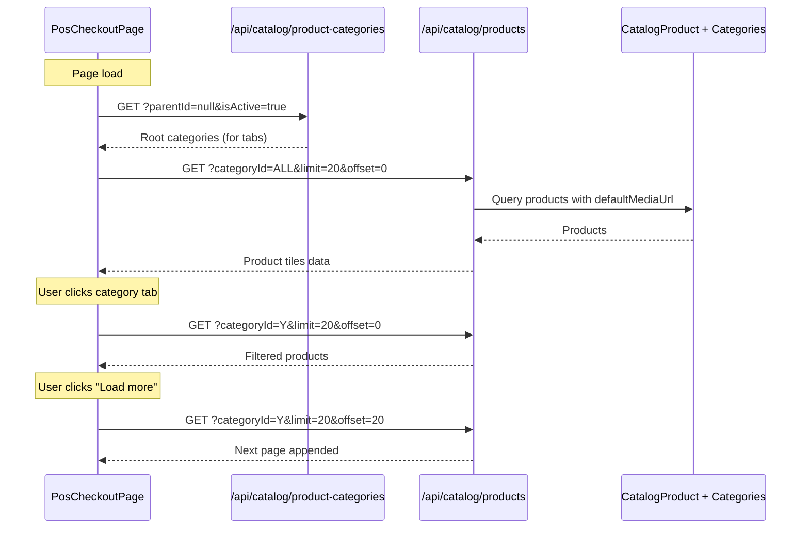

# POS Tile-Based Product Browsing (SPEC-022a)

**Parent**: [SPEC-022 - POS Module](./SPEC-022-2026-02-07-pos-module.md)  
**Date**: 2026-02-09  
**Status**: Proposed  
**PR Feedback**: [#512 Comment by @pkarw](https://github.com/open-mercato/open-mercato/pull/512#discussion_r2778593054)

---

## 1) Problem Statement

The current SPEC-016 defines a search-based product selection UI. For retail/restaurant POS, users need:
- **Visual product browsing** with images (faster than typing)
- **Category navigation** for quick filtering
- **Touch-friendly tiles** for tablet/touchscreen use

---

## 2) Goals (Phase 1)

- Display products as clickable tiles with images
- Provide category tabs using existing `CatalogProductCategory`
- Support barcode scan AND visual selection
- Lazy-load products for performance ("Search more" pattern)

---

## 3) Non-Goals

| Feature | Phase | Notes |
|---------|-------|-------|
| Dedicated `PosProductCategory` entity | N/A | Use `CatalogProductCategory` instead |
| `restrictedCategoryIds` per register | Phase 3 | Advanced configuration |
| Favorites/Quick Keys configuration | Phase 2 | Requires settings UI |

---

## 4) Reference: Odoo POS

Based on [Odoo POS Documentation](https://www.odoo.com/documentation/19.0/applications/sales/point_of_sale/configuration.html):

- **PoS Product Categories** - hierarchical, separate from eCommerce
- **Category restriction per register** - limits visible categories
- **Product tiles** - click to add, images, limited load

**Open Mercato Advantage:** `CatalogProductCategory` already supports:
- Full tree hierarchy (`parentId`, `rootId`, `depth`, `treePath`)
- Cached traversal (`ancestorIds`, `childIds`, `descendantIds`)
- Many-to-many product assignments

---

## 5) UI Design

### 5.1 Updated Checkout Layout

```
┌─────────────────────────────────────────────────────────────────────┐
│  [Session: Register 1 - John D.]                    [Close Session] │
├─────────────────────────────────────┬───────────────────────────────┤
│                                     │                               │
│  🔍 [Search / Scan barcode...]      │   Cart Summary                │
│                                     │   ─────────────               │
│  ┌─────────────────────────────┐    │   Item 1         $12.00      │
│  │ [All] [Drinks] [Food] [+]   │    │   Item 2          $8.50      │
│  │ ─────────────────────────── │    │   ─────────────               │
│  │ ┌─────┐ ┌─────┐ ┌─────┐    │    │   Subtotal       $20.50      │
│  │ │ 🥤  │ │ 🍕  │ │ 🍔  │    │    │   Tax (10%)       $2.05      │
│  │ │Cola │ │Pizza│ │Burger│   │    │   ─────────────               │
│  │ │$2.50│ │$8.00│ │$6.50│    │    │   TOTAL          $22.55      │
│  │ └─────┘ └─────┘ └─────┘    │    │                               │
│  │ ┌─────┐ ┌─────┐ ┌─────┐    │    │   [Pay Cash] [Pay Card]       │
│  │ │ 🍟  │ │ 🥗  │ │ ☕  │    │    │                               │
│  │ │Fries│ │Salad│ │Coffee│   │    │                               │
│  │ │$3.00│ │$7.50│ │$2.00│    │    │                               │
│  │ └─────┘ └─────┘ └─────┘    │    │                               │
│  │                             │    │                               │
│  │ [Load more...]              │    │                               │
│  └─────────────────────────────┘    │                               │
├─────────────────────────────────────┴───────────────────────────────┤
│  [Abandon Cart]                                      [Price Override]│
└─────────────────────────────────────────────────────────────────────┘
```

### 5.2 Components

| Component | Description |
|-----------|-------------|
| `PosCategoryTabs` | Horizontal scrollable tabs showing root categories. Fetched via `GET /api/catalog/product-categories?parentId=null&isActive=true` on page load. |
| `PosProductGrid` | Tile grid with lazy loading via "Load more" button |
| `PosProductTile` | Single product tile (image, name, price). Shows **default variant's gross price**. Multi-variant products open variant selector on click. |
| `PosLoadMore` | "Load more" button (Phase 1). Infinite scroll deferred to Phase 2. |

---

## 6) Data Flow



---

## 7) API Requirements

### Existing Catalog API (reuse)

```
GET /api/catalog/products
  ?organizationId=...
  &tenantId=...
  &categoryId=<uuid>              # Filter by category
  &isActive=true
  &limit=20
  &offset=0
  &fields=id,title,defaultMediaUrl,variants.prices
```

### New Endpoint (optional optimization)

```
GET /api/pos/products
  ?registerId=<uuid>              # For future restrictedCategoryIds
  &categoryId=<uuid>
  &search=<text>
  &limit=20
```

**Phase 1:** Use existing Catalog API  
**Phase 3:** Add `/api/pos/products` with register-specific filtering

---

## 8) Implementation Checklist

- [ ] Create `PosCategoryTabs` component
- [ ] Create `PosProductGrid` component  
- [ ] Create `PosProductTile` component
- [ ] Integrate with Catalog API for product fetch
- [ ] Add category filtering to checkout page
- [ ] Implement lazy loading / pagination
- [ ] Update SPEC-022 UI section to reference this spec

---

## Changelog

### 2026-02-10
- Specified variant pricing strategy: tile shows default variant's gross price
- Clarified category tabs data flow: root categories fetched on page load
- Chose "Load more" button for Phase 1 (infinite scroll deferred to Phase 2)
- Expanded data flow diagram with category fetch and pagination

### 2026-02-09
- Initial sub-specification based on @pkarw PR feedback
- Decided to use existing `CatalogProductCategory` instead of new entity
- Deferred `restrictedCategoryIds` to Phase 3
