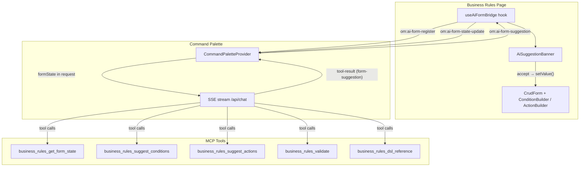

# SPEC-025: AI-Assisted Business Rule Editing

## TLDR

**Key Points:**
- Adds bidirectional AI-to-form communication so the AI assistant can read and suggest changes to business rule conditions and actions
- Introduces a generic **AI Form Bridge** (reusable for future modules) and 5 **MCP tools** specific to the business rules DSL

**Scope:**
- MCP tools for reading form state, suggesting conditions/actions, validating DSL, and providing DSL reference
- Generic `useAiFormBridge` hook and `AiSuggestionBanner` component in `ai-assistant`
- Integration into business rules create/edit pages

**Concerns:**
- AI may generate invalid DSL JSON — mitigated by server-side validation before suggestions reach the frontend
- Form state staleness when user edits while AI generates — mitigated by snapshot comparison and stale warning

## Overview

Business rules in Open Mercato have a complex condition expression DSL (recursive AND/OR/NOT trees with 18 operators, field-to-field comparison, template values) and 10 action types with type-specific config. Building these manually through the ConditionBuilder and ActionBuilder UI is powerful but requires deep DSL knowledge.

The AI assistant currently has **zero infrastructure** for modifying page UI state. It operates server-centrically (AI → API → DB → UI refresh). There is no form state bridge, no suggestion/preview/accept pattern, and no bidirectional communication between the AI chat and page forms.

This spec introduces:
1. A generic **AI Form Bridge** for bidirectional communication between AI assistant and page forms
2. **Business-rules-specific MCP tools** that give the AI deep knowledge of the condition/action DSL

> **Market Reference**: Salesforce Flow Builder's AI-assisted condition generation and HubSpot's workflow AI assist were studied. Both use a "suggest-then-accept" pattern where the AI proposes structured changes and the user reviews before applying. We adopt this suggest/accept/reject pattern. We reject Salesforce's approach of auto-applying changes without preview — explicit user consent is critical for complex business logic.

### Decisions

| Decision | Choice | Rationale |
|----------|--------|-----------|
| Scope | Generic form bridge in `ai-assistant` + specific tools in `business_rules` | Bridge is reusable; DSL knowledge is module-specific |
| Edit scope | Conditions + Actions only (basic info stays manual) | Basic fields (name, description) are simple enough to edit directly |
| Accept/reject UX | Per section (conditions, success actions, failure actions independently) | Granular control — user may accept conditions but reject actions |
| Tool naming | Underscore notation (`business_rules_suggest_conditions`) | MCP tool names must match `^[a-zA-Z0-9_-]{1,128}$` — dots not allowed |

## Problem Statement

1. **High learning curve**: Users must understand the condition DSL (18 operators, group logic, template variables, field-to-field comparison) and 10 action types with type-specific configuration. This creates a barrier for non-technical users like sales managers.
2. **No AI-to-form bridge**: The AI assistant can query data and execute API calls but cannot read or modify the state of an open form. This makes it impossible for the AI to assist with complex form builders.
3. **Error-prone manual entry**: Complex nested condition trees are difficult to construct manually, leading to logic errors that are only caught at execution time.

## User Stories

- **A sales manager** wants to describe a business rule in natural language (e.g., "block orders over $10,000 from non-VIP customers") so that the AI generates the correct condition tree without needing to learn the DSL.
- **A compliance officer** wants to ask the AI to add notification actions to existing rules so that alerts are properly configured without navigating complex action forms.
- **A developer** wants to validate a hand-built condition expression via the AI so that logic errors are caught before saving.
- **A business analyst** wants to ask the AI to explain available operators and template variables so they can understand what's possible before building a rule.

## Architecture



### Communication Flow

1. **Page registers form state**: `useAiFormBridge` dispatches `om:ai-form-register` with form values getter
2. **CommandPaletteProvider captures**: Stores form state ref, includes it in chat request as `formState`
3. **Chat route passes context**: Form state travels as part of message context to OpenCode
4. **AI reads state**: Calls `business_rules_get_form_state` which reads from `ctx.formState`
5. **AI generates suggestion**: Constructs condition/action JSON, validates via `business_rules_suggest_conditions`/`business_rules_suggest_actions`
6. **Tool result flows back**: SSE `tool-result` event contains `{ type: 'form-suggestion', sections: [...] }`
7. **Frontend dispatches**: `useCommandPalette` detects form-suggestion results, dispatches `om:ai-form-suggestion`
8. **Page shows banner**: `useAiFormBridge` receives suggestion, `AiSuggestionBanner` renders with diff + accept/reject
9. **User accepts**: Banner calls `setValue()` on CrudForm, ConditionBuilder/ActionBuilder re-render

## Data Models

No new database entities. This feature operates entirely on in-memory form state and the existing business rules schema.

### Form State Shape (transmitted via CustomEvent)

```typescript
import type { JsonValue } from '@open-mercato/shared/lib/types'

interface AiFormState {
  formId: string               // unique identifier for form instance (UUID)
  formType: string             // e.g., 'business_rules'
  sections: AiFormSection[]    // form sections available for AI editing
  values: Record<string, JsonValue>  // current form values
  metadata?: Record<string, JsonValue> // additional context (e.g., rule type, entity type)
}

interface AiFormSection {
  sectionId: string            // e.g., 'conditionExpression', 'successActions'
  label: string                // human-readable section name
  type: 'json' | 'array'      // for diff rendering
  editable: boolean            // whether AI can suggest changes
}
```

### Suggestion Shape (transmitted via CustomEvent)

```typescript
interface AiFormSuggestion {
  formId: string
  sections: AiFormSectionSuggestion[]
  stateSnapshot: Record<string, JsonValue>  // form values at time of generation (for stale detection)
}

interface AiFormSectionSuggestion {
  sectionId: string
  value: JsonValue             // proposed new value (GroupCondition or Action[] for business rules)
  previousValue: JsonValue     // value before suggestion (for undo-accept)
  explanation: string          // AI explanation of the change
  mode: 'replace' | 'append' | 'modify'
}
```

## API Contracts

### MCP Tool: business_rules_get_form_state

- **Input**: `z.object({})` (empty — reads from chat context `ctx.formState`)
- **Output**: Current form values (conditionExpression, successActions, failureActions, metadata)
- **Features**: `business_rules.view`
- **Errors**: Returns `{ error: 'no_form_state' }` if no business rule form is open

### MCP Tool: business_rules_suggest_conditions

- **Input**: `z.object({ description: z.string(), currentConditions: groupConditionSchema.optional(), mode: z.enum(['replace', 'append', 'modify']) })`
- **Output**: `{ type: 'form-suggestion', sections: [{ sectionId: 'conditionExpression', value: GroupCondition, explanation: string }] }`
- **Validation**: Uses existing `validateConditionExpressionForApi` + `isSafeExpression`
- **Features**: `business_rules.manage`
- **Errors**: Returns `{ error: 'validation_failed', details: string[] }` if generated conditions are invalid

### MCP Tool: business_rules_suggest_actions

- **Input**: `z.object({ description: z.string(), currentActions: z.array(actionSchema).optional(), actionTarget: z.enum(['success', 'failure']), mode: z.enum(['replace', 'append']) })`
- **Output**: `{ type: 'form-suggestion', sections: [{ sectionId: 'successActions'|'failureActions', value: Action[], explanation: string }] }`
- **Validation**: Uses existing `validateActionsForApi`
- **Features**: `business_rules.manage`
- **Errors**: Returns `{ error: 'validation_failed', details: string[] }` if generated actions are invalid

### MCP Tool: business_rules_validate

- **Input**: `z.object({ conditionExpression: groupConditionSchema.optional(), actions: z.array(actionSchema).optional() })`
- **Output**: `{ valid: boolean, errors: string[] }`
- **Features**: `business_rules.view`

### MCP Tool: business_rules_dsl_reference

- **Input**: `z.object({ topic: z.enum(['operators', 'templates', 'actions', 'limits', 'examples', 'all']).optional() })`
- **Output**: Structured documentation object with DSL syntax reference
- **Features**: `business_rules.view`

### No REST API Changes

All communication is via:
- CustomEvents (browser-level, same-origin): `om:ai-form-register`, `om:ai-form-state-update`, `om:ai-form-suggestion`
- Existing `/api/chat` SSE stream (formState added to message context payload)

## Internationalization (i18n)

Translation keys needed (under `ai_assistant.form_bridge.*`):

| Key | Default (en) |
|-----|-------------|
| `ai_assistant.form_bridge.suggestion_title` | AI Suggestion |
| `ai_assistant.form_bridge.accept` | Accept |
| `ai_assistant.form_bridge.reject` | Reject |
| `ai_assistant.form_bridge.undo_accept` | Undo |
| `ai_assistant.form_bridge.preview_diff` | Preview changes |
| `ai_assistant.form_bridge.hide_diff` | Hide changes |
| `ai_assistant.form_bridge.stale_warning` | Form was modified since this suggestion was generated |
| `ai_assistant.form_bridge.generating` | AI is generating a suggestion... |
| `ai_assistant.form_bridge.ai_connected` | AI-connected |
| `ai_assistant.form_bridge.accept_shortcut` | Cmd+Enter to accept |
| `ai_assistant.form_bridge.reject_shortcut` | Escape to reject |
| `ai_assistant.form_bridge.section_conditions` | Conditions |
| `ai_assistant.form_bridge.section_success_actions` | Success Actions |
| `ai_assistant.form_bridge.section_failure_actions` | Failure Actions |

## UI/UX

### AiSuggestionBanner

- Renders above each form section that has a pending suggestion
- Shows: explanation text, "Accept" button, "Reject" button, "Preview diff" toggle
- Shows "Undo" button for 5 seconds after accept (restores `previousValue`)
- Keyboard: `Cmd/Ctrl+Enter` to accept, `Escape` to reject
- Styling: bordered card with accent color, subtle animation on appear
- Dismisses automatically on accept/reject
- Stale warning: if form values differ from `stateSnapshot`, shows warning badge

### AiSuggestionDiff

- JSON tree diff visualization for conditions and actions
- Red/green highlighting for removed/added nodes
- Collapsed by default, toggled via "Preview diff" button in banner

### Form Integration

- `useAiFormBridge` injects a subtle indicator showing "AI-connected" when the chat is open
- ConditionBuilder/ActionBuilder get a CSS class `ai-suggestion-pending` when a suggestion exists (optional visual highlight)
- On accept: immediate form update via `setValue()`, banner shows "Undo" for 5s, then dismisses
- On reject: banner dismisses, no form change

## Configuration

No new environment variables or feature flags. The feature is gated by existing `business_rules.view`/`business_rules.manage` RBAC features and AI assistant availability.

## Phasing

### Phase 1: MCP Tools + DSL Reference (server-side, no UI)
1. Create `business_rules/ai-tools.ts` with 5 tools using underscore naming convention
2. Create `business_rules/lib/dsl-reference.ts` with structured DSL documentation
3. Run `npm run modules:prepare` to register tools
- **Testable**: AI can describe DSL syntax and generate valid JSON in chat text

### Phase 2: Form Bridge Infrastructure (generic plumbing)
1. Create `useAiFormBridge` hook in `packages/ai-assistant/src/frontend/hooks/`
2. Extend `CommandPaletteProvider` to listen for form-register events
3. Extend `startAgenticChat`/`sendAgenticMessage` to include `formState` in request
4. Extend chat route to pass formState as context in the message
5. Add `form-suggestion` detection in SSE event handler
- **Testable**: Console shows form state being sent to AI, tool results recognized

### Phase 3: Suggestion UI + Stale Detection (frontend components)
1. Create `AiSuggestionBanner` component with accept/reject/undo-accept
2. Create `AiSuggestionDiff` component (JSON tree diff for conditions/actions)
3. Integrate `useAiFormBridge` into business_rules create/edit pages
4. Wire accept/reject to CrudForm setValue, store `previousValue` for undo-accept
5. Add stale-state detection: snapshot form values when chat message sent, compare on suggestion arrival
6. Add i18n keys for suggestion UI strings
7. Add keyboard shortcuts (Cmd+Enter accept, Escape reject)
- **Testable**: Full loop — ask AI, see suggestion banner, accept, form updates. Stale warning appears if form modified during generation.

### Phase 4: Polish + Edge Cases
1. Handle concurrent suggestions (new replaces pending)
2. Loading state while AI generates
3. Error handling for invalid AI output
4. Tests for MCP tools and form bridge

## Files to Create

| File | Package | Purpose |
|------|---------|---------|
| `ai-tools.ts` | `packages/core/src/modules/business_rules/` | 5 MCP tools for AI-assisted editing |
| `lib/dsl-reference.ts` | `packages/core/src/modules/business_rules/` | Structured DSL docs for AI |
| `hooks/useAiFormBridge.ts` | `packages/ai-assistant/src/frontend/` | Generic form state bridge |
| `components/AiSuggestionBanner.tsx` | `packages/ai-assistant/src/frontend/` | Per-section accept/reject UI |
| `components/AiSuggestionDiff.tsx` | `packages/ai-assistant/src/frontend/` | JSON tree diff visualization |

## Files to Modify

| File | Change |
|------|--------|
| `packages/ai-assistant/src/frontend/components/CommandPalette/CommandPaletteProvider.tsx` | Listen for `om:ai-form-register`, track form state |
| `packages/ai-assistant/src/frontend/hooks/useCommandPalette.ts` | Include `formState` in chat request, detect form-suggestion tool results |
| `packages/ai-assistant/src/modules/ai_assistant/api/chat/route.ts` | Thread formState into message context |
| `packages/core/src/modules/business_rules/backend/rules/create/page.tsx` | Wire `useAiFormBridge` + `AiSuggestionBanner` |
| `packages/core/src/modules/business_rules/backend/rules/[id]/page.tsx` | Wire `useAiFormBridge` + `AiSuggestionBanner` |
| `packages/core/src/modules/business_rules/components/formConfig.tsx` | Add `ai-suggestion-pending` CSS class support |

## Testing Strategy

- **Unit tests**: MCP tool handlers — verify `business_rules_validate` correctly validates/rejects condition trees and actions
- **Unit tests**: `dsl-reference.ts` — verify structured output for each topic
- **Unit tests**: `useAiFormBridge` — verify event dispatch/listen lifecycle, stale detection logic
- **Integration tests**: Full suggest-accept flow with mocked SSE stream

## Risks & Impact Review

### CustomEvent Dispatch Across Component Trees

- **Scenario**: `useAiFormBridge` dispatches CustomEvents on `window`. If multiple business rule forms are open in different tabs, events could leak across tabs. Within the same tab, multiple forms (unlikely but possible via modals) would conflict.
- **Severity**: Low
- **Affected area**: Form bridge, suggestion routing
- **Mitigation**: Each form instance generates a unique `formId` (UUID). All events carry `formId` and listeners filter by it. CustomEvents are scoped to the same browser origin and tab — no cross-tab leakage with standard CustomEvent.
- **Residual risk**: If two forms with same `formId` exist (impossible with UUID), suggestions could mis-route. Acceptable given UUID collision probability.

### AI Generates Invalid Condition/Action JSON

- **Scenario**: The AI constructs a condition tree or action array that doesn't conform to the DSL schema, causing form corruption if accepted.
- **Severity**: High
- **Affected area**: ConditionBuilder, ActionBuilder, form state
- **Mitigation**: All suggestions are validated server-side via existing `validateConditionExpressionForApi`, `validateActionsForApi`, and `isSafeExpression` before being returned as tool results. Invalid suggestions return an error, never a `form-suggestion` result. Client-side also performs a defensive validation before applying.
- **Residual risk**: Validators themselves may have gaps (e.g., new operators not covered). Acceptable — same risk exists for manual form submission.

### Form State Staleness

- **Scenario**: User modifies the form while AI is generating a suggestion. The suggestion is based on stale state and may conflict with user's manual changes.
- **Severity**: Medium
- **Affected area**: Form state consistency, user experience
- **Mitigation**: Phase 3 includes stale-state detection. The `useAiFormBridge` hook snapshots form values when the chat message is sent. When a suggestion arrives, it compares the snapshot (carried in `AiFormSuggestion.stateSnapshot`) to current form values. If different, a warning badge appears on the banner: "Form was modified since this suggestion was generated."
- **Residual risk**: User may accept a stale suggestion anyway, overwriting their manual changes. Mitigated by the undo-accept button (5s window to restore `previousValue`). The accept action replaces only the specific section (conditions or actions), not the entire form.

### Large Form State in Chat Payload

- **Scenario**: Business rules with deeply nested condition trees or many actions could produce large JSON payloads in the chat request.
- **Severity**: Low
- **Affected area**: Chat API payload size, SSE stream performance
- **Mitigation**: Existing condition expression depth limit (10 levels) and action count limits bound the maximum payload size. A typical complex rule produces ~5KB of JSON. The form state is included in the existing chat message body, not as a separate request.
- **Residual risk**: Extremely complex rules with many string-heavy conditions could approach 50KB. Acceptable for a single chat request.

### Tenant Isolation

- **Scenario**: Form state contains tenant-specific business rule data sent to the AI chat API.
- **Severity**: Medium
- **Affected area**: Data isolation
- **Mitigation**: Form state travels through the same authenticated `/api/chat` endpoint that already enforces tenant isolation via session. The AI tools (`business_rules_get_form_state`, etc.) use `ctx.formState` which is scoped to the requesting user's session. No cross-tenant data exposure — form state never touches the database or shared cache.
- **Residual risk**: None beyond existing AI chat endpoint risks.

### No Database Writes — No Migration Risk

- **Scenario**: N/A — this feature does not add database entities or migrations.
- **Severity**: N/A
- **Mitigation**: N/A
- **Residual risk**: None.

## Verification

1. Open business rules create page
2. Open AI chat (Cmd+J)
3. Type: "Create a guard rule that blocks orders over $10,000 from non-VIP customers"
4. AI reads current form state, generates condition tree, calls `business_rules_suggest_conditions` tool
5. Suggestion banner appears above ConditionBuilder with diff preview
6. Click "Accept" — ConditionBuilder updates to show the new condition tree
7. Click "Undo" within 5s — ConditionBuilder reverts to previous state
8. Re-accept, then type: "Add a success action to send email notification to compliance@company.com"
9. AI calls `business_rules_suggest_actions`, banner appears above success actions
10. Click "Accept" — ActionBuilder shows new NOTIFY action
11. Save the form — all validations pass

## Changelog

### 2026-02-12 (phase 4 implementation)
- Added concurrent suggestion handling: `AiSuggestionBanner` clears undo state and diff view when a new suggestion replaces the current one
- Added loading state: `useAiFormBridge` tracks `generatingSections` via `om:ai-form-generating` CustomEvent; `useCommandPalette` dispatches generating events on `tool-call` for `business_rules_suggest_*` tools, clears on `done`/`error`
- Added `isGenerating` prop to `AiSuggestionBanner` with animated loading indicator (Loader2 spinner)
- Added error handling: section validation in `tool-result` SSE handler (checks `sectionId` string + `value` presence); try-catch in `useAiFormBridge` suggestion handler; generating state cleared on error/done events
- Created `dsl-reference.test.ts` (12 tests): topic selection, all operators/actions documented, example completeness
- Created `ai-tools.test.ts` (25 tests): all 5 tools export, validation, form-suggestion structure, safety limits, RBAC features
- All 343 business_rules tests pass (16 suites)

### 2026-02-12 (phase 3 implementation)
- Created `AiSuggestionBanner` component with accept/reject/undo-accept, diff toggle, stale warning, keyboard shortcuts (Cmd+Enter/Escape)
- Created `AiSuggestionDiff` component for JSON tree diff visualization (red/green line-level diff)
- Updated `useAiFormBridge` hook with stale detection via `stateSnapshot` comparison and `getSuggestionSection`/`isSectionStale` helpers
- Updated `formConfig.tsx` with `SuggestionBannerRenderer` render prop pattern to avoid core→ai-assistant dependency; separate success/failure action wrappers
- Integrated `useAiFormBridge` + `AiSuggestionBanner` into both create and edit pages via `renderSuggestionBanner` callback
- Added 14 i18n keys under `ai_assistant.form_bridge.*` namespace
- Exported `AiSuggestionBanner`, `AiSuggestionDiff` from ai-assistant frontend

### 2026-02-12 (phase 2 implementation)
- Created `useAiFormBridge` hook with CustomEvent-based registration and suggestion handling
- Extended `CommandPaletteProvider` to listen for `om:ai-form-register`/`om:ai-form-unregister` events
- Extended `useCommandPalette` to include `formState` in request body and detect `form-suggestion` in `tool-result` SSE events
- Extended chat route to extract `formState` from body and inject as `[FORM_STATE: {...}]` in message context
- Added `AiFormSuggestion`, `AiFormSuggestionSection`, `AiFormRegistration` types

### 2026-02-12 (phase 1 implementation)
- Implemented Phase 1: created `ai-tools.ts` (5 MCP tools) and `lib/dsl-reference.ts`
- Corrected tool naming: dot notation is invalid for MCP names (`^[a-zA-Z0-9_-]{1,128}$`), switched to underscore notation
- Verified generator discovers tools and build succeeds

### 2026-02-12 (review)
- Added TLDR, Problem Statement, User Stories sections
- Added Market Reference (Salesforce Flow Builder, HubSpot)
- Fixed ACL features: `business_rules.create`/`business_rules.edit` → `business_rules.manage` (matches actual `acl.ts`)
- Fixed tool naming: underscore → dot notation (`business_rules_suggest_conditions`)
- Fixed `any` types: `value: any` → `value: JsonValue`, `values: Record<string, any>` → `Record<string, JsonValue>`
- Added `previousValue` and `stateSnapshot` to suggestion shape for undo-accept and stale detection
- Moved stale-state detection from Phase 4 to Phase 3
- Added undo-accept (5s window) to suggestion banner
- Added i18n section with 14 translation keys
- Added Testing Strategy section
- Added `formConfig.tsx` to Files to Modify table

### 2026-02-12
- Initial specification
