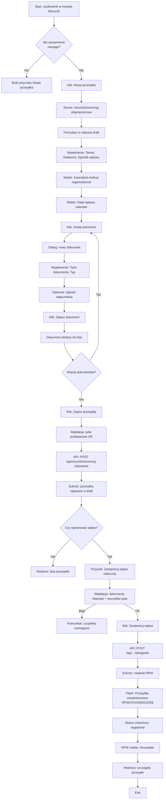
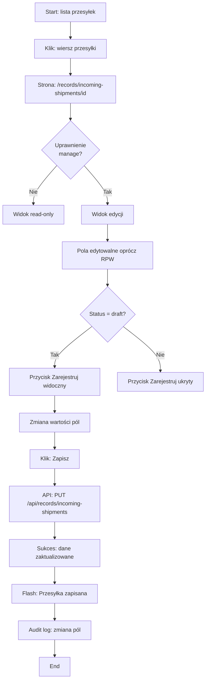
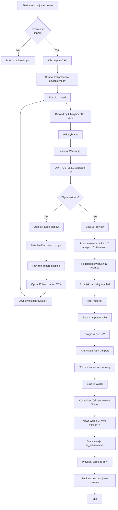
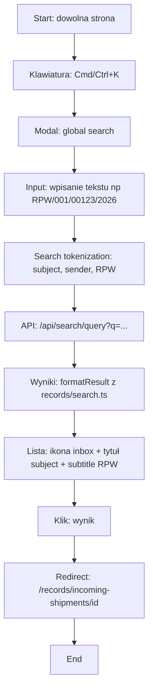

# Analiza wdrożeniowa: Records (Przesyłka wpływająca / RPW / JRWA)

## Changelog
- **2026-02-10 (v8)**: Dodano scenariusz pobierania przesyłek zewnętrznych z systemów kancelaryjnych (EZD RP/eSODOK) oraz pola `external_rpw_number` i `external_document_ids` do obsługi synchronizacji zwrotnej.
- **2026-01-26 (v7)**: Dodano obsługę feature toggles dla wszystkich modułów (records, correspondence_sources). Wprowadzono mechanizm włączania/wyłączania funkcjonalności na poziomie konfiguracji globalnej i per-tenant. Zaktualizowano dokumentację użytkownika o instrukcje aktywacji modułów.
- **2026-01-26 (v6)**: Rozszerzono sekcję integracji z `correspondence_sources` o kluczowe ustalenia biznesowe: automatyczne tworzenie przesyłek w draft, mapowanie nadawców z normalizacją identyfikatorów, obsługa załączników jako records_documents, dwutorowa synchronizacja (manual + scheduled co 15 min), automatyczne wysyłanie UPD.
- **2026-01-26 (v5)**: Dodano sekcję integracji z modułem `correspondence_sources` w "Stan implementacji". Zlinkowano dokumentację integracji eDoreczenia. Uspójniono opis pola `delivery_method` z implementacją automatycznego pobierania korespondencji.
- **2026-01-26 (v4)**: Aktualizacja odpowiedzi backlog Q4 – doprecyzowano Q4-DOC-002 (brakowanie jako osobny status, nie tylko soft-delete), potwierdzono format RPW jako narzucony w MVP, potwierdzono `docs/docs` jako kanoniczną strukturę dokumentacji.
- **2026-01-25 (v3)**: Dodano sekcję "Stan implementacji" oraz szczegółowe ustalenia dot. wzorców UI/UX z analizy istniejących modułów (sales, catalog, customers). Rozszerzono dokumentację o konkretne przykłady komponentów i konwencje architektoniczne.
- **2026-01-25 (v2)**: Zamknięcie backlogu Q3 – rozstrzygnięto kluczowe pytania (Q3-DOC-001/002/003, Q3-ACL-001/002, Q3-RPW-002/003, Q3-VAL-001/002/003, Q3-JRWA-001/002/003, Q3-INT-001/002, Q3-PERF-002). Decyzje włączone do opisu w sekcjach 5–12. Utworzony nowy backlog Q4 (pytania pozostałe i wynikające z Q3).
- **2026-01-26 (v1)**: Zamknięcie backlogu Q2 – wszystkie 9 pytań rozstrzygnięte (Q2-RPW-001/002/003, Q2-SHIP-001/002, Q2-JRWA-001/002, Q2-UI-001, Q2-SEARCH-001). Decyzje włączone do opisu w sekcjach 5–12. Utworzony backlog Q3 (30 pytań).
- **[wcześniej]**: Wersja wstępna dokumentu z backlogiem Q2.

---

## 1) Cel dokumentu
Ten dokument zbiera:
- zakres MVP i plan wdrożenia pierwszego wycinka modułu `records`,
- założenia architektoniczne i techniczne (zgodne z konwencjami repozytorium),
- propozycję modelu danych + API,
- listę **wątpliwości / pytań** (backlog decyzyjny), które będziemy rozstrzygać po kolei.

Dokument jest celowo „wdrożeniowy”: ma umożliwić przejście od opisu procesu (EZD) do implementacji w Open Mercato, z minimalnym ryzykiem przebudowy.

---

<a id="kontekst-domenowy"></a>
## 2) Kontekst domenowy (skrót)

:::info Powiązane dokumenty
- **Obiekt domenowy**: [Przesyłka wpływająca](../obszary/archiwalno-kancelaryjne/obiekty/przesylka-wplywajaca)
- **Operacja**: [Rejestracja przesyłki wpływającej](../obszary/archiwalno-kancelaryjne/czynnosci/rejestracja-przesylki-wplywajacej)
- **Słownik danych**: [Data Dictionary (MVP)](../mapping/openmercato-ezd/data-dictionary#przesyłka-wpływająca-incoming-shipment)
- **Mapowanie API**: [API Map - Incoming Shipments](../mapping/openmercato-ezd/api-map#proponowane-zasoby)

**Struktura dokumentacji**: Kanoniczna lokalizacja dokumentacji to `docs/docs` (nie `docs/`). Wszystkie ścieżki w referencjach zakładają ten katalog jako bazowy.
:::
W oparciu o dostarczone materiały:
- implementację zaczynamy od „Przesyłki wpływającej” (rejestracja wpływu),
- numer RPW jest związany z rejestracją przesyłki (docelowo generator numerów),
- JRWA to klasyfikacja rzeczowa (drzewo klas + retencja), wykorzystywana później m.in. do spraw/dokumentów.

---

## 3) Zakres MVP
### 3.1 Co wchodzi
1) **Moduł `records`** w `packages/core/src/modules/records`.
2) Encje (początkowo minimalne):
   - `records_incoming_shipments` (Przesyłka wpływająca)
   - `records_jrwa_classes` (JRWA)
3) Walidatory Zod:
   - create/update dla obu encji,
   - schemat query listy (paginacja + wyszukiwanie).
4) CRUD API (Next/route):
   - `GET/POST/PUT/DELETE` dla `incoming-shipments`
   - `GET/POST/PUT/DELETE` dla `jrwa-classes`
5) OpenAPI:
   - każdy route eksportuje `openApi` (wymóg repo),
   - modułowy helper `api/openapi.ts`.
6) `di.ts` (nawet jeśli na razie pusty rejestrator).
7) Minimalne `search.ts`:
   - `formatResult` dla obu encji, aby wyniki Cmd+K nie pokazywały gołych UUID.

### 3.2 Co nie wchodzi (na tym etapie)
- generowanie migracji i finalizacja schematu SQL (dopiero po zatwierdzeniu pól + indeksów),
- pełna logika numeracji RPW (generator + sekwencje + konfiguracja),
- encje „kancelaria/office” jako osobny byt w `records` (kancelaria = komórka organizacyjna w strukturze organizacyjnej),
- sprawy i dokumenty (case/document), relacje i workflow.

---

## 4) Ograniczenia i zasady architektoniczne (z repo)
- Moduły muszą być **izomorficzne** i niezależne: brak relacji ORM między modułami (tylko FK jako `*_id`).
- Multi-tenant: wszystkie rekordy tenant-scoped muszą mieć `tenant_id` i (zwykle) `organization_id`.
- Walidacja wejść: Zod (bez ręcznego SQL, bez interpolacji).
- API: CRUD przez `makeCrudRoute`, OpenAPI przez `createCrudOpenApiFactory`.
- Search: dla encji używanych w Cmd+K wymagany `formatResult`.

---

<a id="model-danych"></a>
## 5) Proponowany model danych (draft)
<a id="incoming-shipments"></a>
### 5.1 `records_incoming_shipments`

:::note Single Source of Truth
Pełny opis obiektu domenowego i jego metadanych znajduje się w:
- [Przesyłka wpływająca - obiekt domenowy](../obszary/archiwalno-kancelaryjne/obiekty/przesylka-wplywajaca)
- [Słownik danych - Przesyłka wpływająca](../mapping/openmercato-ezd/data-dictionary#przesyłka-wpływająca-incoming-shipment)
:::
Minimalny zestaw pól (MVP):
- `id: uuid`
- `tenant_id: uuid`
- `organization_id: uuid`
- `receiving_org_unit_id: uuid` – ID komórki organizacyjnej (kancelarii) ze struktury organizacyjnej
- `receiving_org_unit_symbol: text` – **symbol komórki organizacyjnej** (snapshot na przesyłce; używany jako `kanc_id` w RPW; decyzja Q2-RPW-001)
- `subject: text` – temat (wymagane)
- `sender_id: uuid|null` – ID nadawcy (referencja do modułu customers; opcjonalne)
- `sender_display_name: text|null` – nazwa nadawcy (wymagane jeśli brak `sender_id`)
- `sender_anonymous: boolean` – czy nadawca anonimowy (default: `false`)
  - **Zasada**: wymagane jest `sender_id` LUB `sender_display_name` (co najmniej jedno)
- `delivery_method: text` – typ/sposób wpływu (wymagane; np. papier/ePUAP/e-mail). **Przy automatycznym pobieraniu korespondencji** wartość ustawiana automatycznie na typ źródła (np. "edoreczenia-mock", "epuap", "ezdrp", "esodok") przez moduł `correspondence_sources`. Zobacz: [Integracja eDoreczenia](/docs/integracje/edoreczenia/implementation#integration-with-records-module)
- `status: text` – `draft` | `registered` (wymagane; default: `draft`)
- `received_at: timestamptz|null` – data wpływu (wymagane najpóźniej na etapie rejestracji)
- `rpw_number: text|null` – numer RPW (nullable w `draft`, ustawiany wyłącznie w akcji „Zarejestruj wpływ”)
- `external_rpw_number: text|null` – obcy numer RPW z systemu kancelaryjnego (np. EZD RP/eSODOK), przekazywany przy imporcie dla synchronizacji zwrotnej
- `external_document_ids: text[]` – techniczne identyfikatory dokumentów/plików w systemie źródłowym (np. GUID/ID pliku); domyślnie `[]`
- `attachment_ids: uuid[]` – **powiązane załączniki** (relacja do `attachments`; default: `[]`)
  - **Phase 1 (obecna implementacja)**: Przesyłka bezpośrednio referencjonuje załączniki z modułu `attachments`
  - **Phase 2 (planowana)**: Model zostanie rozszerzony do `document_ids` (relacja do `records.documents`, które same mają `attachment_ids`)
  - Zobacz: [Integracja eDoreczenia - Phase 2](/docs/integracje/edoreczenia/implementation#future-enhancements) - obsługa dokumentów jest w fazie planowania
  - W Phase 1: pole pozostaje puste (`[]`) - dokumenty są referencjonowane w polu `remarks` jako tekst
  - W Phase 2: wymagane będzie co najmniej 1 dokument (decyzja Q2-SHIP-001, Q2-SHIP-002)
- `is_active: boolean`
- `created_at`, `updated_at`, `deleted_at`

**Integracja z zewnętrznym systemem kancelaryjnym (EZD RP/eSODOK)**:
- Przesyłka może zostać pobrana już po rejestracji w systemie źródłowym, dlatego `external_rpw_number` przechowuje numer RPW z tamtego systemu.
- `external_document_ids` zapisuje techniczne identyfikatory dokumentów/plików źródłowych, aby umożliwić późniejszą synchronizację zwrotną.
- W tych przypadkach `delivery_method` wskazuje system źródłowy (np. `ezdrp`, `esodok`).

Proponowane indeksy (docelowo):
- `(tenant_id, organization_id)`
- `(tenant_id, organization_id, rpw_number)` – unikalność numeru w scope organizacji
- `(tenant_id, organization_id, receiving_org_unit_id)`

**Generator RPW** (decyzje Q2-RPW-001, Q2-RPW-002):
- Format: `RPW/{kanc_id}/{seq:5}/{yyyy}` – **narzucony w MVP** (nie konfigurowalny)
- `kanc_id` = symbol komórki organizacyjnej (`receiving_org_unit_symbol`)
- Sekwencja `seq` jest **per organization + komórka + rok** (resetowana rocznie dla każdej kancelarii)
- Klucz sekwencji: `(organization_id, receiving_org_unit_id, year)`
- **Uwaga**: Format RPW jest sztywno określony na etapie MVP zgodnie z wymaganiami instrukcji kancelaryjnych. Ewentualna konfigurowalność formatu może być rozważona w przyszłych iteracjach.

<a id="jrwa"></a>
### 5.2 `records_jrwa_classes`

:::note Single Source of Truth
Pełny opis JRWA znajduje się w:
- [JRWA - dokumentacja](../obszary/archiwalno-kancelaryjne/jrwa)
- [Słownik danych - JRWA](../mapping/openmercato-ezd/data-dictionary#jrwa-klasa)
:::
Minimalny zestaw pól (MVP):
- `id: uuid`
- `tenant_id: uuid`
- `organization_id: uuid`
- `code: text` – liczbowy (np. „1234”)
- `name: text`
- `parent_id: uuid|null` – drzewo
- `retention_years: int|null`
- `retention_category: text|null` – np. A/B/BE itd.
- `version: int` – **wersja JRWA** (pole na klasie; decyzja Q2-JRWA-001)
  - Wersjonowanie realizowane przez pole `version` bezpośrednio na encji klasy
  - Brak osobnej encji `jrwa_versions` w MVP
- `is_active: boolean`
- `created_at`, `updated_at`, `deleted_at`

Proponowane indeksy (docelowo):
- `(tenant_id, organization_id, parent_id, code)` – unikalność węzłów w drzewie
- `(tenant_id, organization_id, version)`

**Import CSV** (decyzja Q2-JRWA-002, Q3-JRWA-001):
- Mapowanie `parent_id` przez **kod rodzica** z CSV
- Kolumny CSV: `code`, `name`, `parent_code`, `retention_years`, `retention_category`, `version`
- Proces importu musi rozwiązać kody rodziców na UUID podczas wczytywania
- **Proces importu** (decyzja Q3-JRWA-001):
  - Import realizowany jako batch insert z walidacją (transakcja)
  - Walidacja przed importem: sprawdzenie poprawności struktury CSV, unikalność kodów, istnienie parent_code
  - Błędy w CSV (brak parent_code, duplikaty code) blokują cały import z listą błędów
  - Import tworzy **nową wersję** (`version++`) – stare rekordy archiwizowane (`is_active=false`)
  - Możliwość edycji pojedynczych klas w aktualnej wersji (CRUD) – nie wymusza importu
- **Kod JRWA unikalny** (decyzja Q3-JRWA-003):
  - `code` musi być **unikalny w ramach całego drzewa** (w scope organizacji + wersji)
  - Indeks unique: `(tenant_id, organization_id, version, code)`

<a id="documents"></a>
### 5.3 `records_documents`

:::note Single Source of Truth
Pełny opis dokumentu znajduje się w:
- [Dokument - obiekt domenowy](../obszary/archiwalno-kancelaryjne/obiekty/dokument)
- [Słownik danych - Dokument](../mapping/openmercato-ezd/data-dictionary#dokument)
:::
Minimalny zestaw pól (MVP) – **decyzja Q3-DOC-001**:
- `id: uuid`
- `tenant_id: uuid`
- `organization_id: uuid`
- `title: text` – tytuł dokumentu (wymagane)
- `kind: text` – rodzaj dokumentu, np. `pismo`, `notatka`, `umowa` (wymagane)
- `access_level: text` – poziom dostępu: `public`, `partial`, `restricted` (wymagane)
- `received_at: timestamptz|null` – data wpływu dokumentu (opcjonalne)
- `document_date: date|null` – data pisma/dokumentu (opcjonalne)
- `document_sign: text|null` – znak pisma/sprawy na dokumencie (opcjonalne)
- `case_id: uuid|null` – relacja do sprawy (opcjonalne)
- `incoming_shipment_id: uuid|null` – relacja do przesyłki wpływającej (opcjonalne)
- `outgoing_shipment_id: uuid|null` – relacja do przesyłki wychodzącej (opcjonalne)
- `attachment_ids: uuid[]` – **referencje do załączników** (moduł `attachments`; opcjonalne)
- `disposal_status: text|null` – **status brakowania** (decyzja Q4-DOC-002): `null` (domyślnie), `pending_disposal`, `disposed`
- `disposal_date: date|null` – data brakowania (opcjonalne; wypełniane przy `disposal_status = 'disposed'`)
- `disposal_protocol_number: text|null` – numer protokołu brakowania (opcjonalne)
- `disposal_approved_by: uuid|null` – ID użytkownika zatwierdzającego brakowanie (opcjonalne)
- `is_active: boolean`
- `created_at`, `updated_at`, `deleted_at`

**Uwagi** (decyzje Q3-DOC-001, Q3-DOC-003, Q4-DOC-002):
- `records.documents` to **encja metadanych kancelaryjnych/archiwalnych**
- Fizyczne pliki przechowywane w module `attachments` (core)
- **Typ/format pliku NIE jest polem dokumentu** – pochodzi z `attachments.mime_type`
- Relacja przesyłka↔dokument: `incoming_shipments.document_ids` wskazuje na dokumenty
- **1 dokument = 1 przesyłka** (decyzja Q3-DOC-003) – dokumenty nie są współdzielone między przesyłkami
- Dokument może mieć zarówno `incoming_shipment_id` jak i `outgoing_shipment_id` (dokument wpływający + odpowiedź wychodząca)
- **Brakowanie vs soft-delete** (Q4-DOC-002): `disposal_status` oznacza formalne brakowanie zgodnie z procedurami archiwalnymi, podczas gdy `deleted_at` jest używany do usuwania roboczych/błędnych dokumentów
- Workflow/akceptacje/podpis: **pola rozszerzające** – nie blokują MVP

Proponowane indeksy (docelowo):
- `(tenant_id, organization_id)`
- `(tenant_id, organization_id, incoming_shipment_id)`
- `(tenant_id, organization_id, case_id)`

---

<a id="api"></a>
## 6) API (MVP)

:::note API Mapping
Szczegółowe mapowanie API znajduje się w:
- [Mapowanie API (CRUD)](../mapping/openmercato-ezd/api-map)
:::
### 6.1 Endpointy
- `GET /api/records/incoming-shipments`
- `POST /api/records/incoming-shipments`
- `PUT /api/records/incoming-shipments`
- `DELETE /api/records/incoming-shipments?id=<uuid>`

Akcja procesowa (poza CRUD):
- `POST /api/records/incoming-shipments/{id}/register` – „Zarejestruj wpływ” (nadaje RPW, wymusza komplet danych, ustawia status `registered`)
  - **Idempotencja** (decyzja Q2-RPW-003): jeśli przesyłka już ma status `registered`, zwraca 409 Conflict
  - Akcja nie jest idempotentna – próba ponownej rejestracji jest traktowana jako błąd

- `GET /api/records/jrwa-classes`
- `POST /api/records/jrwa-classes`
- `PUT /api/records/jrwa-classes`
- `DELETE /api/records/jrwa-classes?id=<uuid>`

Akcja procesowa dla JRWA:
- `POST /api/records/jrwa-classes/import` – import CSV (decyzje Q3-JRWA-001, Q3-JRWA-002)
  - Walidacja struktury CSV przed importem
  - Batch insert w transakcji
  - Tworzy nową wersję (`version++`), archiwizuje starą (`is_active=false`)
  - Błędy blokują cały import z raportem błędów

- `GET /api/records/documents`
- `POST /api/records/documents`
- `PUT /api/records/documents`
- `DELETE /api/records/documents?id=<uuid>`

**Uwaga o walidacji rejestracji wpływu** (decyzje Q3-DOC-002, Q3-VAL-001, Q3-RPW-002):
- `document_ids` jest niepustą tablicą UUID
- Wszystkie wskazane dokumenty istnieją, nie są usunięte i są w scope `tenant_id`/`organization_id`
- Wymagane pola: `subject`, `sender_name`, `delivery_method`, `received_at`, `receiving_org_unit_symbol`
- Jeśli `receiving_org_unit_symbol` jest NULL/puste – błąd walidacji
- Jeśli brak dokumentów lub są usunięte – błąd 400 z listą brakujących ID

**Uwaga o edycji przesyłek** (decyzja Q3-VAL-002, Q3-RPW-003):
- Przesyłki w statusie `registered` **można edytować** (każde pole oprócz RPW)
- RPW **nie podlega edycji** po rejestracji – immutable (hard constraint)
- Wszystkie zmiany logowane do audit log

**Statusy przesyłek** (decyzja Q3-VAL-003):
- **MVP (zaimplementowane)**: `draft`, `registered`
  - `draft` – przesyłka utworzona, ale nie zarejestrowana (brak RPW)
  - `registered` – przesyłka zarejestrowana (ma nadany RPW)
- **Planowane w przyszłości**: `archived`
  - Status końcowy dla zamkniętych/zarchiwizowanych przesyłek
  - Wymaga dodatkowej logiki biznesowej i walidacji
  - NIE jest częścią obecnej implementacji MVP

### 6.2 Listowanie
**Decyzja Q3-PERF-002**: używamy QueryEngine od razu (nie ORM fallback).
- jawne `entityId` + `fields`,
- filtrowanie/sortowanie zgodnie z Q3-PERF-001,
- custom fields itd.


---

## 7) Uprawnienia (ACL)
**Decyzje Q3-ACL-001, Q3-ACL-002**: przyjęty model uprawnień z podziałem view/manage.

### 7.1 Przesyłki wpływające
- `records.incoming_shipments.view` – odczyt przesyłek
- `records.incoming_shipments.manage` – zarządzanie (create/edit/delete)
- `records.incoming_shipments.register` – rejestracja wpływu (osobno; wymaga dodatkowych uprawnień)

Uzasadnienie: uproszczenie zarządzania rolami przy zachowaniu możliwości rozdzielenia uprawnienia do rejestracji.

### 7.2 JRWA
- `records.jrwa_classes.view` – odczyt klas JRWA (szeroko; większość użytkowników)
- `records.jrwa_classes.manage` – administracja (create/edit/delete pojedynczych klas)
- `records.jrwa_classes.import` – import CSV (osobno; potencjalnie destrukcyjna operacja masowa)

Uzasadnienie: rozdzielenie `import` od `manage` pozwala dać adminom edycję ręczną bez prawa do masowych zmian.

### 7.3 Dokumenty
- `records.documents.view` – odczyt dokumentów
- `records.documents.manage` – zarządzanie dokumentami (create/edit/delete)

Dostęp do załączników kontrolowany przez:
1. Uprawnienia do głównego właściciela (przesyłka/sprawa/dokument)
2. Poziom dostępu dokumentu (`access_level`)
3. Status właściciela (np. `read-only` dla sprawy)


---

## 8) OpenAPI
Wszystkie route’y muszą eksportować `openApi`.
- Dla CRUD używamy modułowego wrappera `createRecordsCrudOpenApi` (analogicznie do customers/sales/catalog).

---

## 9) Search (Cmd+K)
MVP: definicje w `records/search.ts`:
- `formatResult` dla `incoming_shipments` (np. tytuł / RPW),
- `formatResult` dla `jrwa_classes` (np. `code — name`).

**Strategia search** (decyzja Q2-SEARCH-001):
- Używamy **tokens** (nie fulltext)
- Pola do indeksowania: `subject`, `sender_name`, `rpw_number` dla przesyłek; `code`, `name` dla JRWA
- Tytuł wyniku: dla przesyłek – `subject` + `rpw_number`; dla JRWA – `code — name`

Uwaga: `entityId` w search musi być spójne z rejestrem encji (generator). Decyzja: uruchamiamy generator od razu.

---

## 10) Migracje i generator modułów
Na ten etap: **nie generujemy migracji**.

Jednocześnie: **uruchamiamy generator modułów od razu** (żeby mieć `E.records.*`, registries i spójne `entityId` dla search/indexer).

Plan:
1) Zatwierdzamy model pól + unikalności + indeksy.
2) Dopiero wtedy aktualizujemy encje MikroORM.
3) Generujemy migracje poleceniem repo (`npm run db:generate`).

---

## 11) Strategia wdrożenia (kolejność prac)
1) Scaffold modułu `records` (pliki + kompilacja): encje, validators, routes, openapi, di, search.
2) Generator: `modules:prepare` i dopięcie `entityId`/search.
3) Smoke test API (lokalnie): create/list/update/delete + akcja `register`.
4) Doprecyzowanie RPW:
  - implementacja generatora numerów (wzorowana na `salesDocumentNumberGenerator`),
  - format stały: `RPW/{kanc_id}/{seq:5}/{yyyy}` (sekwencja resetowana rocznie),
  - nadawanie RPW wyłącznie w akcji „Zarejestruj wpływ”.
5) Doprecyzowanie JRWA:
  - import CSV,
  - wersjonowanie,
  - unikalność `(parent_id, code)`.
6) Migracje.
7) UI/backoffice (decyzja Q2-UI-001):
  - Lista przesyłek wpływających (tabela z kolumnami: RPW, temat, nadawca, data wpływu, status)
  - Formularz create/edit przesyłki
  - Przycisk „Zarejestruj wpływ" (Cmd/Ctrl+Enter) dostępny dla przesyłek w statusie `draft`
  - Lista klas JRWA (drzewo lub tabela z kolumnami: kod, nazwa, retencja)
  - Formularz create/edit klasy JRWA

---

## 12) Ryzyka i pułapki (po rozstrzygnięciach Q3)
- ~~`kanc_id` w numerze RPW~~: **ROZSTRZYGNIĘTE** (Q2-RPW-001, Q2-RPW-002, Q3-RPW-002)
  - Używamy `receiving_org_unit_symbol` jako `kanc_id` w formacie RPW
  - Sekwencja per organization + komórka + rok
  - Walidacja wymagająca `receiving_org_unit_symbol` przed rejestracją
- ~~JRWA import CSV + wersjonowanie~~: **ROZSTRZYGNIĘTE** (Q2-JRWA-001, Q2-JRWA-002, Q3-JRWA-001/002/003)
  - Pole `version` bezpośrednio na klasie
  - Import CSV mapuje parent przez kod rodzica
  - Batch insert w transakcji, archiwizacja starej wersji
  - Kod JRWA unikalny w ramach całego drzewa
- ~~Załączniki wymagane w MVP~~: **ROZSTRZYGNIĘTE** (Q2-SHIP-001, Q2-SHIP-002, Q3-DOC-001/002/003)
  - Przesyłka powiązana z dokumentami (`records.documents`)
  - Wymóg co najmniej 1 dokumentu walidowany w akcji `register`
  - Dokumenty jako encja metadanych + attachments dla fizycznych plików
  - 1 dokument = 1 przesyłka (nie współdzielone)
- ~~Uprawnienia ACL~~: **ROZSTRZYGNIĘTE** (Q3-ACL-001, Q3-ACL-002)
  - Model view/manage dla wszystkich encji
  - Osobne uprawnienie `register` dla przesyłek i `import` dla JRWA
- ~~Walidacje i workflow~~: **ROZSTRZYGNIĘTE** (Q3-VAL-001/002/003)
  - Pełna lista wymaganych pól w akcji `register`
  - Możliwość edycji przesyłek po rejestracji (oprócz RPW)
  - Statusy: `draft`, `registered` (zaimplementowane); `archived` planowany w przyszłości
- ~~Generator/sekwencje~~: implementacja generatora RPW według wzorca `salesDocumentNumberGenerator` (Q3-RPW-001) – **ROZSTRZYGNIĘTE** (Q4-RPW-001)
- ~~Integracje modułowe~~: integracje z `directory` / `attachments` / `customers` – **ROZSTRZYGNIĘTE** (Q4-INT-001/002/003)

---

## 13) Backlog wątpliwości Q4 (po rozstrzygnięciu Q3)
Wszystkie pytania Q3 dotyczące dokumentów, uprawnień, walidacji i JRWA zostały **rozstrzygnięte** i włączone do opisu w sekcjach 5–12.

Poniżej lista **pozostałych** i **nowych** pytań wynikających z podjętych decyzji Q3:

### A) Implementacja generatora RPW
- ~~Q4-RPW-001 (P0)~~: Jak dokładnie zaimplementować generator sekwencji dla RPW? – **ROZSTRZYGNIĘTE**
  - Wzorujemy się na `salesDocumentNumberGenerator`, ale jako osobna implementacja w module `records` (inne scope i format).
  - Sekwencje trzymamy w osobnej tabeli `records_rpw_sequences` z unikalnością: `(tenant_id, organization_id, receiving_org_unit_id, year)`.
  - Claim sekwencji robimy atomowo w PostgreSQL: `INSERT ... ON CONFLICT ... DO UPDATE ... RETURNING` (bez optimistic locking).
  - Thread-safety: rejestracja w transakcji + blokada przesyłki (`PESSIMISTIC_WRITE`) + atomowy increment sekwencji; rollback transakcji nie zużywa numeru.
  - Endpoint diagnostyczny (podgląd/reset) jest opcjonalny; jeśli będzie potrzebny, wzorzec jak w `sales` (peek + set next).

- **Q4-RPW-002 (P1)**: Jak obsłużyć migrację historycznych numerów RPW?
  - jeśli organizacja ma już istniejące przesyłki z RPW, jak zainicjować sekwencję?
  - czy sekwencja startuje od max(rpw_sequence) + 1 czy od nowa?
  - potrzebna komenda administracyjna do synchronizacji sekwencji?
  - decyzja: numery migrowane muszą pozostać identyczne (zostały naniesione na dokument).

- ~~Q4-RPW-002 (P1)~~: Jak obsłużyć migrację historycznych numerów RPW? – **ROZSTRZYGNIĘTE**
  - `rpw_number` jest polem „prezentacyjnym” i podczas migracji **musi pozostać identyczny** względem źródła (bez dopisywania prefiksów/sufiksów).
  - Oznaczenie organizacji źródłowej dodajemy jako osobne metadane (nie w `rpw_number`), np. `rpw_origin_org_code` (text) lub `rpw_origin_organization_id` (uuid).
    - „Idealnie”: przy migracji ustawiamy `rpw_origin_org_code` na stabilny identyfikator organizacji w systemie źródłowym (np. skrót).
    - UI/Search może prezentować pochodzenie obok numeru (np. `RPW/.../2024 · źródło: <code>`), ale sam numer pozostaje bez zmian.
  - Podczas migracji uzupełniamy `rpw_sequence` na przesyłce (na podstawie źródła lub przez parsowanie z `rpw_number`, jeśli pasuje do formatu `RPW/{kanc_id}/{seq}/{yyyy}`).
  - Po migracji wykonujemy rzadką operację administracyjną synchronizacji sekwencji:
    - Komenda/akcja admin wylicza `max(rpw_sequence)` w grupach `(tenant_id, organization_id, receiving_org_unit_id, year)` i ustawia `records_rpw_sequences.current_value = maxSeq`.
    - Aktualizacja jest idempotentna: `current_value = greatest(current_value, maxSeq)`.
    - Następny numer generatora startuje od `maxSeq + 1` (a dla scope bez historii – od `1`).


### B) Dokumenty: szczegóły implementacji
- **Q4-DOC-001 (P0)**: Jak implementujemy relację dokument→attachment?
  - czy `attachment_ids: uuid[]` czy tablica obiektów z dodatkowymi metadanymi?
  - czy walidujemy istnienie attachmentów przy zapisie dokumentu?
  - jak obsługujemy upload plików: osobny endpoint czy integracja w CRUD dokumentu?
  - wzorzec API: `POST /documents` z `multipart/form-data` czy `POST /documents` + `POST /documents/{id}/attachments`?

- **Q4-DOC-002 (P1)**: Jak implementujemy „usunięcie” dokumentu (brakowanie vs `DELETE`) w kontekście RPW i składu chronologicznego?
- ~~Q4-DOC-002 (P1)~~: Jak implementujemy „usunięcie" dokumentu (brakowanie vs `DELETE`) w kontekście RPW i składu chronologicznego? – **ROZSTRZYGNIĘTE**
  - **Zasada**: dokumentów będących częścią ewidencji (RPW / skład chronologiczny) **nie usuwamy** przez standardowy `DELETE`.
    - Dokument „ma RPW" w praktyce oznacza: jest powiązany z przesyłką wpływającą, która ma nadany numer RPW (`incoming_shipment.status = registered` i `rpw_number != null`).
    - Dokument „jest w składzie chronologicznym" oznacza: ma aktywne lub historyczne przypisanie lokalizacji (rejestracja chronologiczna / assignments).
  - **Właściwa ścieżka**: **brakowanie jako osobny status** (z protokołem/zgodą, odnotowaniem w ewidencji i audytem), zgodnie z zasadami archiwum zakładowego.
    - **Model danych**: dodanie pola `disposal_status` do dokumentu z wartościami: `null` (domyślnie), `disposed`, `pending_disposal`.
    - Dodatkowe pola metadanych brakowania: `disposal_date`, `disposal_protocol_number`, `disposal_approved_by`.
    - **Różnica vs soft-delete**: `deleted_at` jest używany do standardowego usuwania (roboczych/błędnych dokumentów), natomiast `disposal_status` oznacza formalne brakowanie zgodnie z procedurami archiwalnymi.
    - Dokument z `disposal_status = 'disposed'` pozostaje w systemie (audytowalny), ale nie jest wyświetlany na standardowych listach i nie może być dołączany do nowych przesyłek.
  - **`DELETE` dozwolony tylko w ograniczonych sytuacjach** ("błąd/roboczy dokument"):
    - dokument **nie jest** referencjonowany przez żadną przesyłkę (nie występuje w `incoming_shipments.document_ids` i nie ma `incoming_shipment_id`/`outgoing_shipment_id`),
    - dokument **nie jest** ujęty w składzie chronologicznym (brak przypisań lokalizacji),
    - dokument **nie jest** powiązany ze sprawą (`case_id = null`),
    - dokument **nie jest** elementem procesu wymagającego retencji/archiwizacji (w praktyce: brak rejestracji RPW i brak rejestracji chronologicznej).
    - W pozostałych przypadkach: `DELETE` zwraca błąd (np. 409) z komunikatem "wymagane brakowanie".
  - **Wpływ na walidację `register`**: `register` wymaga, aby wszystkie `document_ids` istniały i miały `deleted_at = null` oraz `disposal_status IN (null, 'pending_disposal')` (dokumenty w trakcie brakowania nie mogą być rejestrowane).
  - **API**: dedykowany endpoint `POST /api/records/documents/{id}/dispose` do inicjowania procedury brakowania (z walidacją uprawnień i wymaganych metadanych).

- **Q4-DOC-003 (P2)**: Czy dokumenty potrzebują własnej numeracji?
  - czy dokument ma pole `document_number` generowane automatycznie?
  - czy numeracja jest per organizacja czy globalna?
  - czy numeracja jest obligatoryjna czy opcjonalna (zależna od typu dokumentu)?
  - decyzja: nie, dokument nie potrzebuje własnej numeracji.

- ~~Q4-DOC-004 (P2)~~: Jak obsługujemy różne typy dokumentów (`kind`)? – **ROZSTRZYGNIĘTE**
  - `kind` jest **konfigurowalnym słownikiem** (per `organization_id`), a nie hard-coded enumem w kodzie.
  - Seed domyślny (MVP): `pismo`, `notatka`, `umowa`, `protokół`, `decyzja`, `postanowienie`, `faktura`, `wniosek`, `skarga`, `opinia`, `prezentacja`.
  - Walidacja MVP: `kind` = **niepusty string**; opcjonalnie (feature flag / konfiguracja środowiska) walidacja, że wartość należy do zseedowanej listy.
  - Różne wymagane pola per `kind`: realizujemy przez **custom fields** (per `entityId` + ewentualnie per „wariant”) – nie blokuje MVP.

### C) Integracje modułowe
- ~~Q4-INT-001 (P0)~~: Jak integrujemy się z modułem `directory` (struktura organizacyjna)? – **ROZSTRZYGNIĘTE**
  - **MVP: bez cache w `records`** – UI pobiera strukturę z API `directory` (hierarchia jednostek), backend nie utrzymuje własnej kopii.
  - **Model danych**: na przesyłce trzymamy `receiving_org_unit_id` (referencja) oraz `receiving_org_unit_symbol` jako **snapshot** (używany jako `kanc_id` w RPW).
  - **Źródło symbolu**: symbol kancelarii jest własnością `directory` (np. jako custom field/konfiguracja na jednostce). `records` jedynie snapshotuje wartość.
  - **Walidacja create/update**: walidujemy, że `receiving_org_unit_id` istnieje i jest w scope `tenant_id`/`organization_id` w momencie zapisu.
  - **Zmiany po rejestracji**: po nadaniu RPW `receiving_org_unit_id` i `receiving_org_unit_symbol` traktujemy jako **immutable** (zmiana wymagałaby zmiany numeru RPW).
  - **Usunięcie/dezaktywacja jednostki**: nie blokuje istniejących przesyłek; snapshot (`receiving_org_unit_symbol`) pozostaje historycznym źródłem prawdy.

- ~~Q4-INT-002 (P0)~~: Jak integrujemy się z modułem `attachments`? – **ROZSTRZYGNIĘTE**
  - **Reużywamy istniejące API `attachments`** (upload/list/metadata/transfer); `records` nie tworzy alternatywnego storage.
  - **Owner/primary link**: podstawowym właścicielem pliku jest encja domenowa (najczęściej `records.document`). W `attachments` owner jest wyrażony przez `entityId` + `recordId`.
  - **Relacje w `records`**: dokument ma `attachment_ids`, przesyłka ma `document_ids`; unikamy duplikowania „właściciela” na kilku poziomach (pliki przypinamy do dokumentu, a nie do przesyłki).
  - **RBAC i access level**: dostęp do plików wynika z uprawnień do właściciela (np. `records.documents.view/manage`) oraz `access_level` dokumentu.
  - **Rekomendacja techniczna**: wystawić wrapper endpointy w `records` dla operacji na plikach (list/upload/delete/transfer), które najpierw egzekwują reguły `records` (ACL + `access_level`), a dopiero potem delegują do `attachments`.
  - **Metadane plików**: specyficzne flagi (np. „główny dokument”, „jakość skanu”, OCR) trzymamy w metadanych `attachments` (tags/custom fields/assignments), bez dodawania pól do `records_documents`.

- ~~Q4-INT-003 (P1)~~: Czy moduł `records` potrzebuje integracji z modułem `customers` (dla nadawców/odbiorców)? – **ROZSTRZYGNIĘTE**
  - **MVP: bez twardej zależności** – `sender_name` pozostaje wymaganym free-text.
  - **Model hybrydowy (opcjonalny)**: `sender_id: uuid | null` (referencja do `customers`) + `sender_name: string` jako **snapshot/fallback**.
  - **Autouzupełnianie**: UI może podpowiadać nadawców z `customers`, ale zapis zawsze utrwala `sender_name` (odporność na usunięcie/zmianę danych klienta).

### D) UI i UX

- ~~Q4-UI-001 (P0)~~: Jak wygląda formularz tworzenia/edycji dokumentu? – **ROZSTRZYGNIĘTE**
  - **Upload plików**: inline w edycji dokumentu (drawer/slide-over) jako sekcja „Pliki”. Dodatkowo szybka akcja „Dodaj plik” przy dokumencie na liście.
  - **Dokument bez attachmentów**: dozwolony (metadata-only). Pliki mogą być dodane później.
  - **Lista attachmentów**: lista/tabela plików (nazwa, typ/MIME, rozmiar, dodano, status, akcje: podgląd/pobierz/usuń). Thumbnails tylko jako opcjonalne ulepszenie (dla obrazów/PDF).
  - **Drag & drop**: wspierany w strefie upload w edycji dokumentu; w MVP dopuszczalne minimum to click-to-upload, a DnD jako enhancement.

- ~~Q4-UI-002 (P1)~~: Jak prezentujemy listę dokumentów na przesyłce? – **ROZSTRZYGNIĘTE**
  - **Prezentacja**: inline tabela w formularzu przesyłki (sekcja „Zawartość przesyłki”).
  - **Edycja bez opuszczania formularza**: edycja dokumentu w drawerze (preferowane) lub modalu.
  - **Dodawanie dokumentu**: przycisk „Dodaj” z dropdownem:
    - „Nowy dokument (metadane)”,
    - „Nowy dokument + dodaj plik” (otwiera drawer i fokusuje upload).

- ~~Q4-UI-003 (P1)~~: Jak obsługujemy UI dla importu CSV JRWA? – **ROZSTRZYGNIĘTE**
  - **Forma**: osobna strona importu (nie modal).
  - **Podgląd przed importem**: wymagany (walidacja + preview pierwszych N wierszy + podsumowanie ok/błędy).
  - **Progress**: wymagany przy imporcie asynchronicznym (status joba + pasek postępu).
  - **Raport błędów**: inline lista błędów + możliwość pobrania raportu (np. CSV/JSON) + filtr „tylko błędne”.

- ~~Q4-UI-004 (P2)~~: Jak pokazujemy historię zmian przesyłki (audit log)? – **ROZSTRZYGNIĘTE**
  - **Lokalizacja**: zakładka „Historia” na szczegółach przesyłki albo sekcja/timeline na dole strony (spójnie ze „Składem chronologicznym”).
  - **Format**: chronologiczna lista zdarzeń (kto/kiedy/co) + dla zmian pól widok „przed → po” (zwijany).
  - **Zmiany dokumentów**: pokazywane jako zdarzenia (dodano/usunięto dokument, zmieniono metadane, dodano/usunięto plik).

#### Opis UX (MVP) – spójny z ustaleniami

**Lista przesyłek (RPW / w trakcie rejestracji)**
- Widok tabelaryczny (DataTable) z wyszukiwarką i filtrami (m.in. status `draft`/`registered`/`archived`, „zarejestrowane przeze mnie”, „metadane do uzupełnienia”).
- Kolumny MVP: RPW/tymczasowy numer, temat, nadawca, data wpływu, status, komórka organizacyjna (kancelaria), rejestrujący.
- Wejście w szczegóły przez klik w wiersz; akcje dodatkowe przez menu „…” (jeśli potrzebne).

**Szczegóły przesyłki (create/edit)**
- Układ sekcyjny jak na referencyjnych ekranach: „Zawartość przesyłki” (dokumenty), „Dane przesyłki”, „Dane nadawcy”, „Skład chronologiczny”, „Potwierdzenie”.
- Przyciski: „Zapisz” i „Anuluj” na dole; dodatkowo akcja procesowa „Zarejestruj wpływ” dostępna tylko w `draft` i tylko dla użytkowników z uprawnieniem `records.incoming_shipments.register`.
- Skróty klawiaturowe: `Cmd/Ctrl+Enter` jako primary action (Zapisz / Zarejestruj – zależnie od kontekstu), `Escape` jako anuluj/zamknij (zgodnie z konwencją UI repo).
- Walidacje: „Zarejestruj wpływ” jest blokowane, jeśli brakuje wymaganych pól z sekcji walidacji `register` (m.in. `subject`, `sender_name`, `delivery_method`, `received_at`, `receiving_org_unit_symbol`) albo jeśli `document_ids` jest puste.
- Po rejestracji: przesyłka pozostaje edytowalna zgodnie z Q3-VAL-002, ale `rpw_number` jest immutable.

**Zawartość przesyłki (dokumenty)**
- Lista dokumentów jako tabela inline z akcją „Dodaj”.
- Przycisk „Dodaj” działa jako split-button:
  - Klik w główną część wykonuje akcję domyślną.
  - Klik w chevron otwiera dropdown z wariantami.
  - Warianty w dropdown:
    - „Nowy dokument + dodaj plik” (tworzy dokument i od razu otwiera drawer z fokusem na upload).
    - „Nowy dokument (metadane)” (tworzy dokument bez wymogu pliku i otwiera drawer na metadanych).
  - Domyślna akcja:
    - Jeśli przesyłka nie ma jeszcze dokumentów: domyślnie „Nowy dokument + dodaj plik”.
    - Jeśli użytkownik ostatnio wybrał wariant (zapamiętanie preferencji per użytkownik w przeglądarce) – ten wariant staje się domyślny.
    - Jeśli użytkownik świadomie prowadzi wpływ „bez załączników” / dodaje metadane bez plików: domyślnie „Nowy dokument (metadane)”.
- Kolumny i statusy w tabeli dokumentów (MVP):
  - Kolumny: LP, tytuł/nazwa dokumentu, rodzaj odwzorowania, status.
  - Status jako kompaktowe ikony + tooltip (mogą występować 2–3 ikony naraz):
    - ✅ „Metadane OK” – wymagane pola dokumentu są uzupełnione.
    - ⚠️ „Wymaga uzupełnienia” – brakuje wymaganych metadanych dokumentu (np. `title`, `kind`, `access_level`).
    - ⬆️ „Wgrywanie/przetwarzanie” – trwa upload lub przetwarzanie plików.
    - 📎 „Brak plików” – dokument nie ma attachmentów (informacyjnie; nie blokuje rejestracji przesyłki).
    - 🔒/👥/🌐 „Dostęp” – ikona poziomu dostępu dokumentu (`restricted`/`partial`/`public`).
- Edycja dokumentu w drawerze (prawy panel): metadane dokumentu + sekcja „Pliki” (upload + lista).
- Dokument może być utworzony bez plików (metadata-only). Pliki można dodać później.

**Upload i lista plików (attachments)**
- Upload uruchamiany z drawer-a dokumentu: click-to-upload + opcjonalny drag&drop.
- W trakcie uploadu: stan „wgrywanie” + progres; po zakończeniu: plik widoczny na liście z akcjami (podgląd/pobierz/usuń).

**JRWA – import CSV**
- Osobna strona importu z etapami: upload → walidacja i podgląd → start importu.
- Błędy blokują import i są prezentowane w raporcie; przy imporcie asynchronicznym UI pokazuje postęp i status joba.

**Historia (audit log) i skład chronologiczny**
- Historia jako timeline/zakładka: zdarzenia dotyczące przesyłki, rejestracji (nadanie RPW), zmian dokumentów i załączników.
- Skład chronologiczny prezentowany jako osobna sekcja; zmiany przypisań/odnotowań widoczne jako zdarzenia (MVP bez skomplikowanych diffów).

---

## 13A) Wzorce UI/UX - analiza istniejących modułów

:::info Źródło wzorców
Poniższa sekcja powstała na podstawie analizy istniejących modułów:
- **sales** (packages/core/src/modules/sales) - dokumenty sprzedaży, faktury
- **catalog** (packages/core/src/modules/catalog) - produkty, kategorie
- **customers** (packages/core/src/modules/customers) - klienci, adresy

Wszystkie komponenty UI modułu `records` muszą być zgodne z tymi wzorcami dla zachowania spójności interfejsu.
:::

### A1) Architektura komponentów UI

#### Struktura plików (wzorzec z sales/catalog)
```
packages/core/src/modules/records/
├── api/                          # Backend API (✅ zaimplementowane)
├── entities/                     # ORM entities (✅ zaimplementowane)
└── frontend/                     # Frontend UI (❌ do zaimplementowania)
    ├── incoming-shipments/
    │   ├── page.tsx              # Lista przesyłek (DataTable)
    │   ├── [id]/
    │   │   └── page.tsx          # Szczegóły/edycja przesyłki
    │   ├── new/
    │   │   └── page.tsx          # Nowa przesyłka
    │   ├── IncomingShipmentForm.tsx     # Główny formularz
    │   ├── ShipmentDocumentsSection.tsx # Sekcja dokumentów (embedded)
    │   └── ShipmentDocumentDialog.tsx   # Dialog dodawania dokumentu
    ├── jrwa-classes/
    │   ├── page.tsx              # Lista/drzewo klas JRWA
    │   ├── [id]/
    │   │   └── page.tsx          # Edycja klasy
    │   ├── new/
    │   │   └── page.tsx          # Nowa klasa
    │   ├── import/
    │   │   └── page.tsx          # Import CSV
    │   └── JrwaClassForm.tsx     # Formularz klasy
    └── backend/                  # Backend-only pages (admin)
        ├── incoming-shipments/
        │   └── page.tsx          # Lista dla admina
        └── jrwa-classes/
            └── page.tsx          # Admin JRWA
```

#### Konwencje nazewnicze
- **Pages**: `page.tsx` (Next.js App Router convention)
- **Forms**: `<EntityName>Form.tsx` (np. `IncomingShipmentForm.tsx`)
- **Sections**: `<Purpose>Section.tsx` (np. `ShipmentDocumentsSection.tsx`)
- **Dialogs**: `<Entity>Dialog.tsx` (np. `ShipmentDocumentDialog.tsx`)
- **Tables**: `<Entity>DataTable.tsx` lub `<Entity>Table.tsx`

### A2) Komponenty bazowe (do wykorzystania)

#### CrudForm (wzorzec: SalesDocumentForm.tsx)
```typescript
import { CrudForm } from '@open-mercato/ui/backend/CrudForm';
import type { CrudField, CrudFormGroup } from '@open-mercato/ui/backend/CrudForm/types';

// Definicja pól formularza
const incomingShipmentFields: CrudField[] = [
  {
    name: 'subject',
    label: 'Temat przesyłki',
    type: 'text',
    required: true,
    placeholder: 'Wpisz temat...',
  },
  {
    name: 'senderDisplayName',
    label: 'Nadawca',
    type: 'text',
    required: true,
  },
  {
    name: 'deliveryMethod',
    label: 'Sposób wpływu',
    type: 'select',
    required: true,
    options: [
      { value: 'paper', label: 'Papier' },
      { value: 'epuap', label: 'ePUAP' },
      { value: 'email', label: 'E-mail' },
      { value: 'other', label: 'Inny' },
    ],
  },
  {
    name: 'receivedAt',
    label: 'Data wpływu',
    type: 'date',
    required: true,
  },
  {
    name: 'receivingOrgUnitId',
    label: 'Kancelaria (komórka organizacyjna)',
    type: 'lookup',
    required: true,
    lookupConfig: {
      module: 'organizational',
      entityId: 'orgUnits',
      displayField: 'name',
      searchFields: ['name', 'symbol'],
    },
  },
  {
    name: 'status',
    label: 'Status',
    type: 'select',
    required: true,
    disabled: true, // tylko do odczytu; zmienia się przez akcje
    options: [
      { value: 'draft', label: 'Robocza' },
      { value: 'registered', label: 'Zarejestrowana' },
      // Przyszłe statusy (do zaimplementowania):
      // { value: 'archived', label: 'Zarchiwizowana' },
      // { value: 'deleted', label: 'Zbrakowana' },
      // { value: 'return', label: 'Zwrócona' },
    ],
  },
];

// Grupowanie pól w sekcje
const incomingShipmentFormGroups: CrudFormGroup[] = [
  {
    title: 'Dane przesyłki',
    fields: ['subject', 'deliveryMethod', 'receivedAt', 'status'],
  },
  {
    title: 'Dane nadawcy',
    fields: ['senderDisplayName'],
  },
  {
    title: 'Dane rejestracji',
    fields: ['receivingOrgUnitId', 'rpwNumber'], // rpwNumber readonly
  },
];

// Użycie w komponencie
export function IncomingShipmentForm({ initialData, mode }: Props) {
  return (
    <CrudForm
      fields={incomingShipmentFields}
      groups={incomingShipmentFormGroups}
      initialData={initialData}
      mode={mode} // 'create' | 'edit'
      onSubmit={handleSubmit}
      customFieldRender={(field, props) => {
        // Custom rendering dla specjalnych pól
        if (field.name === 'rpwNumber' && mode === 'edit') {
          return <div className="text-sm text-muted">{initialData.rpwNumber || '—'}</div>;
        }
        return null; // użyj domyślnego renderingu
      }}
    />
  );
}
```

**Kluczowe cechy CrudForm**:
- Automatyczna walidacja (Zod schema)
- Obsługa custom fields (lookup, dictionary, multi-select)
- Grupowanie pól w sekcje (accordion lub tabs)
- Obsługa disabled/readonly fields
- Custom field rendering przez `customFieldRender`

#### DataTable (wzorzec: SalesDocumentsTable.tsx, ProductsDataTable.tsx)
```typescript
import { DataTable } from '@open-mercato/ui/backend/DataTable';
import { ColumnDef } from '@tanstack/react-table';
import { RowActions } from '@open-mercato/ui/backend/RowActions';

// Definicja kolumn
const incomingShipmentsColumns: ColumnDef<IncomingShipmentRow>[] = [
  {
    accessorKey: 'rpwNumber',
    header: 'Numer RPW',
    cell: ({ row }) => (
      <Link href={`/records/incoming-shipments/${row.original.id}`}>
        {row.original.rpwNumber || <span className="text-muted">—</span>}
      </Link>
    ),
  },
  {
    accessorKey: 'subject',
    header: 'Temat',
    cell: ({ row }) => (
      <div className="max-w-[300px] truncate">{row.original.subject}</div>
    ),
  },
  {
    accessorKey: 'senderDisplayName',
    header: 'Nadawca',
  },
  {
    accessorKey: 'receivedAt',
    header: 'Data wpływu',
    cell: ({ row }) => {
      const date = row.original.receivedAt;
      return date ? new Date(date).toLocaleDateString('pl-PL') : '—';
    },
  },
  {
    accessorKey: 'status',
    header: 'Status',
    cell: ({ row }) => {
      const statusLabels = {
        draft: 'Roboczy',
        registered: 'Zarejestrowany',
        // Przyszłe:
        // archived: 'Zarchiwizowany',
      };
      return statusLabels[row.original.status] || row.original.status;
    },
  },
  {
    id: 'actions',
    cell: ({ row }) => (
      <RowActions
        row={row}
        editHref={`/records/incoming-shipments/${row.original.id}`}
        onDelete={() => handleDelete(row.original.id)}
        deletePermission="records.incoming_shipments.manage"
      />
    ),
  },
];

// Użycie w page.tsx
export default function IncomingShipmentsPage() {
  return (
    <DataTable
      columns={incomingShipmentsColumns}
      endpoint="/api/records/incoming-shipments"
      searchPlaceholder="Szukaj po temacie, nadawcy, numerze RPW..."
      filters={[
        { key: 'status', label: 'Status', type: 'select', options: [...] },
        { key: 'receivedAtFrom', label: 'Data wpływu od', type: 'date' },
        { key: 'receivedAtTo', label: 'Data wpływu do', type: 'date' },
      ]}
      createButton={{
        label: 'Nowa przesyłka',
        href: '/records/incoming-shipments/new',
        permission: 'records.incoming_shipments.manage',
      }}
    />
  );
}
```

**Kluczowe cechy DataTable**:
- Automatyczna paginacja, sortowanie, filtrowanie
- Server-side data fetching (endpoint jako prop)
- RowActions component dla edit/delete
- Feature gates (permissions) dla akcji
- Export do CSV/Excel (opcjonalnie)
- Custom column rendering

#### Embedded Sections (wzorzec: ItemsSection.tsx, AdjustmentsSection.tsx)
```typescript
'use client';

import { useState } from 'react';
import { Button } from '@open-mercato/ui/primitives/Button';
import { DataTable } from '@open-mercato/ui/backend/DataTable';
import { ShipmentDocumentDialog } from './ShipmentDocumentDialog';

interface ShipmentDocumentsSectionProps {
  shipmentId: string;
  documents: DocumentRow[];
  readonly?: boolean;
  onDocumentsChange?: (documents: DocumentRow[]) => void;
}

export function ShipmentDocumentsSection({
  shipmentId,
  documents,
  readonly,
  onDocumentsChange,
}: ShipmentDocumentsSectionProps) {
  const [isDialogOpen, setIsDialogOpen] = useState(false);
  const [editingDocument, setEditingDocument] = useState<DocumentRow | null>(null);

  const handleAddDocument = () => {
    setEditingDocument(null);
    setIsDialogOpen(true);
  };

  const handleEditDocument = (doc: DocumentRow) => {
    setEditingDocument(doc);
    setIsDialogOpen(true);
  };

  const handleDocumentSaved = async (payload: DocumentPayload) => {
    // API call do zapisu dokumentu
    const result = await apiCall(
      editingDocument
        ? `/api/records/documents?id=${editingDocument.id}`
        : '/api/records/documents',
      {
        method: editingDocument ? 'PUT' : 'POST',
        body: JSON.stringify({ ...payload, shipmentId }),
      }
    );

    if (result.success) {
      // Odśwież listę dokumentów
      const updatedDocs = editingDocument
        ? documents.map((d) => (d.id === editingDocument.id ? result.data : d))
        : [...documents, result.data];
      
      onDocumentsChange?.(updatedDocs);
      setIsDialogOpen(false);
      flash({ type: 'success', message: 'Dokument zapisany' });
    }
  };

  const columns: ColumnDef<DocumentRow>[] = [
    {
      accessorKey: 'title',
      header: 'Tytuł dokumentu',
      cell: ({ row }) => (
        <button
          onClick={() => handleEditDocument(row.original)}
          className="text-left hover:underline"
        >
          {row.original.title}
        </button>
      ),
    },
    {
      accessorKey: 'attachmentCount',
      header: 'Załączniki',
      cell: ({ row }) => `${row.original.attachmentCount || 0} plik(ów)`,
    },
    {
      id: 'actions',
      cell: ({ row }) => (
        <RowActions
          row={row}
          onEdit={() => handleEditDocument(row.original)}
          onDelete={() => handleDeleteDocument(row.original.id)}
          deletePermission="records.documents.manage"
        />
      ),
    },
  ];

  return (
    <div className="space-y-4">
      <div className="flex items-center justify-between">
        <h3 className="text-lg font-semibold">Zawartość przesyłki</h3>
        {!readonly && (
          <Button onClick={handleAddDocument} size="sm">
            Dodaj dokument
          </Button>
        )}
      </div>

      <DataTable
        data={documents}
        columns={columns}
        emptyMessage="Brak dokumentów. Dodaj pierwszy dokument."
      />

      <ShipmentDocumentDialog
        open={isDialogOpen}
        onOpenChange={setIsDialogOpen}
        initialData={editingDocument}
        onSave={handleDocumentSaved}
      />
    </div>
  );
}
```

**Kluczowe cechy Embedded Sections**:
- Client component ("use client")
- Props: parentId, data, callbacks (onDataChange)
- Embedded dialog dla CRUD sub-items
- Synchronizacja z parent form przez callbacks
- Walidacja i permissions

#### Dialogs (wzorzec: LineItemDialog.tsx)
```typescript
'use client';

import { Dialog, DialogContent, DialogHeader, DialogTitle } from '@open-mercato/ui/primitives/Dialog';
import { Button } from '@open-mercato/ui/primitives/Button';
import { Input } from '@open-mercato/ui/primitives/Input';
import { useForm } from 'react-hook-form';
import { zodResolver } from '@hookform/resolvers/zod';
import { z } from 'zod';

const documentSchema = z.object({
  title: z.string().min(1, 'Tytuł jest wymagany'),
  description: z.string().optional(),
  documentType: z.string().min(1, 'Typ dokumentu jest wymagany'),
});

type DocumentFormData = z.infer<typeof documentSchema>;

interface ShipmentDocumentDialogProps {
  open: boolean;
  onOpenChange: (open: boolean) => void;
  initialData?: DocumentRow | null;
  onSave: (data: DocumentFormData) => Promise<void>;
}

export function ShipmentDocumentDialog({
  open,
  onOpenChange,
  initialData,
  onSave,
}: ShipmentDocumentDialogProps) {
  const {
    register,
    handleSubmit,
    formState: { errors, isSubmitting },
    reset,
  } = useForm<DocumentFormData>({
    resolver: zodResolver(documentSchema),
    defaultValues: initialData || {},
  });

  const onSubmit = async (data: DocumentFormData) => {
    await onSave(data);
    reset();
  };

  return (
    <Dialog open={open} onOpenChange={onOpenChange}>
      <DialogContent>
        <DialogHeader>
          <DialogTitle>
            {initialData ? 'Edytuj dokument' : 'Nowy dokument'}
          </DialogTitle>
        </DialogHeader>

        <form onSubmit={handleSubmit(onSubmit)} className="space-y-4">
          <div>
            <label htmlFor="title" className="block text-sm font-medium">
              Tytuł dokumentu *
            </label>
            <Input
              id="title"
              {...register('title')}
              error={errors.title?.message}
            />
          </div>

          <div>
            <label htmlFor="description" className="block text-sm font-medium">
              Opis
            </label>
            <Input
              id="description"
              {...register('description')}
              error={errors.description?.message}
            />
          </div>

          <div>
            <label htmlFor="documentType" className="block text-sm font-medium">
              Typ dokumentu *
            </label>
            <select
              id="documentType"
              {...register('documentType')}
              className="w-full rounded-md border p-2"
            >
              <option value="">Wybierz...</option>
              <option value="official">Pismo urzędowe</option>
              <option value="invoice">Faktura</option>
              <option value="contract">Umowa</option>
              <option value="other">Inny</option>
            </select>
            {errors.documentType && (
              <p className="text-sm text-red-500">{errors.documentType.message}</p>
            )}
          </div>

          <div className="flex justify-end gap-2">
            <Button
              type="button"
              variant="outline"
              onClick={() => onOpenChange(false)}
            >
              Anuluj
            </Button>
            <Button type="submit" disabled={isSubmitting}>
              {isSubmitting ? 'Zapisywanie...' : 'Zapisz'}
            </Button>
          </div>
        </form>
      </DialogContent>
    </Dialog>
  );
}
```

**Kluczowe cechy Dialogs**:
- React Hook Form + Zod validation
- Props: open, onOpenChange, initialData, onSave
- Submit handler zwraca Promise (async save)
- Reset form po zapisie
- Loading state podczas submitu

### A3) Szczególne przypadki UI

#### Akcja "Zarejestruj wpływ" (custom action button)
```typescript
'use client';

import { Button } from '@open-mercato/ui/primitives/Button';
import { usePermissions } from '@open-mercato/auth/hooks';
import { apiCall } from '@open-mercato/api';
import { flash } from '@open-mercato/ui/flash';

interface RegisterShipmentButtonProps {
  shipmentId: string;
  status: string;
  canRegister: boolean; // na podstawie walidacji
  onRegistered: () => void;
}

export function RegisterShipmentButton({
  shipmentId,
  status,
  canRegister,
  onRegistered,
}: RegisterShipmentButtonProps) {
  const { hasPermission } = usePermissions();
  const canUserRegister = hasPermission('records.incoming_shipments.register');

  const handleRegister = async () => {
    const result = await apiCall(
      `/api/records/incoming-shipments/${shipmentId}/register`,
      { method: 'POST' }
    );

    if (result.success) {
      flash({ type: 'success', message: `Przesyłka zarejestrowana. RPW: ${result.data.rpwNumber}` });
      onRegistered();
    } else {
      flash({ type: 'error', message: result.error || 'Błąd rejestracji' });
    }
  };

  if (status !== 'draft' || !canUserRegister) {
    return null; // nie pokazuj przycisku
  }

  return (
    <Button
      onClick={handleRegister}
      disabled={!canRegister}
      variant="primary"
      title={!canRegister ? 'Uzupełnij wymagane pola i dodaj dokumenty' : ''}
    >
      Zarejestruj wpływ (Ctrl+Enter)
    </Button>
  );
}
```

#### JRWA - hierarchiczne drzewo (tree view)
```typescript
'use client';

import { useState } from 'react';
import { ChevronRight, ChevronDown } from 'lucide-react';

interface JrwaTreeNodeProps {
  node: JrwaClassRow;
  children?: JrwaClassRow[];
  level: number;
  onSelect: (node: JrwaClassRow) => void;
}

export function JrwaTreeNode({ node, children, level, onSelect }: JrwaTreeNodeProps) {
  const [isExpanded, setIsExpanded] = useState(level === 0);
  const hasChildren = children && children.length > 0;

  return (
    <div>
      <div
        className="flex items-center gap-2 py-2 px-4 hover:bg-gray-100 cursor-pointer"
        style={{ paddingLeft: `${level * 24 + 16}px` }}
        onClick={() => onSelect(node)}
      >
        {hasChildren && (
          <button
            onClick={(e) => {
              e.stopPropagation();
              setIsExpanded(!isExpanded);
            }}
            className="p-1"
          >
            {isExpanded ? <ChevronDown size={16} /> : <ChevronRight size={16} />}
          </button>
        )}
        {!hasChildren && <div className="w-6" />}
        
        <span className="font-mono text-sm">{node.code}</span>
        <span className="text-sm">{node.name}</span>
        <span className="text-xs text-muted ml-auto">{node.retentionCategory}</span>
      </div>

      {isExpanded && hasChildren && (
        <div>
          {children.map((child) => (
            <JrwaTreeNode
              key={child.id}
              node={child}
              children={child.children}
              level={level + 1}
              onSelect={onSelect}
            />
          ))}
        </div>
      )}
    </div>
  );
}

// Użycie w page
export function JrwaClassesTreeView({ classes }: { classes: JrwaClassRow[] }) {
  const handleSelect = (node: JrwaClassRow) => {
    // Otwórz drawer/dialog z detalami lub przekieruj do edycji
    router.push(`/records/jrwa-classes/${node.id}`);
  };

  return (
    <div className="border rounded-lg">
      {classes.map((rootClass) => (
        <JrwaTreeNode
          key={rootClass.id}
          node={rootClass}
          children={rootClass.children}
          level={0}
          onSelect={handleSelect}
        />
      ))}
    </div>
  );
}
```

#### Import CSV - multi-step wizard
```typescript
'use client';

import { useState } from 'react';
import { Button } from '@open-mercato/ui/primitives/Button';
import { UploadDropzone } from '@open-mercato/ui/components/UploadDropzone';
import { apiCall } from '@open-mercato/api';

enum ImportStep {
  Upload = 'upload',
  Validate = 'validate',
  Preview = 'preview',
  Import = 'import',
  Result = 'result',
}

export default function JrwaImportPage() {
  const [step, setStep] = useState<ImportStep>(ImportStep.Upload);
  const [file, setFile] = useState<File | null>(null);
  const [validationResult, setValidationResult] = useState<any>(null);
  const [importResult, setImportResult] = useState<any>(null);

  const handleFileSelected = async (selectedFile: File) => {
    setFile(selectedFile);
    setStep(ImportStep.Validate);

    // Walidacja pliku
    const formData = new FormData();
    formData.append('file', selectedFile);
    
    const result = await apiCall('/api/records/jrwa-classes/validate-csv', {
      method: 'POST',
      body: formData,
    });

    setValidationResult(result);
    setStep(ImportStep.Preview);
  };

  const handleImport = async () => {
    setStep(ImportStep.Import);

    const formData = new FormData();
    formData.append('file', file!);

    const result = await apiCall('/api/records/jrwa-classes/import', {
      method: 'POST',
      body: formData,
    });

    setImportResult(result);
    setStep(ImportStep.Result);
  };

  return (
    <div className="max-w-4xl mx-auto p-6">
      <h1 className="text-2xl font-bold mb-6">Import klas JRWA z CSV</h1>

      {step === ImportStep.Upload && (
        <UploadDropzone
          accept=".csv"
          onFileSelected={handleFileSelected}
          description="Przeciągnij plik CSV lub kliknij aby wybrać"
        />
      )}

      {step === ImportStep.Validate && (
        <div className="text-center py-12">
          <p>Walidacja pliku...</p>
        </div>
      )}

      {step === ImportStep.Preview && validationResult && (
        <div className="space-y-4">
          <div className="bg-blue-50 p-4 rounded">
            <p>Znaleziono: {validationResult.totalRows} wierszy</p>
            <p>Poprawnych: {validationResult.validRows}</p>
            <p>Błędnych: {validationResult.errorRows}</p>
          </div>

          {validationResult.errors.length > 0 && (
            <div className="bg-red-50 p-4 rounded">
              <h3 className="font-semibold mb-2">Błędy:</h3>
              <ul className="list-disc list-inside">
                {validationResult.errors.map((err: any, idx: number) => (
                  <li key={idx}>
                    Wiersz {err.row}: {err.message}
                  </li>
                ))}
              </ul>
            </div>
          )}

          <div className="flex justify-end gap-2">
            <Button variant="outline" onClick={() => setStep(ImportStep.Upload)}>
              Anuluj
            </Button>
            <Button
              onClick={handleImport}
              disabled={validationResult.errorRows > 0}
            >
              Importuj ({validationResult.validRows} klas)
            </Button>
          </div>
        </div>
      )}

      {step === ImportStep.Import && (
        <div className="text-center py-12">
          <p>Importowanie...</p>
          <div className="w-full bg-gray-200 rounded-full h-2 mt-4">
            <div className="bg-blue-600 h-2 rounded-full animate-pulse" style={{ width: '60%' }} />
          </div>
        </div>
      )}

      {step === ImportStep.Result && importResult && (
        <div className="space-y-4">
          {importResult.success ? (
            <div className="bg-green-50 p-4 rounded">
              <p className="font-semibold">Import zakończony pomyślnie!</p>
              <p>Zaimportowano: {importResult.imported} klas</p>
            </div>
          ) : (
            <div className="bg-red-50 p-4 rounded">
              <p className="font-semibold">Import nieudany</p>
              <p>{importResult.error}</p>
            </div>
          )}

          <Button onClick={() => router.push('/records/jrwa-classes')}>
            Wróć do listy
          </Button>
        </div>
      )}
    </div>
  );
}
```

### A4) Wykorzystanie istniejących komponentów (reuse)

:::info Reużywalne komponenty z issues/390
Zgodnie z ustaleniami w issues/390, należy wykorzystać istniejące komponenty:
- **NotesSection** - do notatek/uwag na przesyłce
- **AddressSection** - do danych adresowych nadawcy (jeśli rozszerzymy model)
- **AttachmentsSection** - do załączników dokumentów (upload + lista plików)

Te komponenty są używane w module `customers` i zapewniają spójny UX.
:::

```typescript
// Przykład użycia NotesSection
import { NotesSection } from '@open-mercato/ui/components/NotesSection';

export function IncomingShipmentDetailPage({ shipment }: Props) {
  return (
    <div className="space-y-6">
      {/* ... inne sekcje ... */}
      
      <NotesSection
        entityType="incoming_shipment"
        entityId={shipment.id}
        organizationId={shipment.organizationId}
        tenantId={shipment.tenantId}
      />
    </div>
  );
}
```

### A5) Kluczowe hooki i utilities

```typescript
// Multi-tenant context
import { useOrganizationScopeDetail } from '@open-mercato/auth/hooks';

const { organizationId, tenantId } = useOrganizationScopeDetail();

// Permissions
import { usePermissions } from '@open-mercato/auth/hooks';

const { hasPermission, hasAnyPermission } = usePermissions();
const canRegister = hasPermission('records.incoming_shipments.register');

// API calls
import { apiCall } from '@open-mercato/api';

const result = await apiCall('/api/records/incoming-shipments', {
  method: 'POST',
  body: JSON.stringify(payload),
});

// Flash notifications
import { flash } from '@open-mercato/ui/flash';

flash({ type: 'success', message: 'Przesyłka zapisana' });
flash({ type: 'error', message: 'Błąd walidacji' });

// Router (Next.js App Router)
import { useRouter } from 'next/navigation';

const router = useRouter();
router.push('/records/incoming-shipments');
router.refresh(); // force re-fetch server data
```

### A6) Podsumowanie wzorców

| Komponent | Użycie | Wzorzec z |
|-----------|--------|-----------|
| **CrudForm** | Formularze create/edit | SalesDocumentForm.tsx |
| **DataTable** | Listy z filtrowaniem | ProductsDataTable.tsx |
| **RowActions** | Akcje edit/delete w tabeli | Wszystkie DataTable |
| **Embedded Section** | Sub-entities (dokumenty na przesyłce) | ItemsSection.tsx |
| **Dialog** | Modals dla CRUD | LineItemDialog.tsx |
| **TreeView** | Hierarchiczne dane (JRWA) | (custom, ale wzorowany na category tree) |
| **Multi-step wizard** | Import CSV | (custom, ale pattern z upload flows) |
| **NotesSection** | Notatki/uwagi | customers module |
| **AttachmentsSection** | Upload plików | customers module |

**Wszystkie komponenty muszą**:
- Obsługiwać permissions (feature gates)
- Być tenant-scoped (organizationId + tenantId)
- Używać flash notifications dla feedbacku
- Mieć loading states
- Obsługiwać błędy (error boundaries lub try-catch)
- Być responsywne (mobile-friendly)

---

### E) Performance i indeksy
- **Q4-PERF-001 (P1)**: Czy potrzebujemy indeksu na `sender_name` dla filtrowania?
  - filtr `sender_name contains` bez indeksu może być wolny przy dużej liczbie przesyłek
  - czy dodajemy trigram index (GIN/GiST) dla like/ilike queries?
  - czy wystarczy indeks partial (tylko dla najczęściej wyszukiwanych)?

- **Q4-PERF-002 (P1)**: Czy lista dokumentów wymaga optymalizacji?
  - N+1 query problem przy pobieraniu dokumentów dla wielu przesyłek?
  - czy potrzebujemy eager loading/join dla `document_ids`?
  - czy QueryEngine wspiera efektywne rozwijanie relacji array→UUID?

- **Q4-PERF-003 (P2)**: Jak optymalizujemy drzewo JRWA?
  - czy budujemy materialized path dla szybkiego traversal?
  - czy cachujemy pełne drzewo w pamięci (Redis)?
  - jak często drzewo JRWA się zmienia (cache invalidation strategy)?

---

## 13B) Integracje z innymi modułami

:::info Kontekst
Moduł `records` nie jest izolowany - współpracuje z innymi modułami repozytorium. Poniżej zestawienie integracji wymaganych dla pełnej funkcjonalności.
:::

### B1) Integracja z modułem `organizational` (struktura organizacyjna)

**Wymagane pola z org structure**:
- **`receiving_org_unit_id`**: UUID komórki organizacyjnej (kancelarii) do której wpływa przesyłka
- **`receiving_org_unit_symbol`**: Symbol komórki (używany jako `kanc_id` w numerze RPW)

**Implementacja**:
```typescript
// W formularzu przesyłki - pole lookup do organizational units
{
  name: 'receivingOrgUnitId',
  type: 'lookup',
  lookupConfig: {
    module: 'organizational',
    entityId: 'orgUnits',
    endpoint: '/api/organizational/org-units',
    displayField: 'name',
    searchFields: ['name', 'symbol'],
    valueField: 'id',
    additionalFields: ['symbol'], // potrzebujemy symbol dla RPW
  },
  onChange: (value, additionalData) => {
    // Automatycznie wypełnij receiving_org_unit_symbol
    form.setValue('receivingOrgUnitSymbol', additionalData.symbol);
  },
}
```

**API contract**:
- **GET** `/api/organizational/org-units?tenantId=X&organizationId=Y`
- Response: `{ id, name, symbol, parentId, level, ... }`

**Decyzje (z Q3-INT-001)**:
- ✅ Snapshot `receiving_org_unit_symbol` na przesyłce (nie lookup w runtime)
- ✅ Walidacja: `receiving_org_unit_symbol` musi być wypełniony przed rejestracją
- ❌ Brak foreign key constraint (zgodnie z zasadą izomorficznych modułów)

### B2) Integracja z modułem `attachments` (pliki/załączniki)

**Use case**: Dokumenty na przesyłce mogą mieć załączniki (pliki PDF, obrazy skanów, itp.)

**Model danych**:
```typescript
// RecordsDocument ma pole:
attachmentIds: string[]; // UUID[] do attachments.files

// Lub wykorzystujemy AttachmentsSection z customers module
```

**Implementacja**:
```typescript
// W ShipmentDocumentDialog - sekcja upload
import { AttachmentsSection } from '@open-mercato/ui/components/AttachmentsSection';

<AttachmentsSection
  entityType="records_document"
  entityId={document.id}
  organizationId={organizationId}
  tenantId={tenantId}
  readonly={readonly}
  onAttachmentsChange={(attachments) => {
    // Aktualizuj document.attachmentIds
    updateDocument({ attachmentIds: attachments.map(a => a.id) });
  }}
/>
```

**API contract**:
- **POST** `/api/attachments/upload` - upload pliku
- **GET** `/api/attachments/files?entityType=records_document&entityId=X`
- **DELETE** `/api/attachments/files?id=X`

**Decyzje (z Q3-INT-002)**:
- ✅ Używamy istniejącego modułu `attachments` (nie tworzymy własnego storage)
- ✅ Attachments powiązane z `RecordsDocument` (nie bezpośrednio z przesyłką)
- ✅ Soft delete attachments (deletedAt) przy usunięciu dokumentu

### B3) Integracja z modułem `directory` (rejestr kontrahentów)

**Use case**: Nadawca przesyłki może być podmiotem z rejestru kontrahentów

**Model danych**:
```typescript
// RecordsIncomingShipment ma pola:
senderId?: string; // UUID do directory.subjects (opcjonalne)
senderDisplayName: string; // nazwa nadawcy (snapshot lub custom)
senderAddress?: string; // adres nadawcy (snapshot)
```

**Implementacja**:
```typescript
// W formularzu - pole lookup z opcją custom input
{
  name: 'senderId',
  type: 'lookup-or-custom',
  lookupConfig: {
    module: 'directory',
    entityId: 'subjects',
    endpoint: '/api/directory/subjects',
    displayField: 'name',
    searchFields: ['name', 'taxId', 'regon'],
    valueField: 'id',
  },
  customFieldName: 'senderDisplayName',
  customFieldLabel: 'Lub wpisz nazwę nadawcy',
  onChange: (value, subject) => {
    if (subject) {
      // Automatycznie wypełnij dane ze słownika
      form.setValue('senderDisplayName', subject.name);
      form.setValue('senderAddress', subject.address);
    }
  },
}
```

**API contract**:
- **GET** `/api/directory/subjects?search=X&tenantId=Y`
- Response: `{ id, name, taxId, regon, address, ... }`

**Decyzje (z Q2-SHIP-002)**:
- ✅ `senderId` jest opcjonalne (możliwość wpisania custom nadawcy)
- ✅ Snapshot `senderDisplayName` i `senderAddress` (nie lookup w runtime)
- ✅ Walidacja: albo `senderId` albo `senderDisplayName` musi być wypełnione (XOR)

### B4) Integracja z modułem `auth` (użytkownicy i uprawnienia)

**Use case**: Logowanie użytkownika rejestrującego przesyłkę, kontrola uprawnień

**Model danych**:
```typescript
// RecordsIncomingShipment ma pola:
createdBy: string; // UUID użytkownika tworzącego
registeredBy?: string; // UUID użytkownika rejestrującego wpływ
```

**Implementacja**:
```typescript
// Automatyczne wypełnienie w API
import { getAuthUser } from '@open-mercato/auth/server';

const user = await getAuthUser();

// W POST /api/records/incoming-shipments
const shipment = await repo.create({
  ...payload,
  createdBy: user.id,
  tenantId: user.tenantId,
  organizationId: user.organizationId,
});

// W POST /api/records/incoming-shipments/:id/register
await repo.update(id, {
  status: 'registered',
  rpwNumber: generatedRpw,
  registeredBy: user.id,
  registeredAt: new Date(),
});
```

**Permissions (feature gates)**:
- Sprawdzanie: `usePermissions()` hook na frontendzie
- Enforcement: middleware na API routes

```typescript
// W API route
import { requirePermission } from '@open-mercato/auth/middleware';

export const POST = requirePermission('records.incoming_shipments.register')(
  async (req: Request) => {
    // ... logika rejestracji
  }
);
```

### B5) Integracja z modułem `audit` (historia zmian)

**Use case**: Logowanie wszystkich zmian w przesyłce (audit trail)

**Implementacja**:
```typescript
import { auditLog } from '@open-mercato/audit';

// Po każdej zmianie przesyłki
await auditLog({
  entityType: 'records_incoming_shipment',
  entityId: shipment.id,
  action: 'update',
  changes: {
    subject: { before: oldSubject, after: newSubject },
    status: { before: 'draft', after: 'registered' },
  },
  userId: user.id,
  tenantId: shipment.tenantId,
  organizationId: shipment.organizationId,
});

// Po rejestracji wpływu
await auditLog({
  entityType: 'records_incoming_shipment',
  entityId: shipment.id,
  action: 'register',
  metadata: {
    rpwNumber: shipment.rpwNumber,
    registeredBy: user.id,
    registeredAt: new Date().toISOString(),
  },
  userId: user.id,
  tenantId: shipment.tenantId,
  organizationId: shipment.organizationId,
});
```

**Prezentacja w UI**:
```typescript
// W szczegółach przesyłki - zakładka Historia
import { AuditTimeline } from '@open-mercato/ui/components/AuditTimeline';

<AuditTimeline
  entityType="records_incoming_shipment"
  entityId={shipment.id}
  organizationId={organizationId}
  tenantId={tenantId}
/>
```

### B6) Integracja z modułem `search` (globalne wyszukiwanie Cmd+K)

**Wymagane**:
- ✅ `formatResult()` w `records/search.ts`
- ✅ `entityId` registered w generatorze modułów
- ✅ Tokenizacja pól do indeksowania

**Implementacja** (już zaimplementowane):
```typescript
// packages/core/src/modules/records/search.ts
export const recordsSearchConfig = {
  entities: [
    {
      entityId: 'records.incoming_shipments',
      formatResult: (row: IncomingShipmentRow) => ({
        title: row.subject,
        subtitle: row.rpwNumber || 'Roboczy',
        description: `Nadawca: ${row.senderDisplayName} · ${formatDate(row.receivedAt)}`,
        href: `/records/incoming-shipments/${row.id}`,
        icon: 'inbox',
      }),
      searchFields: ['subject', 'senderDisplayName', 'rpwNumber'],
    },
    {
      entityId: 'records.jrwa_classes',
      formatResult: (row: JrwaClassRow) => ({
        title: `${row.code} — ${row.name}`,
        subtitle: `Retencja: ${row.retentionCategory}`,
        description: row.description || '',
        href: `/records/jrwa-classes/${row.id}`,
        icon: 'folder-tree',
      }),
      searchFields: ['code', 'name', 'description'],
    },
  ],
};
```

### B7) Podsumowanie integracji

| Moduł docelowy | Typ integracji | Status | Priorytet |
|----------------|----------------|--------|-----------|
| **organizational** | Lookup org units (kancelarie) | ✅ Design ready | P0 (MVP) |
| **attachments** | Upload/storage plików | ✅ Design ready | P0 (MVP) |
| **directory** | Lookup nadawców (podmioty) | ✅ Design ready | P1 (post-MVP) |
| **auth** | User context, permissions | ✅ Implemented | P0 (MVP) |
| **audit** | Historia zmian (audit log) | ✅ Design ready | P1 (post-MVP) |
| **search** | Cmd+K global search | ✅ Implemented | P0 (MVP) |

**Kluczowe zasady integracji**:
- ❌ Brak foreign key constraints między modułami (zasada izomorficznych modułów)
- ✅ Snapshot danych z innych modułów (nie runtime lookups)
- ✅ UUID jako identyfikatory (nie relacje ORM)
- ✅ Walidacja istnienia powiązanych rekordów w API (ręczna)
- ✅ Każdy moduł tenant-scoped (tenantId + organizationId)

---

### F) Testy i jakość
- **Q4-TEST-001 (P0)**: Jakie testy są wymagane dla generatora RPW?
  - test współbieżności: 100 równoczesnych wywołań `register` → sekwencja bez luk/duplikatów
  - test resetowania rocznie: czy sekwencja się resetuje w Nowy Rok?
  - test rollback transakcji: czy failed `register` nie zuży numeru z sekwencji?

- **Q4-TEST-002 (P1)**: Jak testujemy import CSV JRWA?
  - test przypadków brzegowych: puste CSV, brak parent_code, cykliczne zależności
  - test dużego importu (1000+ rekordów): performance, memory usage
  - test rollback przy błędzie: czy transakcja wycofuje cały import?

- **Q4-TEST-003 (P2)**: Czy potrzebujemy testów E2E dla UI?
  - test flow: utworzenie przesyłki → dodanie dokumentu → rejestracja wpływu → weryfikacja RPW
  - test walidacji: próba rejestracji bez dokumentów → błąd
  - test uprawnień: użytkownik bez `register` nie widzi przycisku "Zarejestruj wpływ"

### G) Migracje i deployment
- **Q4-MIG-001 (P0)**: Jaka jest strategia migracji danych?
  - czy potrzebujemy seed data dla JRWA (domyślne klasy)?
  - czy potrzebujemy migracji dla istniejących organizacji (inicjalizacja sekwencji RPW)?
  - czy deployment wymaga downtime (dodawanie indeksów na dużych tabelach)?

- **Q4-MIG-002 (P1)**: Jak obsługujemy backward compatibility?
  - jeśli zmienimy format RPW w przyszłości, jak obsłużymy stare numery?
  - czy stare przesyłki będą miały flagę `legacy_rpw_format`?
  - czy API musi wspierać starsze wersje schematów?

### H) Dokumentacja i onboarding
- **Q4-DOC-USER-001 (P1)**: Czy potrzebujemy dokumentacji użytkownika dla modułu `records`?
  - podręcznik: jak utworzyć przesyłkę, jak zarejestrować wpływ, jak wyszukiwać
  - FAQ: najczęstsze pytania użytkowników
  - format: MDX w docs/ czy osobny system (Confluence, Notion)?

- **Q4-DOC-DEV-001 (P2)**: Czy aktualizujemy dokumentację developerską?
  - aktualizacja `docs/docs/domains/prawo/administracja-publiczna/mapping/openmercato-ezd/` z finalnymi decyzjami
  - dodanie przykładów API payloadów (request/response)
  - diagram przepływu: draft → registered (→ archived w przyszłości)

### I) Przyszłe rozszerzenia (poza MVP)
- **Q4-FUTURE-001**: Czy sprawy i dokumenty wejdą w kolejnym MVP?
  - relacja sprawa↔dokument
  - znak sprawy (generowanie, format, unikalność)
  - integracja z JRWA (sprawa ma klasę JRWA)

- **Q4-FUTURE-002**: Czy workflow (BPM) będzie w module `records` czy osobny moduł?
  - workflow dla rejestracji przesyłki (akceptacje, delegowanie)
  - workflow dla spraw (etapy, statusy, przejścia)
  - integracja z workflow engine (Camunda, Temporal)?

- **Q4-FUTURE-003**: Czy przesyłki wychodzące (RKW) wejdą w MVP czy później?
  - analogiczny model do przesyłek wpływających
  - generator RKW (format, sekwencja)
  - relacja dokument→przesyłka wychodząca

---
## 14) Kryteria akceptacji (MVP)
- Moduł `records` buduje się i uruchamia bez migracji.
- API CRUD działa (create/list/update/delete) dla obu zasobów w scope tenant/org.
- Każdy route ma `openApi`.
- Search ma `formatResult` i nie pokazuje surowych UUID jako tytułu.
- Backlog pytań jest kompletny i gotowy do „zamykania” w kolejnych iteracjach.

---

## 15) Przepływy użytkownika (User Flows)

:::info Cel sekcji
Poniższe diagramy przepływów przedstawiają szczegółowe ścieżki użytkownika przez interfejs modułu `records`. Służą jako specyfikacja dla implementacji frontendu.
:::

### Flow 1: Rejestracja nowej przesyłki wpływającej (happy path)



### Flow 2: Edycja istniejącej przesyłki



### Flow 3: Import CSV klas JRWA



### Flow 4: Wyszukiwanie przesyłek (Cmd+K)



---

## 16) Checklist implementacji frontendu

:::warning Priorytet P0 - MVP
Poniższa lista jest minimalnym zakresem implementacji UI dla MVP modułu `records`. Wszystkie punkty muszą być zrealizowane przed uznaniem modułu za kompletny.
:::

### Przesyłki wpływające (Incoming Shipments)

#### Komponenty bazowe
- [ ] **IncomingShipmentForm.tsx** (CrudForm)
  - [ ] Definicja pól: subject, senderDisplayName, deliveryMethod, receivedAt, status
  - [ ] Pole lookup: receivingOrgUnitId → organizational/org-units
  - [ ] Grupowanie w sekcje: Dane przesyłki, Dane nadawcy, Dane rejestracji
  - [ ] Custom render: rpwNumber readonly (visible po rejestracji)
  - [ ] Walidacja: required fields zgodnie z schemas.ts

- [ ] **ShipmentDocumentsSection.tsx** (Embedded Section)
  - [ ] Lista dokumentów jako DataTable inline
  - [ ] Przycisk: Dodaj dokument (+ dropdown: nowy / nowy+plik)
  - [ ] Edit dokumentu w drawerze (nie modal)
  - [ ] Callback: onDocumentsChange dla sync z parent form
  - [ ] Walidacja: co najmniej 1 dokument dla rejestracji

- [ ] **ShipmentDocumentDialog.tsx** (Dialog/Drawer)
  - [ ] Pola: title, description, documentType
  - [ ] Sekcja: AttachmentsSection (upload plików)
  - [ ] Submit: POST /api/records/documents
  - [ ] Loading state, error handling

- [ ] **RegisterShipmentButton.tsx** (Custom Action)
  - [ ] Visible tylko w status=draft
  - [ ] Disabled jeśli !canRegister (walidacja)
  - [ ] API call: POST /api/.../id/register
  - [ ] Flash notification z RPW po sukcesie
  - [ ] Keyboard shortcut: Cmd/Ctrl+Enter

#### Strony (Pages)
- [ ] **frontend/incoming-shipments/page.tsx** (Lista)
  - [ ] DataTable z kolumnami: RPW, temat, nadawca, data wpływu, status
  - [ ] Filtry: status, data wpływu od/do, kancelaria
  - [ ] Search bar: temat, nadawca, RPW
  - [ ] Przycisk: Nowa przesyłka (permission: manage)
  - [ ] RowActions: edit, delete (soft)

- [ ] **frontend/incoming-shipments/new/page.tsx** (Nowa)
  - [ ] IncomingShipmentForm w mode=create
  - [ ] Domyślny status: draft
  - [ ] Submit: POST /api/records/incoming-shipments
  - [ ] Redirect po zapisie: /incoming-shipments/[id]

- [ ] **frontend/incoming-shipments/[id]/page.tsx** (Szczegóły/Edycja)
  - [ ] Layout sekcyjny: Dane przesyłki, Zawartość (dokumenty), Historia
  - [ ] IncomingShipmentForm w mode=edit
  - [ ] ShipmentDocumentsSection embedded
  - [ ] RegisterShipmentButton (jeśli draft)
  - [ ] Audit timeline (zakładka Historia)
  - [ ] Submit: PUT /api/records/incoming-shipments

#### Integracje
- [ ] **Lookup: organizational/org-units**
  - [ ] LookupSelect z searchFields: name, symbol
  - [ ] onChange: snapshot receiving_org_unit_symbol
  
- [ ] **Lookup: directory/subjects** (opcjonalne)
  - [ ] LookupSelect dla nadawcy z opcją custom input
  - [ ] onChange: snapshot senderDisplayName, senderAddress

- [ ] **AttachmentsSection** (dla dokumentów)
  - [ ] Reuse z customers module
  - [ ] entityType=records_document

- [ ] **NotesSection** (dla notatek na przesyłce)
  - [ ] Reuse z customers module
  - [ ] entityType=incoming_shipment

### JRWA Classes

#### Komponenty bazowe
- [ ] **JrwaClassForm.tsx** (CrudForm)
  - [ ] Pola: code, name, description, retentionCategory, archivalPackageVariant
  - [ ] Pole lookup: parentId → JRWA classes (hierarchia)
  - [ ] Walidacja: unique (parent, code)

- [ ] **JrwaTreeNode.tsx** (Tree View)
  - [ ] Rekurencyjny component dla hierarchii
  - [ ] Expand/collapse children
  - [ ] onClick: redirect do szczegółów
  - [ ] Visual: indentation by level

#### Strony (Pages)
- [ ] **frontend/jrwa-classes/page.tsx** (Lista/Drzewo)
  - [ ] Toggle: widok drzewa vs tabela
  - [ ] Widok drzewa: JrwaTreeView
  - [ ] Widok tabela: DataTable z kolumnami: kod, nazwa, retencja
  - [ ] Przycisk: Nowa klasa (permission: manage)
  - [ ] Przycisk: Import CSV (permission: import)

- [ ] **frontend/jrwa-classes/new/page.tsx** (Nowa)
  - [ ] JrwaClassForm w mode=create
  - [ ] Submit: POST /api/records/jrwa-classes

- [ ] **frontend/jrwa-classes/[id]/page.tsx** (Szczegóły/Edycja)
  - [ ] JrwaClassForm w mode=edit
  - [ ] Submit: PUT /api/records/jrwa-classes
  - [ ] Lista dzieci (children) jako readonly table

- [ ] **frontend/jrwa-classes/import/page.tsx** (Import CSV)
  - [ ] Multi-step wizard: upload → validate → preview → import → result
  - [ ] Etap 1: UploadDropzone (.csv)
  - [ ] Etap 2: Walidacja (auto po upload)
  - [ ] Etap 3: Preview + raport błędów
  - [ ] Etap 4: Progress bar (async import)
  - [ ] Etap 5: Wynik + redirect

### Dokumenty (Documents)

:::info Status
Encja `RecordsDocument` jest zdefiniowana w sekcji 5.3, ale nie zaimplementowana. Poniższy checklist jest dla przyszłej implementacji.
:::

- [ ] **RecordsDocument.entity.ts** (Backend)
  - [ ] Pola: title, description, documentType, attachmentIds
  - [ ] Relacja: shipmentId (via incoming_shipments.document_ids)

- [ ] **API routes** (Backend)
  - [ ] GET/POST/PUT/DELETE /api/records/documents
  - [ ] Walidacja: schemas.ts
  - [ ] OpenAPI: export openApi

- [ ] **DocumentForm.tsx** (Frontend)
  - [ ] Używany w ShipmentDocumentDialog
  - [ ] Integracja z AttachmentsSection

### Testy

**Uwaga**: Pełna dokumentacja strategii testowania dla integracji z eDoreczenia znajduje się w [Dokumentacji implementacji integracji eDoreczenia](/docs/integracje/edoreczenia/implementation#testing-strategy).

#### A) Unit Tests

Testy jednostkowe dla modułu `records` powinny być umieszczone w katalogach `__tests__` obok testowanego kodu.

**Lokalizacja**: `packages/core/src/modules/records/__tests__/`

##### A.1) Walidacja Zod Schemas

**Plik**: `validators.test.ts`

```typescript
describe('IncomingShipment Validation', () => {
  // Required Fields
  it('should validate required fields on create')
  it('should require subject, receivedAt, receivingOrgUnitId')
  it('should allow optional fields: postedAt, senderReference, documentDate')
  
  // Sender Validation (XOR logic)
  it('should accept senderId without senderDisplayName')
  it('should accept senderDisplayName without senderId')
  it('should reject when both senderId and senderDisplayName are missing')
  it('should allow both senderId and senderDisplayName together')
  
  // RPW Immutability
  it('should prevent rpwNumber modification on update')
  it('should prevent status change from registered to draft')
  it('should allow status change from draft to registered')
  
  // Date Validations
  it('should validate receivedAt is valid ISO date')
  it('should allow receivedAt in the past')
  it('should reject receivedAt in the future (optional business rule)')
  it('should validate postedAt <= receivedAt when both present')
  
  // Document IDs
  it('should validate documentIds as UUID array')
  it('should accept empty documentIds array')
  it('should reject invalid UUID format in documentIds')
  
  // Delivery Method
  it('should accept valid delivery methods (edoreczenia-mock, epuap, email, postal)')
  it('should reject invalid delivery methods')
  
  // Edge Cases
  it('should handle very long subject (should truncate or reject)')
  it('should handle special characters in sender name')
  it('should handle null vs undefined for optional fields')
})

describe('JrwaClass Validation', () => {
  // Required Fields
  it('should require code, name, organization')
  it('should validate code format (alphanumeric, dashes, dots)')
  
  // Hierarchy
  it('should allow null parentId for root classes')
  it('should validate parentId as UUID when provided')
  it('should prevent circular parent references')
  
  // Version Control
  it('should default version to 1 on create')
  it('should default isActive to true on create')
  
  // Unique Constraints
  it('should enforce unique (organization, parent_id, code)')
  it('should allow same code in different organizations')
  it('should allow same code with different parent')
})

describe('CSV Import Validation', () => {
  // File Format
  it('should validate CSV headers match expected format')
  it('should reject CSV with missing required columns')
  it('should handle different column order')
  
  // Data Validation
  it('should validate each row against JrwaClass schema')
  it('should collect all validation errors (not fail on first)')
  it('should provide line numbers for errors')
  
  // Hierarchy Validation
  it('should reject rows with non-existent parent_code')
  it('should detect circular dependencies')
  it('should validate topological order (parents before children)')
  
  // Edge Cases
  it('should handle empty CSV file')
  it('should handle CSV with only headers')
  it('should handle CSV with BOM (byte order mark)')
  it('should handle different line endings (CRLF, LF)')
})
```

##### A.2) Generator RPW

**Plik**: `rpw-generator.test.ts`

**Odpowiedź na Q4-TEST-001**:

```typescript
describe('RPW Number Generator', () => {
  // Format Validation
  it('should generate RPW in format: RPW/{symbol}/{seq:5}/{yyyy}')
  it('should pad sequence number to 5 digits')
  it('should use current year in format')
  
  // Uniqueness
  it('should generate unique RPW for same org unit and year')
  it('should not reuse RPW numbers')
  
  // Scoping
  it('should use organization + org unit symbol + year as scope')
  it('should allow same sequence in different org units')
  it('should allow same sequence in different years')
  it('should isolate sequences between organizations')
  
  // Sequence Management
  it('should start sequence at 1 for new scope')
  it('should increment sequence correctly')
  it('should find and reuse existing sequence entity')
  
  // Year Rollover
  it('should reset sequence to 1 on New Year')
  it('should maintain separate sequences for different years')
  it('should handle year change at midnight correctly')
  
  // Concurrency (Critical!)
  it('should handle 100 concurrent register calls without duplicates', async () => {
    const shipments = await createMultipleShipments(100)
    
    // Register all concurrently
    const registered = await Promise.all(
      shipments.map(s => registerShipment(s.id))
    )
    
    // Extract RPW numbers
    const rpwNumbers = registered.map(s => s.rpwNumber)
    
    // Verify no duplicates
    const uniqueRpw = new Set(rpwNumbers)
    expect(uniqueRpw.size).toBe(100)
    
    // Verify no gaps in sequence
    const sequences = rpwNumbers.map(rpw => {
      const match = rpw.match(/\/(\d{5})\//)
      return parseInt(match[1], 10)
    }).sort((a, b) => a - b)
    
    expect(sequences[0]).toBe(1)
    expect(sequences[99]).toBe(100)
  })
  
  // Transaction Rollback
  it('should not consume sequence number on failed registration', async () => {
    const shipment1 = await createShipment()
    const shipment2 = await createShipment()
    
    // Simulate registration failure for shipment1
    await expect(registerWithFailure(shipment1.id)).rejects.toThrow()
    
    // Register shipment2 successfully
    const registered = await registerShipment(shipment2.id)
    
    // Should get sequence 1 (not 2, because shipment1 failed)
    expect(registered.rpwNumber).toMatch(/\/00001\//)
  })
  
  // Performance
  it('should generate 1000 RPW numbers in < 5 seconds', async () => {
    const start = Date.now()
    await generateMultipleRpw(1000)
    const duration = Date.now() - start
    expect(duration).toBeLessThan(5000)
  })
  
  // Error Handling
  it('should throw error when org unit symbol is missing')
  it('should throw error when organization is missing')
  it('should handle database connection errors gracefully')
})
```

##### A.3) JRWA Import Logic

**Plik**: `jrwa-import.test.ts`

**Odpowiedź na Q4-TEST-002**:

```typescript
describe('JRWA CSV Import', () => {
  // Basic Import
  it('should import valid CSV with all classes')
  it('should create classes with correct hierarchy')
  it('should set version and isActive correctly')
  
  // Edge Cases
  it('should handle empty CSV file', async () => {
    const result = await importJrwaCsv('')
    expect(result.success).toBe(false)
    expect(result.errors).toContain('Empty file')
  })
  
  it('should handle CSV with only headers', async () => {
    const csv = 'code,name,parent_code\n'
    const result = await importJrwaCsv(csv)
    expect(result.success).toBe(true)
    expect(result.imported).toBe(0)
  })
  
  it('should reject CSV with missing parent_code reference', async () => {
    const csv = `code,name,parent_code
CLASS-1,Class 1,
CLASS-2,Class 2,NON-EXISTENT`
    const result = await importJrwaCsv(csv)
    expect(result.success).toBe(false)
    expect(result.errors).toContain('Parent code "NON-EXISTENT" not found')
  })
  
  it('should detect circular dependencies', async () => {
    const csv = `code,name,parent_code
CLASS-A,Class A,CLASS-B
CLASS-B,Class B,CLASS-A`
    const result = await importJrwaCsv(csv)
    expect(result.success).toBe(false)
    expect(result.errors).toContain('Circular dependency detected')
  })
  
  // Large Import Performance
  it('should import 1000+ records efficiently', async () => {
    const csv = generateLargeCsv(1000)
    const start = Date.now()
    
    const result = await importJrwaCsv(csv)
    
    const duration = Date.now() - start
    expect(result.success).toBe(true)
    expect(result.imported).toBe(1000)
    expect(duration).toBeLessThan(30000) // < 30 seconds
  })
  
  it('should not exceed memory limits with large CSV', async () => {
    const csv = generateLargeCsv(5000)
    const memBefore = process.memoryUsage().heapUsed
    
    await importJrwaCsv(csv)
    
    const memAfter = process.memoryUsage().heapUsed
    const memIncrease = (memAfter - memBefore) / 1024 / 1024 // MB
    expect(memIncrease).toBeLessThan(100) // < 100 MB
  })
  
  // Transaction Rollback
  it('should rollback entire import on error', async () => {
    const csv = `code,name,parent_code
CLASS-1,Class 1,
CLASS-2,Class 2,
INVALID,Invalid Class,` // This will fail due to some validation
    
    const countBefore = await countJrwaClasses()
    
    await expect(importJrwaCsv(csv)).rejects.toThrow()
    
    const countAfter = await countJrwaClasses()
    expect(countAfter).toBe(countBefore) // No partial import
  })
  
  // Versioning
  it('should increment version on reimport of existing classes')
  it('should deactivate old versions when importing new version')
  it('should maintain history of previous versions')
  
  // Duplicate Handling
  it('should update existing class if code matches')
  it('should create new version instead of overwriting')
})
```

#### B) Integration Tests

Testy integracyjne weryfikują interakcje między modułami i systemem.

**Lokalizacja**: `packages/core/src/modules/records/api/__tests__/`

##### B.1) API Endpoints

**Plik**: `incoming-shipments.api.test.ts`

```typescript
describe('GET /api/records/incoming-shipments', () => {
  it('should return list of shipments for authenticated user')
  it('should filter by status (draft, registered, archived)')
  it('should filter by receivedAt date range')
  it('should filter by deliveryMethod')
  it('should sort by receivedAt desc by default')
  it('should support pagination (page, perPage)')
  it('should return 401 for unauthenticated requests')
  it('should return 403 without records.incoming_shipments.view permission')
  it('should filter by tenant and organization automatically')
})

describe('POST /api/records/incoming-shipments', () => {
  it('should create shipment with valid data')
  it('should set status to draft by default')
  it('should not allow setting rpwNumber on create')
  it('should validate required fields')
  it('should validate sender (senderId XOR senderDisplayName)')
  it('should return 400 for invalid data')
  it('should return 401 for unauthenticated requests')
  it('should return 403 without records.incoming_shipments.manage permission')
})

describe('PUT /api/records/incoming-shipments/:id', () => {
  it('should update shipment with valid data')
  it('should prevent rpwNumber modification')
  it('should prevent status change from registered to draft')
  it('should return 404 for non-existent shipment')
  it('should return 403 for shipments in other organizations')
})

describe('DELETE /api/records/incoming-shipments/:id', () => {
  it('should soft delete shipment')
  it('should set deletedAt timestamp')
  it('should not return deleted shipments in list')
  it('should prevent deletion of registered shipments (business rule)')
})

describe('POST /api/records/incoming-shipments/:id/register', () => {
  it('should assign RPW number to draft shipment')
  it('should change status to registered')
  it('should set registeredAt timestamp')
  it('should prevent registering already registered shipment')
  it('should prevent registering without required fields (documents)')
  it('should return 403 without records.incoming_shipments.register permission')
  it('should handle concurrent registration attempts gracefully')
})
```

**Plik**: `jrwa-classes.api.test.ts`

```typescript
describe('GET /api/records/jrwa-classes', () => {
  it('should return hierarchical list of JRWA classes')
  it('should filter by isActive')
  it('should filter by version')
  it('should support search by code or name')
  it('should return 401 for unauthenticated requests')
  it('should return 403 without records.jrwa_classes.view permission')
})

describe('POST /api/records/jrwa-classes', () => {
  it('should create new JRWA class')
  it('should validate unique (organization, parent_id, code)')
  it('should set version to 1 by default')
  it('should return 403 without records.jrwa_classes.manage permission')
})

describe('POST /api/records/jrwa-classes/import', () => {
  it('should import CSV file successfully')
  it('should validate CSV structure before import')
  it('should return validation errors with line numbers')
  it('should rollback on error')
  it('should return import statistics (imported, updated, errors)')
  it('should return 403 without records.jrwa_classes.import permission')
})
```

##### B.2) Database Operations

**Plik**: `database.test.ts`

```typescript
describe('RecordsIncomingShipment Entity', () => {
  it('should create shipment with all fields')
  it('should enforce foreign key constraints')
  it('should cascade soft delete to related entities')
  it('should update updatedAt on modification')
})

describe('RecordsRpwSequence Entity', () => {
  it('should create sequence with correct scope')
  it('should increment currentValue atomically')
  it('should handle concurrent increments correctly')
})

describe('RecordsJrwaClass Entity', () => {
  it('should create hierarchical structure')
  it('should prevent circular parent references')
  it('should enforce unique constraint')
  it('should maintain version history')
})
```

##### B.3) Integracja z modułem correspondence_sources

**Plik**: `correspondence-integration.test.ts`

```typescript
describe('Correspondence Sources Integration', () => {
  it('should create shipment from correspondence sync')
  it('should map correspondence metadata correctly')
  it('should set deliveryMethod to source type')
  it('should set status to draft')
  it('should not assign RPW automatically')
  it('should include external ID in remarks')
  
  // Zobacz też: /docs/integracje/edoreczenia/implementation#integration-tests
})
```

#### C) E2E Tests

Testy end-to-end weryfikują pełne przepływy użytkownika.

**Odpowiedź na Q4-TEST-003**: Tak, testy E2E są wymagane dla krytycznych przepływów.

**Lokalizacja**: `tests/e2e/records/`

##### C.1) Rejestracja Przesyłki

**Plik**: `shipment-registration-flow.test.ts`

```typescript
describe('E2E: Shipment Registration Flow', () => {
  it('should complete full registration flow', async () => {
    // 1. Create draft shipment
    const shipment = await apiCall('POST', '/api/records/incoming-shipments', {
      subject: 'Test Document',
      receivedAt: new Date().toISOString(),
      receivingOrgUnitId: testOrgUnitId,
      senderDisplayName: 'Test Sender'
    })
    
    expect(shipment.status).toBe('draft')
    expect(shipment.rpwNumber).toBeNull()
    
    // 2. Add documents (when Phase 2 implemented)
    // await addDocuments(shipment.id, [...files])
    
    // 3. Register shipment (assign RPW)
    const registered = await apiCall('POST', `/api/records/incoming-shipments/${shipment.id}/register`)
    
    expect(registered.status).toBe('registered')
    expect(registered.rpwNumber).toMatch(/^RPW\/\w+\/\d{5}\/\d{4}$/)
    expect(registered.registeredAt).toBeTruthy()
    
    // 4. Verify in list
    const list = await apiCall('GET', '/api/records/incoming-shipments')
    const found = list.items.find(s => s.id === shipment.id)
    expect(found.status).toBe('registered')
  })
  
  it('should prevent registration without documents', async () => {
    const shipment = await createDraftShipment()
    
    await expect(
      apiCall('POST', `/api/records/incoming-shipments/${shipment.id}/register`)
    ).rejects.toMatchObject({
      status: 400,
      error: 'Cannot register shipment without documents'
    })
  })
  
  it('should respect permissions for registration', async () => {
    // User without register permission
    const userWithoutPermission = await createUserWithPermissions([
      'records.incoming_shipments.view',
      'records.incoming_shipments.manage'
    ])
    
    const shipment = await createDraftShipment()
    
    await expect(
      apiCallAsUser(
        'POST',
        `/api/records/incoming-shipments/${shipment.id}/register`,
        {},
        userWithoutPermission
      )
    ).rejects.toMatchObject({
      status: 403,
      error: 'Forbidden'
    })
  })
})
```

##### C.2) Import CSV JRWA

**Plik**: `jrwa-import-flow.test.ts`

```typescript
describe('E2E: JRWA CSV Import Flow', () => {
  it('should import valid CSV successfully', async () => {
    const csv = `code,name,parent_code,retention_category,archival_package_variant
CLASS-1,Class 1,,A,1
CLASS-1-1,Class 1.1,CLASS-1,B,2
CLASS-1-2,Class 1.2,CLASS-1,C,3`
    
    const result = await apiCall('POST', '/api/records/jrwa-classes/import', {
      csv,
      version: 2
    })
    
    expect(result.success).toBe(true)
    expect(result.imported).toBe(3)
    expect(result.errors).toHaveLength(0)
    
    // Verify classes created
    const classes = await apiCall('GET', '/api/records/jrwa-classes')
    expect(classes.items).toHaveLength(3)
  })
  
  it('should show validation errors for invalid CSV', async () => {
    const csv = `code,name,parent_code
CLASS-1,Class 1,NON-EXISTENT`
    
    const result = await apiCall('POST', '/api/records/jrwa-classes/import', {
      csv
    })
    
    expect(result.success).toBe(false)
    expect(result.errors).toContainEqual(
      expect.objectContaining({
        line: 2,
        message: expect.stringContaining('Parent code "NON-EXISTENT" not found')
      })
    )
  })
})
```

##### C.3) Integracja z eDoreczenia

**Plik**: `edoreczenia-integration-flow.test.ts`

```typescript
describe('E2E: eDoreczenia Integration Flow', () => {
  it('should sync correspondence and register shipment', async () => {
    // 1. Create correspondence source
    const source = await apiCall('POST', '/api/correspondence-sources/sources', {
      name: 'Test eDoreczenia',
      sourceType: 'edoreczenia-mock',
      config: {
        defaultReceivingOrgUnitId: testOrgUnitId,
        defaultReceivingOrgUnitSymbol: 'TEST'
      }
    })
    
    // 2. Create mock correspondence
    await apiCall('POST', '/api/correspondence-sources/edoreczenia-mock/correspondence', {
      subject: 'E2E Test Document',
      senderName: 'External Sender',
      receivedAt: new Date().toISOString(),
      documents: [{ filename: 'test.pdf', mimeType: 'application/pdf' }]
    })
    
    // 3. Trigger sync
    const syncResult = await apiCall('POST', `/api/correspondence-sources/sources/${source.id}/sync`)
    
    expect(syncResult.status).toBe('success')
    expect(syncResult.shipmentsCreated).toBe(1)
    
    // 4. Verify shipment created
    const shipments = await apiCall('GET', '/api/records/incoming-shipments')
    const shipment = shipments.items.find(s => s.subject === 'E2E Test Document')
    
    expect(shipment).toBeDefined()
    expect(shipment.status).toBe('draft')
    expect(shipment.deliveryMethod).toBe('edoreczenia-mock')
    
    // 5. Register shipment
    const registered = await apiCall('POST', `/api/records/incoming-shipments/${shipment.id}/register`)
    
    expect(registered.rpwNumber).toBeTruthy()
    expect(registered.status).toBe('registered')
  })
  
  // Zobacz też: /docs/integracje/edoreczenia/implementation#e2e-tests
})
```

#### D) Performance Tests

**Lokalizacja**: `tests/performance/records/`

```typescript
describe('Performance: RPW Generation', () => {
  it('should handle 1000 concurrent registrations', async () => {
    const shipments = await createMultipleShipments(1000)
    const start = Date.now()
    
    await Promise.all(
      shipments.map(s => registerShipment(s.id))
    )
    
    const duration = Date.now() - start
    expect(duration).toBeLessThan(60000) // < 1 minute
  })
})

describe('Performance: JRWA Import', () => {
  it('should import 10,000 classes in reasonable time', async () => {
    const csv = generateLargeCsv(10000)
    const start = Date.now()
    
    await importJrwaCsv(csv)
    
    const duration = Date.now() - start
    expect(duration).toBeLessThan(120000) // < 2 minutes
  })
})
```

#### E) Test Coverage Goals

- **Unit Tests**: > 80% coverage
- **Integration Tests**: > 70% coverage
- **E2E Tests**: Cover all critical user journeys

#### F) Running Tests

```bash
# Run all tests
npm test

# Run specific module tests
npm test -- records

# Run specific test file
npm test -- rpw-generator.test.ts

# Run with coverage
npm test -- --coverage

# Run E2E tests only
npm test -- tests/e2e/records
```

#### G) Testing Tools

- **Jest**: Test framework (see `/jest.config.cjs`)
- **Supertest**: HTTP API testing
- **@faker-js/faker**: Test data generation
- **MikroORM**: Database transactions for test isolation

#### H) Best Practices

1. **Izolacja**: Każdy test powinien być niezależny
2. **Transakcje**: Używaj transakcji bazodanowych do rollbacku po testach
3. **Fixtures**: Używaj wspólnych fixtures dla testów
4. **AAA Pattern**: Arrange, Act, Assert
5. **Czytelność**: Nazwy testów powinny jasno opisywać co testują
6. **Edge Cases**: Testuj przypadki brzegowe i błędy
7. **Performance**: Testy jednostkowe powinny być szybkie (< 100ms każdy)

### Dokumentacja użytkownika (opcjonalne)

- [ ] Podręcznik: jak utworzyć przesyłkę
- [ ] Podręcznik: jak zarejestrować wpływ
- [ ] Podręcznik: jak importować JRWA
- [ ] FAQ: najczęstsze pytania

---

## 17) Podsumowanie i next steps

### Co zostało osiągnięte w tej dokumentacji?

✅ **Kompletna analiza stanu implementacji**:
- Backend/API w 100% zaimplementowany
- Frontend/UI w 0% - wymagana pełna implementacja

✅ **Wzorce UI/UX z istniejących modułów**:
- CrudForm, DataTable, Embedded Sections, Dialogs
- Konkretne przykłady kodu (copy-paste ready)
- Podsumowanie: co skąd wykorzystać

✅ **Integracje z innymi modułami**:
- organizational, attachments, directory, auth, audit, search
- API contracts, przykłady implementacji
- Tabela integracji ze statusem i priorytetem

✅ **Przepływy użytkownika (User Flows)**:
- Mermaid diagramy dla 4 głównych scenariuszy
- Happy paths i edge cases

✅ **Checklist implementacji frontendu**:
- Kompletna lista komponentów do zrealizowania
- Podzielona na moduły: przesyłki, JRWA, dokumenty
- Priorytetyzacja: P0 (MVP) vs post-MVP

### Następne kroki

1. **Implementacja frontendu** (P0):
   - Rozpocząć od IncomingShipmentForm + lista + szczegóły
   - Następnie: ShipmentDocumentsSection + dialog
   - Na końcu: RegisterShipmentButton + walidacje

2. **JRWA UI** (P0):
   - Lista/drzewo klas
   - Import CSV (multi-step wizard)

3. **Encja Documents** (P1):
   - Implementacja RecordsDocument.entity.ts
   - API routes
   - Frontend integration

4. **Testy** (P1):
   - Unit tests dla schemas
   - Integration tests dla API
   - E2E tests dla user flows

5. **Dokumentacja użytkownika** (P2):
   - Podręczniki użytkowania
   - FAQ

### Otwarte pytania (Backlog Q4)

Backlog Q4 zawiera 30+ pytań w kategoriach:
- A) Implementacja generatora RPW
- B) Dokumenty: szczegóły implementacji
- C) Integracje modułowe
- D) UI i UX (✅ rozstrzygnięte w tej wersji)
- E) Performance i indeksy
- F) Testy i jakość
- G) Migracje i deployment
- H) Dokumentacja i onboarding
- I) Przyszłe rozszerzenia (poza MVP)

Decyzje będą podejmowane iteracyjnie w trakcie implementacji.

---

**Koniec dokumentu analitycznego. Dokument gotowy do wykorzystania przez zespół implementacyjny.**
